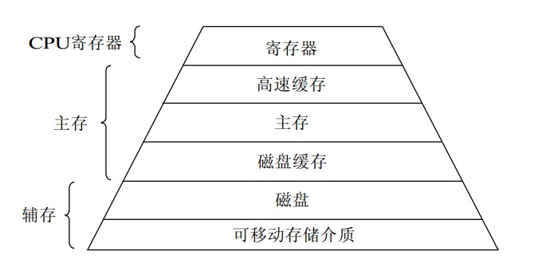
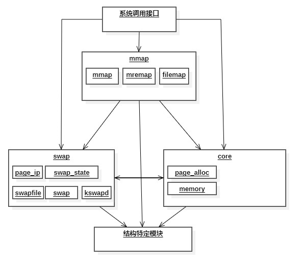
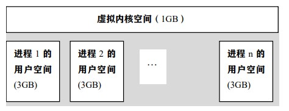
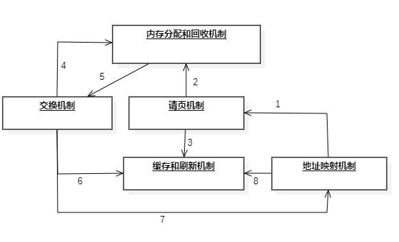
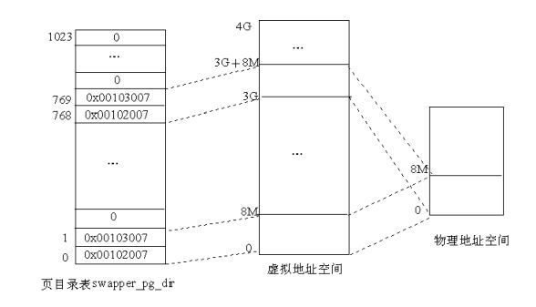
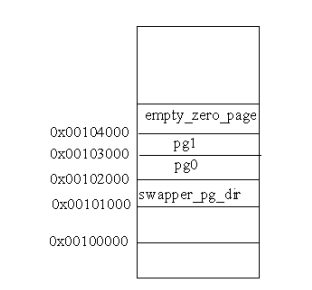
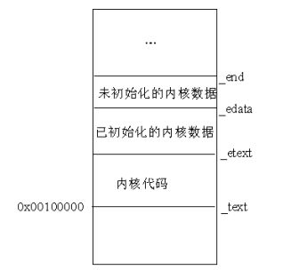

# Linux内存管理
存储器是许多存储单元的集合，是用来存储程序和各种数据信息的记忆部件。它能够为用户提供方便、安全和充分大的存储空间，因此对于存储器，系统必须对其进行仔细管理。一个存储器的质量可以通过其容量、访问速度和价格来度量。但由于技术限制，目前并没有一种无穷大的、访问快速的、内容不丢失的以及廉价的存储器。因此，当今大部分计算机都采用层次结构的思想将存储器组成多层存储器，并通过管理软件和辅助硬件等有机组合成统一的整体，使存放的程序和数据按层次分布各存储器中，具体方案为少量快速、昂贵、易变的高速缓存；若干兆字节的中等速度、中等价格、易变的主存储器（RAM）；以及数百兆或数千兆的低速、廉价、不易变的磁盘。资源的合理利用与否关系着系统的效率。
存储器的层次结构图解如图所示：



本部分主要对Linux内存管理部分的代码进行分析，包括其所涉及到的许多机制：比如内存的初始化机制、地址映射机制、请页机制、交换机制、内存分配和回收机制、缓存和刷新机制以及内存共享机制，还包括进程的创建与执行。
## Linux内存管理概述
Linux是为多用户多任务所设计的操作系统，因此在对于资源使用方面，存储资源有可能被多个进程有效共享；而且程序规模随发展而不断膨胀，如今计算机所需求的内存空间越来越大。因此Linux内存管理的设计选择利用计算机系统所提供的虚拟存储技术，从而实现了虚拟存储器管理。
Linux的内存管理主要体现在对虚拟内存的管理上，因此我们把Linux虚拟内存管理功能划分为以下几点：
* 大地址空间
* 进程保护
* 内存映射
* 公平的物理内存分配
* 共享虚拟内存
### Linux虚拟内存的实现结构
Linux对于实现虚拟内存的源代码大部分放在/mm目录下。根据负责功能的不同，我们可以将其分为以下四个模块：
* 内存映射模块（mmap）：该模块负责把磁盘文件的逻辑地址映射到虚拟地址，以及把虚拟地址映射到物理地址。
* 交换模块（swap）：该模块负责控制内存内容的换入和换出，它通过交换机制，使得在物理内存的页面（RAM页）中保留有效的页，即从主存中淘汰最近没被访问的页，保存近来访问过的页。
* 核心内存管理模块（core）：该模块负责核心内存管理功能，即对页的分配、回收、释放和请页处理等，这些功能将被别的内核子系统所使用。
* 结构特定模块：该模块负责给各种硬件平台提供通用接口，这个模块通过执行命令来改变硬件MMU的虚拟地址映射，并在发生页错误时，提供公用方法来通知别的内核子系统。该模块是实现虚拟内存的物理基础。
基于以上模块，我们画出Linux虚拟内存整体结构如图所示：


### 内核空间和用户空间
Linux虚拟空间为0~4G字节。Linux内核将这4G字节的空间分为两部分。将最高的1G字节（从虚拟地址0xC0000000到0xFFFFFFFF）供给内核使用，称为“内核空间”；又将较低的3G字节（从虚拟地址0x00000000到0xBFFFFFFF）供给各个进程使用，称为“用户空间”。
Linux内核由系统内的所有进程共享，每个进程可以通过系统调用进入内核。Linux使用两级保护机制：0级供内核使用；3级供用户程序使用，通过对图6.3的观察，我们可以得出每个进程有各自的私有用户空间（对其他进程不可见），而最高的1G字节虚拟内核空间则为所有进程以及内核所共享。


* 虚拟内核空间到物理空间的映射
内核空间中存放的是内核代码和数据，而进程的用户空间中存放的是用户程序的代码和 数据。不管是内核空间还是用户空间，它们都处于虚拟空间中。虽然内核空间占据了每个虚拟空间中的最高1G字节，但映射到物理内存却总是从最低地址（0x00000000）开始。对内核空间来说，其地址映射是很简单的线性映射，0xC0000000就是物理地址与线性地址之间的位移量，在Linux代码中就叫做PAGE_OFFSET。因此对于内核空间而言，如果物理内存小于950MB，则虚地址为x时，物理地址为“x-PAGE_OFFSET”；物理地址为x时，虚地址为“x+PAGE_OFFSET”。
* 内核映像
内核映像即内核的代码和数据。系统启动时将Linux内核映像安装在物理地址0x00100000开始的地方，即1MB开始的区间。而在正常运行时内核映像被放在虚拟内核空间中，因此连接程序在连接内核映像时需要在所有符号地址上加一个偏移量PAGE_OFFSET,因此内核映像在内核空间的起始地址为0xC0100000。
### 虚拟内存实现机制间的关系
Linux通过对各种实现机制的采用和联系，完成对虚拟内存的实现。总的来说，Linux的实现机制主要有以下几种：内存分配和回收机制；地址映射机制；缓存和刷新机制；请页机制；交换机制；内存共享机制。


在虚拟内存的实现过程中，内存管理程序首先通过映射机制把用户程序的逻辑地址映射到物理地址，如果没有对应的物理内存，就发出请页要求（过程1），如果内存有空间，则进行分配（过程2），并把物理页记录页缓存中（过程3）；如果内存无空间，则进行交换（过程4,5）。另外，在找寻物理页的过程中也会使用地址映射机制（过程8）、交换机制中也会用到交换缓存（过程6）、交换后也会修改页表来映射文件地址（过程7）。
## Linux内存初始化
### 启用分页机制
1.关于Linux页表初步初始化的代码如下：
```
/*
* The page tables are initialized to only 8MB here - the final page
* tables are set up later depending on memory size.
*/
.org 0x2000
ENTRY(pg0)
.org 0x3000
ENTRY(pg1)
/*
* empty_zero_page must immediately follow the page tables ! (The
* initialization loop counts until empty_zero_page)
*/
.org 0x4000
ENTRY(empty_zero_page)
-------------------------------------------------------------------------------
/*
* Initialize page tables
*/
movl $pg0-__PAGE_OFFSET,%edi /* initialize page tables */
movl $007,%eax  /* "007" doesn't mean with right to kill, but
PRESENT+RW+USER */
2:  stosl
add $0x1000,%eax
cmp $empty_zero_page-__PAGE_OFFSET,%edi
jne 2b
```
首先我们需要知道Linux启动时首先会运行在实模式下，然后才转到保护模式下运行。该代码在执行时还没进入保护模式，因此指令寄存器EIP中的地址仍然为物理地址。然而，pg0中存放的是虚拟地址，因此需要减去偏移量——获得“$pg0-__PAGE_OFFSET”即为pg0的物理地址。根据代码可以看出，pg0存放在相对于内核代码起点0x2000的位置，因此pg0的实际物理地址为0x00102000。页表中的表项则依次设置为0x007、0x1007、0x2007等。内核共映射2K个页面，基地址分别为0x0、0x1000、0x2000等。因此Linux内核对物理内存的最低要求为8MB。然后会存放零页（即empty_zero_page），负责存放系统启动参数和命令行参数。
2.然后是启用分页机制的部分代码：
```
/*
* This is initialized to create an identity-mapping at 0-8M (for bootup
* purposes) and another mapping of the 0-8M area at virtual address
* PAGE_OFFSET.
*/
.org 0x1000
ENTRY(swapper_pg_dir)
.long 0x00102007
.long 0x00103007
.fill BOOT_USER_PGD_PTRS-2,4,0
/* default: 766 entries */
.long 0x00102007
.long 0x00103007
/* default: 254 entries */
.fill BOOT_KERNEL_PGD_PTRS-2,4,0
-------------------------------------------------------------------------------
/*
* Enable paging
*/
3:
movl $swapper_pg_dir-__PAGE_OFFSET,%eax
movl %eax,%cr3  /* set the page table pointer.. */
movl %cr0,%eax
orl $0x80000000,%eax
movl %eax,%cr0  /* ..and set paging (PG) bit */
jmp 1f  /* flush the prefetch-queue */
1:
movl $1f,%eax
jmp *%eax  /* make sure eip is relocated */
1:
```
该段代码的主要作用为：把页目录swapper_pg_dir的物理地址装入控制寄存器cr3中，并把cr0中的最高位置成1，从而开启分页机制。
然而，指令寄存器中的地址还是物理地址，不是虚地址。所以Linux内核还未真正进入保护模式。jmp 1f指令负责将指令流水线中的内容丢弃，然后mov和jmp指令会把第2个标号为1的地址装入EAX寄存器中并进行跳转。此时由于编译程序使得所有的符号地址都在虚拟内存空间中，因此第2个标号1的地址也为虚拟地址（PAGE_OFFSET+某处），这样，jmp指令执行过后，EIP就指向虚拟内核空间的某个地址，这就使CPU转入了内核空间，从而完成从实模式到保护模式的转换。
然后再看页目录swapper_pg_dir中的内容。pg0和pg1两个页表的起始物理地址分别为0x00102000和0x00103000。由于页目录项的最低12位用来描述页表的属性，因此，在swapper_pg_dir中的第0和第1个目录项0x00102007、0x00103007，就表示pg0和pg1这两个页表是用户页表、可写且页表的内容在内存。 接着，把swapper_pg_dir中的第2～767共766个目录项全部置为0（因为一个页表的大小为4KB，每个表项占4个字节，即每个页表含有1024个表项，每个页的大小也为4KB，因此这768个目录项所映射的虚拟空间为768×1024×4K＝3G，即swapper_pg_dir表中的前768个目录项映射的是用户空间。） 最后，在第768和769个目录项中又存放pg0和pg1这两个页表的地址和属性，而把第770～1023共254个目录项置 0（这256个目录项所映射的虚拟地址空间为256×1024×4K＝1G，也就是说swapper_pg_dir表中的后256个目录项映射的是内核空间。 ）由此可以看出，在初始的页目录swapper_pg_dir中，用户空间和内核空间都只映射了开头的两个目录项，即8MB的空间，而且有着相同的映射，如图所示。


3.然后是对物理内存的初始分布进行分析。
初始化阶段页目录以及几个页表在物理空间中的位置如图：


其中empty_zero_page为零页，在其中会存放操作系统的引导过程中所收集的一些数据（引导参数）。经过初始化完成后，系统转入正常运行时就可通过宏定义ZERO_PAGE来引用该页面。setup.c中定义了引用参数的宏：
```
/*
* This is set up by the setup-routine at boot-time
*/
#define PARAM （（unsigned char *）empty_zero_page）
#define SCREEN_INFO （*（struct screen_info *） （PARAM+0））
#define EXT_MEM_K （*（unsigned short *） （PARAM+2））
#define ALT_MEM_K （*（unsigned long *） （PARAM+0x1e0））
#define E820_MAP_NR （*（char*） （PARAM+E820NR））
#define E820_MAP （（struct e820entry *） （PARAM+E820MAP））
#define APM_BIOS_INFO （*（struct apm_bios_info *） （PARAM+0x40））
#define DRIVE_INFO （*（struct drive_info_struct *） （PARAM+0x80））
#define SYS_DESC_TABLE （*（struct sys_desc_table_struct*）（PARAM+0xa0））
#define MOUNT_ROOT_RDONLY （*（unsigned short *） （PARAM+0x1F2））
#define RAMDISK_FLAGS （*（unsigned short *） （PARAM+0x1F8））
#define ORIG_ROOT_DEV （*（unsigned short *） （PARAM+0x1FC））
#define AUX_DEVICE_INFO （*（unsigned char *） （PARAM+0x1FF））
#define LOADER_TYPE （*（unsigned char *） （PARAM+0x210））
#define KERNEL_START （*（unsigned long *） （PARAM+0x214））
#define INITRD_START （*（unsigned long *） （PARAM+0x218））
#define INITRD_SIZE （*（unsigned long *） （PARAM+0x21c））
#define COMMAND_LINE （（char *） （PARAM+2048））
#define COMMAND_LINE_SIZE 256
```
其中宏PARAM就是零页的起始位置。
初始化后，物理内存中内核映像的分布如图：


其中的_text对应物理地址0X00100000，表示内核代码的第一个字节地址。_etext对应内核代码的结束位置。在内核数据中，分为已初始化的数据和未初始化的数据，其中初始化的数据紧跟在_etext后，在_edata处结束；而未初始化的数据结束符为_end。表示整个内核映像的结束。
### 物理内存的探测
Linux系统通过内核本身进行资源的扫描探测，并根据获得的信息生成物理内存构成图，即e820图，然后通过参数块传给内核。这样，内核就知道系统的内存资源配置情况。
前面提到分页机制启用，在这之后与内存管理相关的操作就是调用init/main.c中的start_kernel()函数，而该函数需要调用setup_arch()函数（位于arch/i386/sernel/setup.c中），我们通过分析该函数来了解物理内存探测内容。
#### setup_arch()函数
在分析之前，我们先列出代码中需要用到的一些宏定义：
```
#define PFN_UP（x） （（（x） + PAGE_SIZE-1） >> PAGE_SHIFT）
#define PFN_DOWN（x） （（x） >> PAGE_SHIFT）
#define PFN_PHYS（x） （（x） << PAGE_SHIFT）
#define VMALLOC_RESERVE （unsigned long）（128 << 20）
#define MAXMEM （unsigned long）（-PAGE_OFFSET-VMALLOC_RESERVE）
#define MAXMEM_PFN PFN_DOWN（MAXMEM）
#define MAX_NONPAE_PFN （1 << 20）
```
解释如下：
* PFN_UP：将地址x转换为页面号，并返回大于x的第一个页面号。
* PFN_DOWN：返回小于x的第1个页面号。
* PFN_PHYS：返回页面号x的物理地址。
* VMALLOC_RESERVE：vmalloc()函数访问内核空间所保留的内存区（128MB）。
* MAXMEM：内核能直接映射的最大RAM容量。
* MAXMEM_PFN：返回由内核能直接映射的最大物理页面数。
* MAX_NONPAE_PFN：给出在4GB之上第1个页面的页面号。当页面扩充（PAE）功能启用时才能访问4GB以上的内存。

1.首先该函数调用setup_memory_region()函数，处理内存构成图并把内存分布信息存放在全局变量e820中（详细描述见下文）。
2.然后调用parse_mem_cmdline(cmdline_p)函数，该函数用来分析命令行中的选择项，并据此对数据结构e820中的内容作出修正，其代码也在setup.c中。
3.然后获得内核映像之后的起始页面号：
```
start_pfn = PFN_UP（__pa（&_end））;
```
start_pfn存放着内核映像之后的页面号。
4.接着找出可用的最高页面号：
```
max_pfn = 0;
for （i = 0; i < e820.nr_map; i++） {
  unsigned long start, end;
  /* RAM? */
  if （e820.map[i].type != E820_RAM）
    continue;
  start = PFN_UP（e820.map[i].addr）;
  end = PFN_DOWN（e820.map[i].addr + e820.map[i].size）;
  if （start >= end）
    continue;
  if （end > max_pfn）
    max_pfn = end;
}
```
该部分代码循环查找类型为E820_RAM的内存区，并把最后一个页面的页面号存放在max_pfn中。
5.确定最高和最低内存的范围：
```
max_low_pfn = max_pfn;
if （max_low_pfn > MAXMEM_PFN） {
max_low_pfn = MAXMEM_PFN;
#ifndef CONFIG_HIGHMEM
/* Maximum memory usable is what is directly addressable */
printk（KERN_WARNING "Warning only %ldMB will be used.\n", MAXMEM>>20）;
  if （max_pfn > MAX_NONPAE_PFN）
    printk（KERN_WARNING "Use a PAE enabled kernel.\n"）;
  else
    printk（KERN_WARNING "Use a HIGHMEM enabled kernel.\n"）;
#else /* !CONFIG_HIGHMEM */
#ifndef CONFIG_X86_PAE
  if （max_pfn > MAX_NONPAE_PFN） {
    max_pfn = MAX_NONPAE_PFN;
    printk（KERN_WARNING "Warning only 4GB will be used.\n"）;
    printk（KERN_WARNING "Use a PAE enabled kernel.\n"）;
}
#endif /* !CONFIG_X86_PAE */
#endif /* !CONFIG_HIGHMEM */
}
```
该代码用来检查系统物理内存大小的情况，根据内存情况不同做出不同操作：
如果物理内存RAM大于896MB，小于4GB，则选用CONFIG_HIGHMEM选项来访问；
如果大于4GB，则选用CONFIG_X86_OAE。
6.调用init_bootmem()函数，为物理内存页面管理机制的建立做初步准备。
```
bootmap_size = init_bootmem（start_pfn, max_low_pfn）;
```
为整个物理内存建立起一个页面位图。该位图从start_pfn开始，即将_end（内核映像的结束位置）上方的若干页面用作物理页面位图。建立该位图，目的是统计物理内存中哪些页面可以动态分配。
bootmem分配器负责登记全部低区（0~896MB）的可用RAM页面，并调用free_bootmem()函数将所有可用的RAM都标记为可用。
```
reserve_bootmem（HIGH_MEMORY, （PFN_PHYS（start_pfn） + bootmap_size + PAGE_SIZE-1） - （HIGH_MEMORY））;
```
该函数将内核和bootmem位图所占的内存标记为“保留”。
7.初始化分页机制
```
paging_init（）;
```
该函数初始化分页内存管理所需的数据结构。
#### setup_memory_region()函数
该函数用来处理BIOS的内存构成图，并将图拷贝到全局变量e920中。若失败则创建一个伪内存构成图。
1.调用sanitize_e820_map()函数，以删除内存构成图中任何重叠的部分，因为BIOS所报告的内存构成图可能有重叠。
2.调用copy_e820_map()进行实际的拷贝。
3.如果操作失败，创建一个伪内存构成图，这个伪构成图有两部分：0到640K及1M到最大物理内存。
4.打印最终的内存构成图。
#### copy_e820_map()函数
该函数为将内存构成图拷贝到e820中。它每次从BIOS构成图中取出一项进行检查。对于BIOS把640KB~1MB之间的区间作为RAM使用的情况，该函数需要进行修正，将涉及该位置的区间拆开成两个区间，中间跳过该部分。
#### add_memory_region()函数
该函数功能为在e820中增加一项。操作流程为：
1.先获取e820中现有的内存区数。
2.如果区数已经达到最大（32），则报错。
3.如果未达到最大，则增加1项。
#### print_memory_map()函数
该函数负责把内存构成图输出在控制台中。

