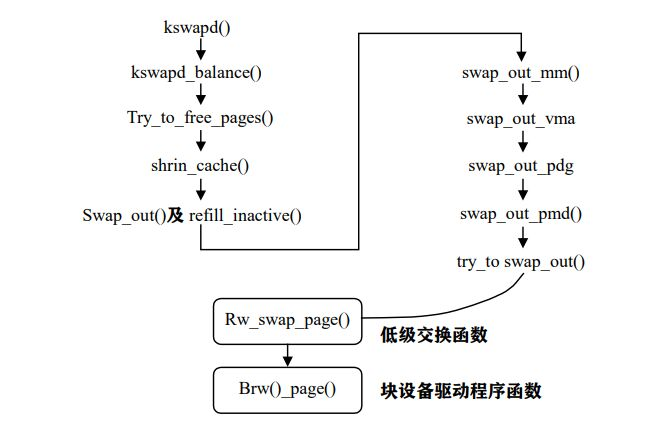

# 交换机制
当物理内存不足时，Linux内存管理子系统需要释放部分物理内存页面。该任务由内核的交换守护进程kswapd完成。该进程在内核初始化时启动并周期运行，以保证系统中有足够的空闲页面。
## 交换的基本原理
当系统的进程数达到一定数量时，对存储空间的总需求量就会变得很大，此时，一般的物理内存量就很难满足要求。因此，Linux设立了一个用作交换的磁盘空间，即交换文件或交换区。
在Linux中，交换的单位为页面。但页面交换会使程序的执行在时间上有较大不确定性，因此Linux允许用户选择是否开启或关闭交换机制。
在页面交换中，页面置换算法是影响交换性能的关键性指标，其复杂性主要与换出有关。总之，需要考虑4个问题：
* 哪种页面要换出
* 如何在交换区中存放页面
* 如何选择被交换出的页面
* 何时执行页面换出操作
另外，页面的换入换出实际上是指页面中数据的换入换出，因为这里的页和页面指的是其中存放的数据。
### 哪种页面被换出
交换的最终目的是页面的回收。事实上，只有与用户空间建立了映射关系的物理页面才会被换出去，而内核空间中内核所占的页面则常驻内存。
用户空间的页面按照内容和性质可以进行以下区分：
* 进程映像所占的页面，包括进程代码段、数据段、堆栈段以及动态分配的存储堆。
* 通过系统调用mmap()把文件的内容映射到用户空间。
* 进程间共享内存区。

对于第一种情况，进程的代码、数据段所占的内存页面可以被换入换出。
对于第二种情况，页面所使用的交换区就是被映射的文件本身。
对于第三种情况，其页面的换入换出比较复杂。
与此对照，映射到内核空间的页面都不会被换出。具体来说，内核代码和内核中的全局量所占的内存页既不需要分配，也不会被释放，这部分为静态的。除此之外，内核在执行过程中使用的页面要经过动态分配，但永驻内存。
在内核中还有一种页面，虽然使用完毕，但其内容仍然有保留价值，因此不会被立即释放。这类页面会进入一个LRU队列，经过一段时间后让其老化，如果在这段时间内又使用了就将其投入使用。这些页面主要有：
* 文件系统中用来缓冲存储一些文件目录结构dentry的空间。
* 文件系统中用来缓冲存储一些索引节点inode的空间。
* 用于文件系统/写操作的缓冲区。

### 如何在交换区中存放页面
* 策略一：需要时交换。每当缺页异常发生时就给它分配一个物理页面。如果发现没有空闲的页面可供分配，就设法将一个或多个内存页面换出到磁盘上，从而腾出一些内存页面来。（缺点：被动的交换策略）
* 策略二：系统空闲时交换。这是一种积极的交换策略，在系统空闲时预先换出一些页面而腾出一些内存页面，从而在内存中维持一定的空闲页面供应量，使得在缺页中断发生时总有空闲页面可供使用。换出页面的选择则是采用LRU算法。（缺点：有可能被换出的页面过会又正好需要访问——会造成页面“抖动”现象）
* 策略三：换出但不立即释放。当系统挑选出若干页面进行换出时，将相应的页面写入磁盘交换区，并修改相应页表中页表项的内容（把present标志位置为0），但并不立即释放，而是将其page结构留在一个缓冲队列中，使其从活跃状态转为不活跃状态。对于这些页面的释放则推迟到必要时进行。
* 策略四：把页面换出推迟到不能再推迟为止。换出页面时不一定要把它的内容写入磁盘。如果一个页面自从最近一次换入后并没有被写过（如代码），那么这个页面是“干净的”，就没有必要把它写入磁盘。“脏”页面也没有必要立即写出去，可以采用策略三。至于“干净”页面，可以一直缓冲到必要时才回收。
下面是策略四的一些描述：
（1）释放页面。如果一个页面变为空闲可用，就把该页面page结构链入某个页面管理区的空闲队列free_area，同时页面的使用计数count减1。
（2）分配页面。调用__alloc_pages()或__get_free_page()从某个空闲队列分配内存页面，并count置为1。
（3）活跃状态。已分配的页面处于活跃状态，该页面的数据结构 page 通过其队列头结 构 lru 链入活跃页面队列 active_list，并且在进程地址空间中至少有一个页与该页面之间 建立了映射关系。
（4）不活跃“脏”状态。处于该状态的页面其 page 结构通过其队列头结构 lru 链入不 活跃“脏”页面队列 inactive_dirty_list，并且原则是任何进程的页面表项不再指向该页 面，也就是说，断开页面的映射，同时把页面的使用计数 count 减 1。
（5）将不活跃“脏”页面的内容写入交换区，并将该页面的page结构从不活跃“脏”页面队列inactive_dirty_list转移到不活跃“干净”页面队列，准备被回收。
（6）不活跃“干净”状态。页面page结构通过其队列头结构lru链入某个不活跃“干净”页面队列，每个页面管理区都有个不活跃“干净”页面队列inactive_clean_list。
（7）如果在转入不活跃状态以后的一段时间内，页面又受到访问，则又转入活跃状态并恢复映射。
（8）当需要时，就从“干净”页面队列中回收页面，也就是说或者把页面链入到空闲队列，或者直接进行分配。

### 何时进行页面换出
Linux内核设置kswapd守护进程，用于定期将页面换出。

## 页面交换守护进程kswapd
从原理上说，kswapd相当于一个进程，进程控制块为task_struct结构。受内核调度，而kswapd相比其他进程也有其特殊性。首先，其没有自己独立的地址空间，内核空间就是其地址空间；其次，他的代码是静态地链接在内核中的，可以直接调用内核的子程序和函数。
kswapd的源代码大多在mm/vmscan.c中，由于kswapd的实现过于复杂，我们仅对一些主要函数进行描述，以下是kswapd中与交换有关的主要函数调用关系：



### kswapd()
该函数的代码为
```
int kswapd（void *unused）
{
struct task_struct *tsk = current;
DECLARE_WAITQUEUE（wait, tsk）; 
daemonize（）; ／*内核线程的初始化*/
strcpy（tsk->comm, "kswapd"）;
sigfillset（&tsk->blocked）; ／*把进程 PCB 中的阻塞标志位全部置为 1*/
/*
* Tell the memory management that we're a "memory allocator",
* and that if we need more memory we should get access to it
* regardless （see "__alloc_pages（）"）. "kswapd" should * never get caught in the normal page freeing logic. *
* （Kswapd normally doesn't need memory anyway, but sometimes
* you need a small amount of memory in order to be able to
* page out something else, and this flag essentially protects 
* us from recursively trying to free more memory as we're
* trying to free the first piece of memory in the first place）.
*/ tsk->flags |= PF_MEMALLOC; ／*这个标志表示给 kswapd 要留一定的内存*/
/*
* Kswapd main loop.
*/
for （;;） {
__set_current_state（TASK_INTERRUPTIBLE）;
add_wait_queue（&kswapd_wait, &wait）; ／*把 kswapd 加入等待队列*／
mb（）; ／*增加一条汇编指令*/
if （kswapd_can_sleep（）） ／*检查调度标志是否置位*/
schedule（）; ／*调用调度程序*/
_set_current_state（TASK_RUNNING）; ／*让 kswapd 处于就绪状态*/
remove_wait_queue（&kswapd_wait, &wait）; ／*把 kswapd 从等待队列删除*/
/*
* If we actually get into a low-memory situation,
* the processes needing more memory will wake us
* up on a more timely basis.
*/
kswapd_balance（）; ／* kswapd 的核心函数，请看后面内容*/
run_task_queue（&tq_disk）; ／*运行 tq_disk 队列中的例程*/
}
}
```
kswapd是内存管理中唯一的一个线程，其创建如下：
```
static int __init kswapd_init（void）
{
printk（"Starting kswapd\n"）;
swap_setup（）;
kernel_thread（kswapd, NULL, CLONE_FS | CLONE_FILES | CLONE_SIGNAL）;
return 0;
}
```
然后内核启动时由模块的初始化例程调用kswapd_init。
通过分析代码可知，本函数主要由一个无限循环组成。循环一开始把kswapd加入等待队列，但如果调度标志为1，就执行调度程序，然后从等待队列中删除并将状态改为就绪。只要调度程序再次执行，它就会得到执行，如此周而复始。
### kswapd_balance()函数
在初始化部分时，我们分析了物理内存的3个层次，即存储节点、管理区和页面。该函数的作用是使对页面的释放均衡地在各个存储节点、管理区中进行。
该函数主要是对每个存储节点进行扫描。然后调用kswapd_balance_pgdat()对每个管理区进行扫描。
函数调用check_classzone_need_balance()函数来查看各个管理区的空闲页面数是否小于最高警戒线，如果是，则平衡标志need_balance为1，这时候就需要调用try_to_free_pages()函数。
### try_to_free_pages()
```
int try_to_free_pages（zone_t *classzone, unsigned int gfp_mask, unsigned int order）
{
int priority = DEF_PRIORITY;
int nr_pages = SWAP_CLUSTER_MAX;
gfp_mask = pf_gfp_mask（gfp_mask）;
do {
nr_pages = shrink_caches（classzone, priority, gfp_mask, nr_pages）;
if （nr_pages <= 0）
return 1;
} while （--priority）;
/*
* Hmm.. Cache shrink failed - time to kill something?
* Mhwahahhaha! This is the part I really like. Giggle.
*/
out_of_memory（）;
return 0;
}
```
优先级代表对队列进行扫描的长度，缺省为6，为最低优先级。优先级n表示要扫描的队列长度为L/2^n^，其中L为队列长度，循环至少循环n次。nr_pages为要换出的页面数，最大值为32。
该函数其中调用了shrink_caches()函数，其代码如下：
```
static int shrink_caches（zone_t * classzone, int priority, unsigned int gfp_mask, int nr_pages）
{
int chunk_size = nr_pages;
unsigned long ratio;
nr_pages -= kmem_cache_reap（gfp_mask）;
if （nr_pages <= 0）
return 0;
nr_pages = chunk_size;
/* try to keep the active list 2/3 of the size of the cache */
ratio = （unsigned long） nr_pages * nr_active_pages / （（nr_inactive_pages + 1） * 2）;
refill_inactive（ratio）;
nr_pages = shrink_cache（nr_pages, classzone, gfp_mask, priority）;
if （nr_pages <= 0）
return 0;
shrink_dcache_memory（priority, gfp_mask）;
shrink_icache_memory（priority, gfp_mask）;
1 #ifdef CONFIG_QUOTA
shrink_dqcache_memory（DEF_PRIORITY, gfp_mask）;
#endif
return nr_pages;
}
```
kmem_cache_reap()函数负责收取由slab机制管理的空闲页面，如果这时的空闲页面已经大于要换出的页面数，则不从其他地方换出。refill_inactive()函数把活跃队列中的页面移到非活跃队列。shrink_cache()函数把一个“洗净”且未加锁的页面移到非活跃队列，以便该页被尽快释放。
### 页面置换
swap_out()和shrink_cache()用于将页面筛选出候选页以备换出。
shrink_cache()关注两个队列：LRU队列（活跃队列）和FIFO队列（）非活跃队列，每个队列都是struct page形成的链表。该函数的工作情况如下：
* 把引用过的页面从活跃队列的队尾移到队头。
* 把未引用过的页面从活跃队列的队尾移到非活跃队列的队头。
* 把脏页面安排在非活跃队列的队尾准备写到磁盘。
* 从非活跃队列的队尾恢复干净页面。

## 交换空间的数据结构
Linux支持多个交换文件或设备，其将被swapon和swapoff系统调用来打开或关闭。
每个交换文件或设备都可用swap_info_struct结构描述：
```
struct swap_info_struct {
unsigned int flags;
kdev_t swap_device;
spinlock_t sdev_lock;
struct dentry * swap_file;
struct vfsmount *swap_vfsmnt;
unsigned short * swap_map;
unsigned int lowest_bit;
unsigned int highest_bit;
unsigned int cluster_next;
unsigned int cluster_nr;
int prio; /* swap priority */
int pages;
unsigned long max;
int next; /* next entry on swap list */
};
extern int nr_swap_pages;
```
* flags域（SWP_USED或SWP_WRITEOK）用作控制访问交换文件。当swapoff被调用（为了取消一个文件）时，SWP_WRITEOK置off，使在文件中无法分配空间。如果swapon加入一个新的交换文件时，SWP_USED被置位。这里还有一静态变量（nr_swapfiles）来记录当前活动的交换文件数。
* 域lowest_bit，highest_bit表明在交换文件中空闲范围的边界，这是为了快速寻址。
* 当用户程序mkswap初始化交换文件或设备时，在文件的第一个页插槽的前10个字节，有一个包含有位图的标志，在位图里初始化为0，代表坏的页插槽，1代表相关页插槽是空闲的。
* 当用户程序调用swapon()时，有一页被分配给swap_map。
* swap_map为在交换文件中每一个页插槽保留了一个字节，0代表可用页插槽，128代表不可用页插槽。它被用于记下交换文件中每一页插槽上的swap请求。
* 内存中的一页被换出时，调用get_swap_page()会得到一个一个记录换出位置的索引，然后在页表项中回填（1～31位）此索引。这是为了在发生在缺页异常时进行处理 （do_no_page）。索引的高7位给定交换文件，后24位给定设备中的页插槽号。
* 函数swap_duplicate()被copy_page_tables()调用来实现子进程在fork()时继承被换出的页面，这里要增加域swap_map中此页面的count值，任何进程访问此页面时，会换入它的独立的拷贝。
* swap_free()减少域swap_map中的count值，如果count减到0时，则这页面又可再次分配（ get_swap_page），在把一个换出页面调入(swap_in)内存时或放弃一个页面时（free_one_table）调用swap_free()。

## 交换空间的应用
### 建立交换空间
作为交换空间的交换文件实际为通常的文件，但文件的扇区必须是连续的，且交换文件必须保存在本地硬盘上。
交换分区也与其他分区相似，但其不包含任何文件系统。分区类型对内核来说不重要，但最好为Linux Swap类型。
建立交换文件或交换分区后，需要在文件或分区开头写入签名，写入的签名其实是由内核使用的一些管理信息。写入签名命令为mkswap。
Linux内存管理子系统将每个交换空间的大小限制在127MB。可以在系统中同时使用16个交换空间，从而使交换空间总量达到2GB。
### 使用交换空间
* 利用swapon命令可以将经过初始化的交换空间投入使用：
```
$ swapon /extra-swap
$
```
* 如果在/etc/fstab文件中列出交换空间，则可自动将交换空间投入使用：
```
/dev/hda5 none swap sw 0 0
/extra-swap none swap sw 0 0
```
* 实际上，启动脚本会运行swapon -a命令，从而将所有出现在/etc/fstab文件中的交换空间投入使用。
* 使用free命令可以查看交换空间的使用。包括物理内存使用情况、物理内存总量、有关交换空间的类似信息等。
* 利用swapoff命令可移去使用中的交换空间。但该命令应只用于临时交换空间，否则有可能造成系统崩溃。
swapoff –a命令按照/etc/fstab文件中的内容移去所有的交换空间，但任何手工投入使用的交换空间保留不变。

### 分配交换空间
交换空间的大小按照以下规则确定：
* 估计需要的内存总量。运行想同时运行的所有程序，并利用free或ps程序估计所需的内存总量。
* 增加一些安全性余量。
* 减去已有的物理内存数量，然后将所得数据取整为MB，这就是应当的交换空间大小。
* 如果得到的交换空间大小远大于物理内存量，则说明需要增加物理内存数量，否则系统性能会因为过分的页面交换而下降。
* 当计算的结果说明不需要任何交换空间时，也有必要使用交换空间。因为Linux从性能考虑出发会在磁盘空闲时将某些页面交换到交换空间，以减少必要时的交换时间。


