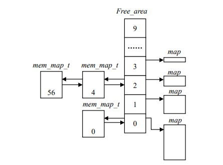

# 内存的分配和回收
内存进行初始化后，内存中就常驻有内核映像（内核代码和数据）。在这之后，内存需要随着用户程序的执行和结束不停地进行物理页面的分配和释放。这时，一种稳定、高效的分配策略就成了急需。为此，我们必须先解决由于频繁地请求和释放不同大小的连续页面而带来的外碎片问题。Linux采用了伙伴算法来解决外碎片问题。
需要注意的是，Linux中CPU不能按物理地址来访问存储空间，因此对于页面的管理一般是先分配虚拟内存，然后才为其分配物理内存并建立映射。

## 伙伴算法
### 原理
伙伴算法将所有的空闲页面分为10个块组，第n个组中存储大小为2^n个页面的块，比如第0组存储大小为1个页面的块、第1组存储大小为2个页面的块......也就是说，每一组中块的大小都相同，且同样大小的块形成一个链表。
当要求分配一定大小的块时，Linux先在块大小为相同大小的链表中查找，看是否有空闲块，如果有则直接分配；而如果没有，则去查找块大小大于该大小的链表中是否有空闲块，如果有则该块分为两等份（因为大小都为2的幂次方），一块分配出去，另一份插入到之前的链表中；如果也没有则再次查抄块大小更大的链表，并进行分配、插入操作；如果最大的链表（512个页面）也没有空闲块，则放弃分配，发出错误信号。
两个块若为伙伴，则满足以下条件：
* 两块大小相同。
* 两块物理地址连续。
### 数据结构
之前介绍的管理区数据结构struct zone_struct中涉及了空闲区的数据结构free_area_t free_area[MAX_ORDER]，其描述为：
```
#difine MAX_ORDER 10
type struct free_area_struct {
struct list_head free_list
unsigned int *map
} free_area_t
```
其中list_head是一个通用的双向链表，表中元素为mem_map_t（struct page结构）。map指向一个位图，大小取决于现有的页面数。free_area第k项位图的每一位描述的是大小为2^k^个页面两个伙伴块的状态：为0则表示一对兄弟块中两个都空闲或者两个都被分配；为1则表示肯定有一块被分配。当兄弟块都空闲时，内核将其看做大小为2^k+1^的块。其示意图如下：



其中，free_area数组的元素0包含了一个空闲页（页面编号为0）；元素2则包含两个大小为4个页面的空闲块，第一个块编号为4，第二个为56。

### 物理页面的分配和释放
一个进程请求分配连续的物理页面时，可以调用alloc_pages()。Linux2.4中有两个alloc_pages()，编译时会根据所定义的条件选项CONFIG_DISCONTIGMEM来决定。
CONFIG_DISCONTIGMEM条件编译的含义是“不连续的存储空间”，因此页面的分配可以分为非一致存储结构（NUMA）、一致存储结构（UMA）两类。
#### NUMA中的分配
alloc_page()函数在mm/numa.c中：
```
/* * This can be refined. Currently, tries to do round robin, instead
* should do concentratic circle search, starting from current node.
*/
struct page * _alloc_pages（unsigned int gfp_mask, unsigned int order）
{
struct page *ret = 0;
pg_data_t *start, *temp;
#ifndef CONFIG_NUMA unsigned long flags;
static pg_data_t *next = 0;
#endif
if（order >= MAX_ORDER）
return NULL;
#ifdef CONFIG_NUMA
temp = NODE_DATA（numa_node_id（））;
#else
spin_lock_irqsave（&node_lock, flags）;
if （!next） next = pgdat_list;
temp = next; next = next->node_next;
spin_unlock_irqrestore（&node_lock, flags）;
#endif
start = temp;
while （temp） {
if （（ret = alloc_pages_pgdat（temp, gfp_mask, order）））
return（ret）;
temp = temp->node_next;
}
temp = pgdat_list;
while （temp != start） {
if （（ret = alloc_pages_pgdat（temp, gfp_mask, order））） return（ret）;
temp = temp->node_next;
}
return（0）;
}
```
说明如下：
* gfp_mask表示采用哪种分配策略，order表示所需物理块的大小，可以是1~2^MAX_ORDER-1^。
* 如果定义了CONFIG_NUMA，也就是在NUMA结构的系统中，可通过NUMA_DATA()宏找到CPU所在节点的pg_data_t数据结构队列。
* 如果在不连续的UMA结构中，则有个队列pgdat_list，元素为pg_data_t，pgdat_list就是该队列的首部。
* 分配时轮流从各个节点开始。函数中有两个循环，分别对节点队列进行一次扫描，直至在某个节点内分配成功，则跳出循环，否则失败，返回0。对于每个节点，调用alloc_pages_pgdat()函数试图分配所需的页面。

#### UMA中的分配
alloc_page()函数位于include/linux/mm.h中。
该函数为封装函数，其核心为_alloc_pages()函数，定义于mm/page_alloc.c中，以下是描述：
_alloc_pages()在管理区链表zonelists中依次查找每个区，从中找到满足要求的区，然后用伙伴算法从该区中分配给定大小的页面块。如果没有足够的空闲页面，则调用swapper或bdflush内核线程，把脏页写到磁盘以释放页面。
对该函数的具体分析如下：
1.先进行所有页面管理区的循环，循环中依次考察各区中空闲页面的总量，如果总量大于“最低水位线”与所请求页面数之和，就调用rmqueue()试图进行分配。如果分配成功就返回page结构指针，指向页面块中第一个页面。

2.
