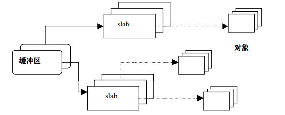
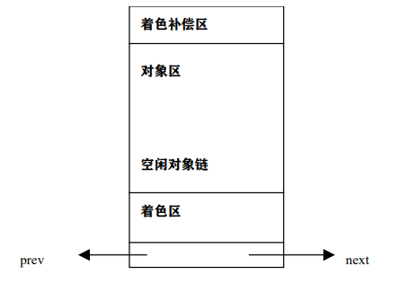
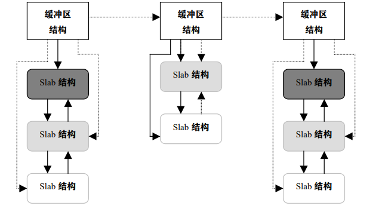
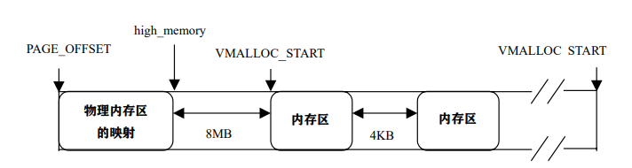

# 内存的分配和回收
内存进行初始化后，内存中就常驻有内核映像（内核代码和数据）。在这之后，内存需要随着用户程序的执行和结束不停地进行物理页面的分配和释放。这时，一种稳定、高效的分配策略就成了急需。为此，我们必须先解决由于频繁地请求和释放不同大小的连续页面而带来的外碎片问题。Linux采用了伙伴算法来解决外碎片问题。
需要注意的是，Linux中CPU不能按物理地址来访问存储空间，因此对于页面的管理一般是先分配虚拟内存，然后才为其分配物理内存并建立映射。

## 伙伴算法
### 原理
伙伴算法将所有的空闲页面分为10个块组，第n个组中存储大小为2^n个页面的块，比如第0组存储大小为1个页面的块、第1组存储大小为2个页面的块......也就是说，每一组中块的大小都相同，且同样大小的块形成一个链表。
当要求分配一定大小的块时，Linux先在块大小为相同大小的链表中查找，看是否有空闲块，如果有则直接分配；而如果没有，则去查找块大小大于该大小的链表中是否有空闲块，如果有则该块分为两等份（因为大小都为2的幂次方），一块分配出去，另一份插入到之前的链表中；如果也没有则再次查抄块大小更大的链表，并进行分配、插入操作；如果最大的链表（512个页面）也没有空闲块，则放弃分配，发出错误信号。
两个块若为伙伴，则满足以下条件：
* 两块大小相同。
* 两块物理地址连续。
### 数据结构
之前介绍的管理区数据结构struct zone_struct中涉及了空闲区的数据结构free_area_t free_area[MAX_ORDER]，其描述为：
```
#difine MAX_ORDER 10
type struct free_area_struct {
struct list_head free_list
unsigned int *map
} free_area_t
```
其中list_head是一个通用的双向链表，表中元素为mem_map_t（struct page结构）。map指向一个位图，大小取决于现有的页面数。free_area第k项位图的每一位描述的是大小为2^k^个页面两个伙伴块的状态：为0则表示一对兄弟块中两个都空闲或者两个都被分配；为1则表示肯定有一块被分配。当兄弟块都空闲时，内核将其看做大小为2^k+1^的块。其示意图如下：


其中，free_area数组的元素0包含了一个空闲页（页面编号为0）；元素2则包含两个大小为4个页面的空闲块，第一个块编号为4，第二个为56。

### 物理页面的分配和释放
一个进程请求分配连续的物理页面时，可以调用alloc_pages()。Linux2.4中有两个alloc_pages()，编译时会根据所定义的条件选项CONFIG_DISCONTIGMEM来决定。
CONFIG_DISCONTIGMEM条件编译的含义是“不连续的存储空间”，因此页面的分配可以分为非一致存储结构（NUMA）、一致存储结构（UMA）两类。
#### NUMA中的分配
alloc_page()函数在mm/numa.c中：
```
/* * This can be refined. Currently, tries to do round robin, instead
* should do concentratic circle search, starting from current node.
*/
struct page * _alloc_pages（unsigned int gfp_mask, unsigned int order）
{
struct page *ret = 0;
pg_data_t *start, *temp;
#ifndef CONFIG_NUMA unsigned long flags;
static pg_data_t *next = 0;
#endif
if（order >= MAX_ORDER）
return NULL;
#ifdef CONFIG_NUMA
temp = NODE_DATA（numa_node_id（））;
#else
spin_lock_irqsave（&node_lock, flags）;
if （!next） next = pgdat_list;
temp = next; next = next->node_next;
spin_unlock_irqrestore（&node_lock, flags）;
#endif
start = temp;
while （temp） {
if （（ret = alloc_pages_pgdat（temp, gfp_mask, order）））
return（ret）;
temp = temp->node_next;
}
temp = pgdat_list;
while （temp != start） {
if （（ret = alloc_pages_pgdat（temp, gfp_mask, order））） return（ret）;
temp = temp->node_next;
}
return（0）;
}
```
说明如下：
* gfp_mask表示采用哪种分配策略，order表示所需物理块的大小，可以是1~2^MAX_ORDER-1^。
* 如果定义了CONFIG_NUMA，也就是在NUMA结构的系统中，可通过NUMA_DATA()宏找到CPU所在节点的pg_data_t数据结构队列。
* 如果在不连续的UMA结构中，则有个队列pgdat_list，元素为pg_data_t，pgdat_list就是该队列的首部。
* 分配时轮流从各个节点开始。函数中有两个循环，分别对节点队列进行一次扫描，直至在某个节点内分配成功，则跳出循环，否则失败，返回0。对于每个节点，调用alloc_pages_pgdat()函数试图分配所需的页面。

#### UMA中的分配
alloc_page()函数位于include/linux/mm.h中。
该函数为封装函数，其核心为_alloc_pages()函数，定义于mm/page_alloc.c中，以下是描述：
_alloc_pages()在管理区链表zonelists中依次查找每个区，从中找到满足要求的区，然后用伙伴算法从该区中分配给定大小的页面块。如果没有足够的空闲页面，则调用swapper或bdflush内核线程，把脏页写到磁盘以释放页面。
对该函数的具体分析如下：
1.先进行所有页面管理区的循环，循环中依次考察各区中空闲页面的总量，如果总量大于“最低水位线”与所请求页面数之和，就调用rmqueue()试图进行分配。如果分配成功就返回page结构指针，指向页面块中第一个页面。

2.如果管理区空闲页面总量已降到最低点，则把zone_t结构中需要重新平衡的标志（need_balance）置1，如果内核线程kswapd在一个等待队列中睡眠，则唤醒它，让它收回一些页面以备用。

3.如果给定分配策略中所有页面管理区都分配失效，那就把最低点降低（除以4），然后看是否满足要求，如果满足就进行分配。

4.如果分配还不成功，就观察是哪类进程在请求分配内存页面。其中PF_MEMALLOC和PF_MEMDIE是进程的task_struct结构中flags域的值，对于正在分配页面的进程，则PF_MEMALLOC的值为1；对于使内存溢出而被杀死的进程，则PF_MEMDIE为1。两种情况都需要给进程分配页面，因此继续分配。

5.如果请求分配页面的进程不能等待也不能重新调度，就直接返回（以没有分配到页面的情况）。

6.到现在，如果进程还没分配到页面，就调用balance_classzone()函数把当前进程所占有的局部页面释放。如果释放成功就返回page结构指针，指向页面块中第一个页面的起始地址，然后继续分配。

#### 释放页面
页面块的分配会导致内存的碎片化，而页面块的释放则可以将页面块重新组合成大的页面块。释放函数为__free_pages(page struct *page, unsigned long order)，该函数从给定的页面开始，释放的页面块大小为2^order^：
```
void __free_pages（page struct *page, unsigned long order）
{
if （!PageReserved（page） && put_page_testzero（page））
__free_pages_ok（page, order）;
}
```
对该函数有以下描述：
* put_page_testzero()函数把页面的引用计数-1，如果-1之后为0则返回1。该函数的目的是检测调用者是不是该页面的最后一个用户，如果不是则不释放该页面。
* 如果是最后一个用户，则__free_pages()再调用__free_pages_ok()。把释放的页面块链入空闲链表，并对伙伴系统的位图进行管理，必要时合并伙伴块。

## Slab分配机制
伙伴算法每次至少分配一个页面，而当请求分配的内存小于一页时（几十字节或几百字节），就需要在一个页面中分配小的内存区。
Slab分配机制可以解决小内存区的分配问题。Slab引入了对象的概念，即存放一组数据结构的内存区，其方法就是构造或析构函数（构造函数用于初始化数据结构所在的内存区、析构函数用于收回相应的内存区）。Slab并不丢弃已分配的对象，而是释放并保存在内存中，这样能够避免重复初始化对象。
Linux对Slab分配机制进行了些许改进，Linux不调用构造和析构函数，而是把指向这两个函数的指针置空。Linux引入Slab的目的是减少对伙伴算法的调用次数。
实际上，内核经常反复使用某一内存区，因此可以通过对内存区的使用频率进行分类：对于频繁使用的内存区，创建特定大小专用缓冲区进行处理；对于较少使用的内存区，创建一组通用缓冲区进行处理。
Slab把对象分组放进缓冲区（指的是内存中的区域而不是Cache）。Slab缓冲区由一连串的“大块（Slab）”组成，而每个大块中包含若干个同种类型的对象。如图所示：



实际上，缓冲区就是主存中的一片区域，把这片区域划分为多个块，每块就是一个Slab，每个Slab由一个或多个页面组成，每个Slab中存放的就是对象。

### 数据结构
#### Slab
Slab是Slab管理模式中最基本的结构，由一组连续的物理页面组成，对象就被顺序放在这些页面中。其数据结构定义如下（位于mm/slab.c）：
```
/*
* slab_t
*
* Manages the objs in a slab. Placed either at the beginning of mem allocated
* for a slab, or allocated from an general cache.
* Slabs are chained into three list: fully used, partial, fully free slabs.
*/
typedef struct slab_s {
struct list_head list;
unsigned long colouroff;
void *s_mem;/* including colour offset */
unsigned int inuse; /* num of objs active in slab */
kmem_bufctl_t free;
} slab_t;
```
具体说明为：
* list为链表，用来将前一个Slab和后一个Slab链接起来形成双向链表。
* colouroff为该Slab上着色区的大小。
* 指针s_mem指向对象区的起点。
* Inuse是Slab中所分配对象的个数。
* free的值指明了空闲对象链中的第一个对象。

这里需要补充一点：对象分为两种，一种是大小小于512字节的小对象；另一种是大于512字节的大对象。对于小对象，就把Slab的描述结构slab_t放在该Slab中；对于大对象，则把Slab结构游离出来，集中存放。
每个Slab的首部都有一个叫“着色区”的区域。着色区的大小使Slab中的每一个对象的起始位置都按高速缓存中的“缓存行”大小进行对齐。因为Slab是由1个页面或多个页面组成的，因此每个Slab都从一个页面边界开始，其自然按高速缓存的缓冲行对齐。但是，Slab中对象大小不确定，设置着色区的目的是将Slab中第一个对象的起始地址往后推到与缓冲行对齐的位置。而一个缓冲区中有多个Slab，因此每个着色区的大小尽量不同，可以使得在不同Slab中，处于同一相对位置的对象，让他们在高速缓存中的起始地址相互错开，从而提高高速缓存的存取效率。Slab的结构图如下：



可以看到对象区最后还有一个“着色补偿区”，其大小取决于着色区的大小，以及Slab与每个对象的相对大小。

#### 缓冲区
每个缓冲区管理着一个Slab链表，Slab链表按序分为3组。第一组是全满的Slab，第二组Slab只有部分对象被分配，部分对象空闲，最后一组Slab的对象全部空闲。这样能对Slab进行有效的管理。每个缓冲区还有一个轮转锁，在对链表进行修改时就使用轮转锁进行同步。
类型kmem_cache_s在mm/slab.c中定义如下：
```
struct kmem_cache_s {
/* 1） each alloc & free */
/* full, partial first, then free */
struct list_head slabs_full;
struct list_head slabs_partial;
struct list_head slabs_free;
unsigned int objsize;
unsigned int flags;/* constant flags */
unsigned int num; /* # of objs per slab */
spinlock_t spinlock;
#ifdef CONFIG_SMP
unsigned int batchcount;
#endif
/* 2） slab additions /removals */
/* order of pgs per slab （2^n） */
unsigned int gfporder;
/* force GFP flags, e.g. GFP_DMA */
unsigned int gfpflags;
size_t colour; /* cache colouring range */
unsigned int colour_off; /* colour offset */
unsigned int colour_next; /* cache colouring */
kmem_cache_t *slabp_cache;
unsigned int growing;
unsigned int dflags; /* dynamic flags */
/* constructor func */
void （*ctor）（void *, kmem_cache_t *, unsigned long）;
/* de-constructor func */
void （*dtor）（void *, kmem_cache_t *, unsigned long）;
unsigned long failures;
/* 3）
cache creation/removal */
char name[CACHE_NAMELEN];
struct list_head next;
#ifdef CONFIG_SMP
/* 4） per-cpu data */
cpucache_t *cpudata[NR_CPUS];
#endif
…..
};
```
kmem_cache_t的定义为：
```
static kmem_cache_t cache_cache = {
slabs_full: LIST_HEAD_INIT（cache_cache.slabs_full）,
slabs_partial: LIST_HEAD_INIT（cache_cache.slabs_partial）,
slabs_free: LIST_HEAD_INIT（cache_cache.slabs_free）,
objsize: sizeof（kmem_cache_t）,
flags: SLAB_NO_REAP,
spinlock: SPIN_LOCK_UNLOCKED,
colour_off: L1_CACHE_BYTES,
name: "kmem_cache",
};
```
该结构中的slabs_full、slabs_partial、slabs_free分别指向满Slab、半满Slab和空闲Slab，另一个队列next则把所有的专用缓冲区链成一个链表。
其余部分的描述为：
* objsize是原始的数据结构的大小。
* num表示每个Slab上有几个缓冲区。
* gfporder表示每个Slab由2^gfporder^个页面组成。
* colour_off表示着色区的颜色的偏移量。
* colour表示颜色的数量。（取决于Slab中对象的个数、剩余空间以及高速缓存行的大小）。
* colour_next保存下一个Slab将要使用的颜色。

其中，着色区的大小可以根据colour_off*colour得到。
kmem_cache_t相当于slab的总控结构，缓冲区结构与Slab结构的关系如图：（其中，深灰表示全满Slab，浅灰表示半满，白色表示空闲）



### 专用缓冲区的建立和撤销
专用缓冲区通过kmem_cache_create()函数建立，原型为：
```
kmem_cache_t *kmem_cache_create（const char *name, size_t size, size_t offset, unsigned long c_flags,
void （*ctor） （void *objp, kmem_cache_t *cachep, unsigned long flags）,
void （*dtor） （void *objp, kmem_cache_t *cachep, unsigned long flags））
```
对其中的参数有以下描述：
* name：缓冲区名。
* size：对象大小。
* offset：着色偏移量。
* c_flags：对缓冲区的设置标志。
* ctor：构造函数（一般为NULL）。
* dtor：析构函数（一般为NULL）。
* objp：指向对象的指针。
* cachep：指向缓冲区。

建立的过程：
kmem_cache_create()经过一系列计算，确定最佳的Slab构成。（比如每个Slab由几个页面组成，划分为多少个对象）；并根据调用参数和计算结果设置kmem_cache_t结构中的各个域。最后将kmem_cache_t结构插入cache_cache的next队列。
但此时的缓冲区里没有Slab，当满足以下条件时，才给缓冲区分配Slab：

1.已发出一个分配新对象的请求。

2.缓冲区不包含任何空闲对象。

当从内核卸载一个模块时，同时需要撤销该模块数据结构的缓冲区。我们调用kmem_cache_destroy()函数完成。

### 通用缓冲区
内核中初始化开销不大的数据结构可以合用一个通用缓冲区。最小的为32，然后依次为64、128......直到128KB（32个页面）。从通用缓冲区中分配和释放缓冲区的函数为：
```
void *kmalloc（size_t size, int flags）;
Void kree（const void *objp）;
```
当一个数据结构使用不频繁、或大小不足一个页面时，调用kmallo()；当大小接近一个页面时，调用alloc_page()。

## 内核空间非连续内存区的管理
非连续内存处于3GB到4GB之间，即内核空间。内核地址区间图如下：



PAGE_OFFSET为3GB，high_memory为保存物理地址最高值的变量，VMALLOC_START为非连续区的起始地址。
在物理地址的末尾和第一个内存区之间插入了8MB的区间（即VMALLOC_OFFSET），目的是为了捕获对非连续区的非法访问。这样的区间在其他内存区之间也有设立。
### 非连续区的数据结构
数据结构为struct vm_struct：
```
struct vm_struct {
unsigned long flags;
void * addr;
unsigned long size;
struct vm_struct * next;
};
struct vm_struct * vmlist;
```
非连续区组成一个单链表，第一个元素存放在变量vmlist中。Addr域是内存区的起始地址；size是内存区的大小加4096（安全区的大小）。
### 创建非连续区的结构
用get_vm_area()函数创建新的非连续区结构，其代码在mm/vmalloc.c中，具体操作为在单链表中插入一个元素。分别调用kmalloc()（分配内存）和kfree()（释放所分配的内存）。
### 分配非连续内存区
vmalloc()给内核分配一个非连续的内存区，它是一个封装函数，最终调用__vmalloc()函数：
```
void * __vmalloc （unsigned long size, int gfp_mask, pgprot_t prot）
{
void * addr;
struct vm_struct *area;
size = PAGE_ALIGN（size）;
if （!size || （size >> PAGE_SHIFT） > num_physpages） {
BUG（）;
return NULL;
}
area = get_vm_area（size, VM_ALLOC）;
if （!area）
return NULL;
addr = area->addr;
if （vmalloc_area_pages（VMALLOC_VMADDR（addr）, size, gfp_mask, prot）） {
vfree（addr）;
return NULL;
}
return addr;
}
```
函数先把size参数取整为页面大小的倍数，然后进行检查，如果有大小合适的可用内存就调用get_vm_area()获得一个内存区的结构。函数vmalloc_area_pages()真正进行非连续内存区的分配：
```
inline int vmalloc_area_pages （unsigned long address, unsigned long size, int gfp_mask, pgprot_t prot）
{
pgd_t * dir;
unsigned long end = address + size; int ret;
dir = pgd_offset_k（address）;
spin_lock（&init_mm.page_table_lock）;
do { pmd_t *pmd; pmd = pmd_alloc（&init_mm, dir, address）;
ret = -ENOMEM;
if （!pmd）
break;
ret = -ENOMEM;
if （alloc_area_pmd（pmd, address, end - address, gfp_mask, prot））
break;
address = （address + PGDIR_SIZE） & PGDIR_MASK;
dir++; ret = 0;
} while （address && （address < end））;
spin_unlock（&init_mm.page_table_lock）;
return ret;
}
```
其中：
* address表示内存区的起始地址。
* size表示内存区大小。
* 内存区的末尾地址赋给end变量。
* pgd_offset_k()宏导出内存区起始地址在页目录中的目录项。
* pmd_alloc()为新的内存区创建一个中间页目录。
* alloc_area_pmd()为新的中间页目录分配所有相关的页表，并更新页的总目录。

需要注意的是，kmalloc()分配的内存处于3GB-high_memory之间，而vmalloc()分配的内存在VMALLOC_START-4GB之间（非连续内存区）。一般情况下，kmalloc()用来给数据结构分配内存，而vmalloc()用来为活动的交换区分配数据结构。因此这两个函数有所区别。
