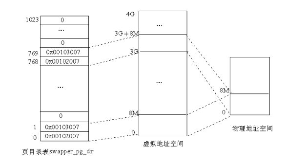
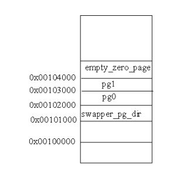

# Linux内存初始化
## 启用分页机制
1.关于Linux页表初步初始化的代码如下：
```
/*
* The page tables are initialized to only 8MB here - the final page
* tables are set up later depending on memory size.
*/
.org 0x2000
ENTRY(pg0)
.org 0x3000
ENTRY(pg1)
/*
* empty_zero_page must immediately follow the page tables ! (The
* initialization loop counts until empty_zero_page)
*/
.org 0x4000
ENTRY(empty_zero_page)
-------------------------------------------------------------------------------
/*
* Initialize page tables
*/
movl $pg0-__PAGE_OFFSET,%edi /* initialize page tables */
movl $007,%eax  /* "007" doesn't mean with right to kill, but
PRESENT+RW+USER */
2:  stosl
add $0x1000,%eax
cmp $empty_zero_page-__PAGE_OFFSET,%edi
jne 2b
```
首先我们需要知道Linux启动时首先会运行在实模式下，然后才转到保护模式下运行。该代码在执行时还没进入保护模式，因此指令寄存器EIP中的地址仍然为物理地址。然而，pg0中存放的是虚拟地址，因此需要减去偏移量——获得“$pg0-__PAGE_OFFSET”即为pg0的物理地址。根据代码可以看出，pg0存放在相对于内核代码起点0x2000的位置，因此pg0的实际物理地址为0x00102000。页表中的表项则依次设置为0x007、0x1007、0x2007等。内核共映射2K个页面，基地址分别为0x0、0x1000、0x2000等。因此Linux内核对物理内存的最低要求为8MB。然后会存放零页（即empty_zero_page），负责存放系统启动参数和命令行参数。
2.然后是启用分页机制的部分代码：
```
/*
* This is initialized to create an identity-mapping at 0-8M (for bootup
* purposes) and another mapping of the 0-8M area at virtual address
* PAGE_OFFSET.
*/
.org 0x1000
ENTRY(swapper_pg_dir)
.long 0x00102007
.long 0x00103007
.fill BOOT_USER_PGD_PTRS-2,4,0
/* default: 766 entries */
.long 0x00102007
.long 0x00103007
/* default: 254 entries */
.fill BOOT_KERNEL_PGD_PTRS-2,4,0
-------------------------------------------------------------------------------
/*
* Enable paging
*/
3:
movl $swapper_pg_dir-__PAGE_OFFSET,%eax
movl %eax,%cr3  /* set the page table pointer.. */
movl %cr0,%eax
orl $0x80000000,%eax
movl %eax,%cr0  /* ..and set paging (PG) bit */
jmp 1f  /* flush the prefetch-queue */
1:
movl $1f,%eax
jmp *%eax  /* make sure eip is relocated */
1:
```
该段代码的主要作用为：把页目录swapper_pg_dir的物理地址装入控制寄存器cr3中，并把cr0中的最高位置成1，从而开启分页机制。
然而，指令寄存器中的地址还是物理地址，不是虚地址。所以Linux内核还未真正进入保护模式。jmp 1f指令负责将指令流水线中的内容丢弃，然后mov和jmp指令会把第2个标号为1的地址装入EAX寄存器中并进行跳转。此时由于编译程序使得所有的符号地址都在虚拟内存空间中，因此第2个标号1的地址也为虚拟地址（PAGE_OFFSET+某处），这样，jmp指令执行过后，EIP就指向虚拟内核空间的某个地址，这就使CPU转入了内核空间，从而完成从实模式到保护模式的转换。
然后再看页目录swapper_pg_dir中的内容。pg0和pg1两个页表的起始物理地址分别为0x00102000和0x00103000。由于页目录项的最低12位用来描述页表的属性，因此，在swapper_pg_dir中的第0和第1个目录项0x00102007、0x00103007，就表示pg0和pg1这两个页表是用户页表、可写且页表的内容在内存。 接着，把swapper_pg_dir中的第2～767共766个目录项全部置为0（因为一个页表的大小为4KB，每个表项占4个字节，即每个页表含有1024个表项，每个页的大小也为4KB，因此这768个目录项所映射的虚拟空间为768×1024×4K＝3G，即swapper_pg_dir表中的前768个目录项映射的是用户空间。） 最后，在第768和769个目录项中又存放pg0和pg1这两个页表的地址和属性，而把第770～1023共254个目录项置 0（这256个目录项所映射的虚拟地址空间为256×1024×4K＝1G，也就是说swapper_pg_dir表中的后256个目录项映射的是内核空间。 ）由此可以看出，在初始的页目录swapper_pg_dir中，用户空间和内核空间都只映射了开头的两个目录项，即8MB的空间，而且有着相同的映射，如图所示。



3.然后是对物理内存的初始分布进行分析。
初始化阶段页目录以及几个页表在物理空间中的位置如图：



其中empty_zero_page为零页，在其中会存放操作系统的引导过程中所收集的一些数据（引导参数）。经过初始化完成后，系统转入正常运行时就可通过宏定义ZERO_PAGE来引用该页面。setup.c中定义了引用参数的宏：
```
/*
* This is set up by the setup-routine at boot-time
*/
#define PARAM （（unsigned char *）empty_zero_page）
#define SCREEN_INFO （*（struct screen_info *） （PARAM+0））
#define EXT_MEM_K （*（unsigned short *） （PARAM+2））
#define ALT_MEM_K （*（unsigned long *） （PARAM+0x1e0））
#define E820_MAP_NR （*（char*） （PARAM+E820NR））
#define E820_MAP （（struct e820entry *） （PARAM+E820MAP））
#define APM_BIOS_INFO （*（struct apm_bios_info *） （PARAM+0x40））
#define DRIVE_INFO （*（struct drive_info_struct *） （PARAM+0x80））
#define SYS_DESC_TABLE （*（struct sys_desc_table_struct*）（PARAM+0xa0））
#define MOUNT_ROOT_RDONLY （*（unsigned short *） （PARAM+0x1F2））
#define RAMDISK_FLAGS （*（unsigned short *） （PARAM+0x1F8））
#define ORIG_ROOT_DEV （*（unsigned short *） （PARAM+0x1FC））
#define AUX_DEVICE_INFO （*（unsigned char *） （PARAM+0x1FF））
#define LOADER_TYPE （*（unsigned char *） （PARAM+0x210））
#define KERNEL_START （*（unsigned long *） （PARAM+0x214））
#define INITRD_START （*（unsigned long *） （PARAM+0x218））
#define INITRD_SIZE （*（unsigned long *） （PARAM+0x21c））
#define COMMAND_LINE （（char *） （PARAM+2048））
#define COMMAND_LINE_SIZE 256
```
其中宏PARAM就是零页的起始位置。
初始化后，物理内存中内核映像的分布如图：


其中的_text对应物理地址0X00100000，表示内核代码的第一个字节地址。_etext对应内核代码的结束位置。在内核数据中，分为已初始化的数据和未初始化的数据，其中初始化的数据紧跟在_etext后，在_edata处结束；而未初始化的数据结束符为_end。表示整个内核映像的结束。
## 物理内存的探测
Linux系统通过内核本身进行资源的扫描探测，并根据获得的信息生成物理内存构成图，即e820图，然后通过参数块传给内核。这样，内核就知道系统的内存资源配置情况。
前面提到分页机制启用，在这之后与内存管理相关的操作就是调用init/main.c中的start_kernel()函数，而该函数需要调用setup_arch()函数（位于arch/i386/sernel/setup.c中），我们通过分析该函数来了解物理内存探测内容。
### setup_arch()函数
在分析之前，我们先列出代码中需要用到的一些宏定义：
```
#define PFN_UP（x） （（（x） + PAGE_SIZE-1） >> PAGE_SHIFT）
#define PFN_DOWN（x） （（x） >> PAGE_SHIFT）
#define PFN_PHYS（x） （（x） << PAGE_SHIFT）
#define VMALLOC_RESERVE （unsigned long）（128 << 20）
#define MAXMEM （unsigned long）（-PAGE_OFFSET-VMALLOC_RESERVE）
#define MAXMEM_PFN PFN_DOWN（MAXMEM）
#define MAX_NONPAE_PFN （1 << 20）
```
解释如下：
* PFN_UP：将地址x转换为页面号，并返回大于x的第一个页面号。
* PFN_DOWN：返回小于x的第1个页面号。
* PFN_PHYS：返回页面号x的物理地址。
* VMALLOC_RESERVE：vmalloc()函数访问内核空间所保留的内存区（128MB）。
* MAXMEM：内核能直接映射的最大RAM容量。
* MAXMEM_PFN：返回由内核能直接映射的最大物理页面数。
* MAX_NONPAE_PFN：给出在4GB之上第1个页面的页面号。当页面扩充（PAE）功能启用时才能访问4GB以上的内存。

1.首先该函数调用setup_memory_region()函数，处理内存构成图并把内存分布信息存放在全局变量e820中（详细描述见下文）。

2.然后调用parse_mem_cmdline(cmdline_p)函数，该函数用来分析命令行中的选择项，并据此对数据结构e820中的内容作出修正，其代码也在setup.c中。

3.然后获得内核映像之后的起始页面号：
```
start_pfn = PFN_UP（__pa（&_end））;
```
start_pfn存放着内核映像之后的页面号。

4.接着找出可用的最高页面号：
```
max_pfn = 0;
for （i = 0; i < e820.nr_map; i++） {
  unsigned long start, end;
  /* RAM? */
  if （e820.map[i].type != E820_RAM）
    continue;
  start = PFN_UP（e820.map[i].addr）;
  end = PFN_DOWN（e820.map[i].addr + e820.map[i].size）;
  if （start >= end）
    continue;
  if （end > max_pfn）
    max_pfn = end;
}
```
该部分代码循环查找类型为E820_RAM的内存区，并把最后一个页面的页面号存放在max_pfn中。

5.确定最高和最低内存的范围：
```
max_low_pfn = max_pfn;
if （max_low_pfn > MAXMEM_PFN） {
max_low_pfn = MAXMEM_PFN;
#ifndef CONFIG_HIGHMEM
/* Maximum memory usable is what is directly addressable */
printk（KERN_WARNING "Warning only %ldMB will be used.\n", MAXMEM>>20）;
  if （max_pfn > MAX_NONPAE_PFN）
    printk（KERN_WARNING "Use a PAE enabled kernel.\n"）;
  else
    printk（KERN_WARNING "Use a HIGHMEM enabled kernel.\n"）;
#else /* !CONFIG_HIGHMEM */
#ifndef CONFIG_X86_PAE
  if （max_pfn > MAX_NONPAE_PFN） {
    max_pfn = MAX_NONPAE_PFN;
    printk（KERN_WARNING "Warning only 4GB will be used.\n"）;
    printk（KERN_WARNING "Use a PAE enabled kernel.\n"）;
}
#endif /* !CONFIG_X86_PAE */
#endif /* !CONFIG_HIGHMEM */
}
```
该代码用来检查系统物理内存大小的情况，根据内存情况不同做出不同操作：
如果物理内存RAM大于896MB，小于4GB，则选用CONFIG_HIGHMEM选项来访问；
如果大于4GB，则选用CONFIG_X86_OAE。

6.调用init_bootmem()函数，为物理内存页面管理机制的建立做初步准备。
```
bootmap_size = init_bootmem（start_pfn, max_low_pfn）;
```
为整个物理内存建立起一个页面位图。该位图从start_pfn开始，即将_end（内核映像的结束位置）上方的若干页面用作物理页面位图。建立该位图，目的是统计物理内存中哪些页面可以动态分配。
bootmem分配器负责登记全部低区（0~896MB）的可用RAM页面，并调用free_bootmem()函数将所有可用的RAM都标记为可用。
```
reserve_bootmem（HIGH_MEMORY, （PFN_PHYS（start_pfn） + bootmap_size + PAGE_SIZE-1） - （HIGH_MEMORY））;
```
该函数将内核和bootmem位图所占的内存标记为“保留”。

7.初始化分页机制
```
paging_init（）;
```
该函数初始化分页内存管理所需的数据结构。
### setup_memory_region()函数
该函数用来处理BIOS的内存构成图，并将图拷贝到全局变量e920中。若失败则创建一个伪内存构成图。

1.调用sanitize_e820_map()函数，以删除内存构成图中任何重叠的部分，因为BIOS所报告的内存构成图可能有重叠。

2.调用copy_e820_map()进行实际的拷贝。

3.如果操作失败，创建一个伪内存构成图，这个伪构成图有两部分：0到640K及1M到最大物理内存。

4.打印最终的内存构成图。
### copy_e820_map()函数
该函数为将内存构成图拷贝到e820中。它每次从BIOS构成图中取出一项进行检查。对于BIOS把640KB~1MB之间的区间作为RAM使用的情况，该函数需要进行修正，将涉及该位置的区间拆开成两个区间，中间跳过该部分。
### add_memory_region()函数
该函数功能为在e820中增加一项。操作流程为：

1.先获取e820中现有的内存区数。

2.如果区数已经达到最大（32），则报错。

3.如果未达到最大，则增加1项。
### print_memory_map()函数
该函数负责把内存构成图输出在控制台中。
## 物理内存的描述
### 一致存储结构（UMA）和非一致存储结构（NUMA）
一致存储结构（Uniform Memory Architecture）是指计算机结构中整个物理内存都是均匀一致的，CPU访问各个空间所需要的时间都相同。这也是传统的计算机所选的结构。
然而，在一些新的系统结构中，这种一致性反而会造成一定的问题。以多CPU结构为例，系统中有一条总线，多个CPU模块连接在系统总线上，这样每个CPU就能在拥有本地物理内存的基础上通过总线访问其他CPU的内存。这时，对于某个CPU而言，访问其本地的内存速度是最快的，而访问其他内存就会相对较慢，而且还面临因可能的竞争而引起的不确定性。这就导致存取速度不一致，所以为“非一致存储结构”。
Linux内核提供了对NUMA的支持。为了对其进行描述，Linux引入了“存储节点”的概念，即访问时间相同的存储空间。一般情况下，把连续的物理页面分配在相同的存储节点上，如果遇到需要分配的页面数大于存储空间的情况，则把页面全部分配在公用模块上。
Linux把物理内存划分为3个层次来管理
* 页面（Page）
* 管理区（Zone）
* 存储节点（Node）

我们分别对以上层次进行说明
### 页面（Page）
通过对/include/linux/mm.h部分代码的分析，我们将物理页面的描述展示如下：
```
typedef struct page {
  struct list_head list; /* ->mapping has some page lists. */
  struct address_space *mapping; /* The inode （or ...） we belong to. */
  unsigned long index; /* Our offset within mapping. */
  struct page *next_hash; /* Next page sharing our hash bucket in the pagecache hash table. */
  atomic_t count; /* Usage count, see below. */
  unsigned long flags; /* atomic flags, some possibly updated asynchronously */
  struct list_head lru; /* Pageout list, eg. active_list; protected by pagemap_lru_lock !! */
  wait_queue_head_t wait; /* Page locked? Stand in line... */
  struct page **pprev_hash; /* Complement to *next_hash. */
  struct buffer_head * buffers; /* Buffer maps us to a disk block. */
  void *virtual; /* Kernel virtual address （NULL if not kmapped, ie. highmem） */
  struct zone_struct *zone; /* Memory zone we are in. */
} mem_map_t;
extern mem_map_t * mem_map；
```
以下是一些说明：
* 如果页面的数据来自一个文件，则index代表该页面中数据在文件中的偏移量；当页面的内容被换出到交换设备时，则index表示页面的去向。
* 结构尽量把联系紧密的若干域存放在一起，因为这些域被放在同一缓冲行时几乎可以同时存取。
* 每个物理页面都有一个mem_map_t结构。系统在初始化阶段根据内存大小建立一个该结构的数组mem_map，下标就是内存中物理页面的序号。

### 管理区（Zone）
管理区又分为3个区：
* 供DMA使用的ZONE_DMA区（小于16MB）
* ZONE_NORMAL区（大于16MB小于896MB）
* 内核不能直接映射的区ZONE_HIGME区（大于896MB）

之所以为DMA单独设置管理区，有以下原因
* DMA使用的页面是磁盘I/O所需的，如果将该部分的页面分配出去，则页面及盘区的交换就会无法进行。
* 部分CPU不提供单独的MMU作为页式存储管理的硬件支持，而是直接在CPU内部实现，所以DMA对内存的访问不经过MMU提供的地址映射。这样外部设备就能直接访问物理页面的地址。而有些外设要求用于DMA的物理地址不能过高。
* DMA控制器不能依靠MMU将连续的虚拟存储页面映射到物理上也连续的页面上，而DMA所需的缓冲区超过一个物理页面大小时必须要求两个物理页面在物理上连续。因此，用于DMA的物理页面必须单独管理。

### 存储节点（Node）
查询Include/linux/mmzone.h中的代码可知，存储节点的定义为：
```
typedef struct pglist_data {
  zone_t node_zones[MAX_NR_ZONES];
  zonelist_t node_zonelists[GFP_ZONEMASK+1];
  int nr_zones;
  struct page *node_mem_map;
  unsigned long *valid_addr_bitmap;
  struct bootmem_data *bdata;
  unsigned long node_start_paddr;
  unsigned long node_start_mapnr;
  unsigned long node_size;
  int node_id;
  struct pglist_data *node_next;
} pg_data_t;
```
node_next指针指向下一个pglist_data数据结构，因此可以通过链表的形式存储。每个结构中的node_mem_map指向具体节点的page结构数组，而node_zone[]为该节点的管理区。
其中的node_zonelists数组定义如下：
```
typedef struct zonelist_struct {
  zone_t *zone[MAX_NR_ZONE+1]; //NULL delimited
  Int gfp_mast;
} zonelist_t
```
zone[]数组中每个元素按照次序指向具体的页面管理区，表示分配页面时先试zone[0]所指向的管理区，如果不满足就转向zone[1]。
## 页面管理机制的初步建立
bootmem分配器用于在系统引导时为整个物理内存建立一个页面位图,用来统计哪些物理页面可以动态分配。以此为页面管理机制作出初步准备，位图的数据结构为：
```
typedef struct bootmem_data {
  unsigned long node_boot_start;
  unsigned long node_low_pfn;
  void *node_bootmem_map;
  unsigned long last_offset;
  unsigned long last_pos;
} bootmem_data_t;
```
以上代码位于mm/numa.c，以下是对代码的说明：
* node_boot_start：表示存放bootmem位图的第一个页面（即内核映像结束处的第一个页面）。
* node_low_pfn：物理内存的顶点，最高不超过896MB。
* node_bootmem_map：指向bootmem位图。
* last_offset：存放在前一次分配中分配的最后一个字节相当于last_pos的位移量。
* last_pos：前一次分配的最后一个页面的页面号。

除定义之外，mm/bootmeme.c中还有一些与bootmem相关的函数，在此一并列出。
### init_bootmem()函数
该函数在初始化建立bootmem分配器时使用。
```
unsigned long __init init_bootmem （unsigned long start, unsigned long pages）
{
  max_low_pfn = pages;
  min_low_pfn = start;
  return（init_bootmem_core（&contig_page_data, start, 0, pages））;
}
```
可以看出，该函数实际上是init_bootmem_core()函数的封装函数。其中start表示内核映像结束处的页面号，pages表示物理内存顶点所在的页面号。而函数init_bootmem_core()就是对contig_page_data变量进行初始化。
contig_page_data变量的定义如下：
```
int numnodes = 1; /* Initialized for UMA platforms */
static bootmem_data_t contig_bootmem_data;
pg_data_t contig_page_data = { bdata: &contig_bootmem_data };
```
### init_bootmem_core()函数
```
static unsigned long __init init_bootmem_core （pg_data_t *pgdat, unsigned long mapstart, unsigned long start, unsigned long end）
{
  bootmem_data_t *bdata = pgdat->bdata;
  unsigned long mapsize = （（end - start）+7）/8;
  pgdat->node_next = pgdat_list;
  pgdat_list = pgdat;
  mapsize = （mapsize + （sizeof（long） - 1UL）） & ~（sizeof（long） - 1UL）;
  bdata->node_bootmem_map = phys_to_virt（mapstart << PAGE_SHIFT）;
  bdata->node_boot_start = （start << PAGE_SHIFT）;
  bdata->node_low_pfn = end;
  /*
  * Initially all pages are reserved - setup_arch（） has to
  * register free RAM areas explicitly.
  */
  memset（bdata->node_bootmem_map, 0xff, mapsize）;
  return mapsize;
}
```
* mapsize存放位图的大小。end-start给出现有的页面数，而+7是为了向上取整，除以8获得所需的字节数（每个字节映射8个页面）。
* pgdat_list用来指向节点所形成的循环链表首部。
* mapsize = （mapsize + （sizeof（long） - 1UL）） & ~（sizeof（long） - 1UL）使得mapsize成为下一个4的倍数。
* phys_to_virt(mapstart<<PAGE_SHIFT)把给定的物理地址转换为虚地址。
* 用节点的起始物理地址初始化node_boot_start。
* 用物理内存节点的页面号初始化node_low_pfn。
* 初始化所有被保留的页面，即把页面中所有位都置为1。
* 返回位图的大小。

### free_bootmem()函数
该函数负责将给定范围的页面标记为空闲（也就是把位图中某些位清0），表示相应的物理内存可以投入分配。
该函数为封装函数，实际工作由free_bootmem_core()函数完成。
### free_bootmem_core()函数
```
static void __init free_bootmem_core（bootmem_data_t *bdata, unsigned long addr, unsigned long size）
{
  unsigned long i;
  unsigned long start;
  /*
  * round down end of usable mem, partially free pages are
  * considered reserved.
  */
  unsigned long sidx;
  unsigned long eidx = （addr + size - bdata->node_boot_start）/PAGE_SIZE;
  unsigned long end = （addr + size）/PAGE_SIZE;
  if （!size） BUG（）;
  if （end > bdata->node_low_pfn） BUG（）;
  /*
  * Round up the beginning of the address.
  */
  start = （addr + PAGE_SIZE-1） / PAGE_SIZE;
  sidx = start - （bdata->node_boot_start/PAGE_SIZE）;
  for （i = sidx; i < eidx; i++） {
    if （!test_and_clear_bit（i, bdata->node_bootmem_map））
      BUG（）;
  }
}
```
* eidx被初始化为页面总数。
* end被初始化为最后一个页面的页面号。
* 进行两个可能的条件检查。
* start初始化为第一个页面的页面号，sidx初始化为相当于node_boot_start的页面号
* 将位图中从sidx到eidx的所有位都标记为可用。

### reserve_bootmem()函数
该函数用来保留页面。即在bootmem位图中把该页面相应位置为1。
该函数为封装函数。
### reserve_bootmem_core()函数
主要功能为将位图中从sidx到eidx的所有位置1。
其中：
* sidx初始化为相当于node_boot_start的页面号。
* eidx初始化为页面总数（向上取整）。

### __alloc_bootmem()函数
该函数以循环轮转的方式从不同节点分配页面。
该函数为封装函数。
### __alloc_bootmem_core()函数
* 首先，将eidx初始化为本节点中现有页面的总数，并进行条件检查。
* 然后进行首选页的计算：
```
/*
* We try to allocate bootmem pages above 'goal'
* first, then we try to allocate lower pages.
*/
if （goal && （goal >= bdata->node_boot_start） && （（goal >> PAGE_SHIFT） < bdata->node_low_pfn）） {
preferred = goal - bdata->node_boot_start;
} else
preferred = 0;
preferred = （（preferred + align - 1） & ~（align - 1）） >> PAGE_SHIFT;
```
1.如果goal为非0且有效，则给preferred赋初值，否则给preferred赋值为0。

2.根据align对齐preferred的物理地址。然后获得所需页面的总数areasize（向上取整），根据对齐的大小选择增加值incr（对齐的大小小于4KB时，增加值为1）。

然后通过循环从首选页面号开始，找到空闲页面号：
```
restart_scan:
  for （i = preferred; i < eidx; i += incr） {
  unsigned long j;
    if （test_bit（i, bdata->node_bootmem_map））
      continue;
```
查看首次满足内存需求后，是否还有足够的空闲页面：
```
for （j = i + 1; j < i + areasize; ++j） {
  if （j >= eidx）
    goto fail_block;
  if （test_bit （j, bdata->node_bootmem_map））
    goto fail_block;
}
```
如果首选页面中没有满足需要的连续页面（即进入了fail_block），那么就忽略preferred的值（置0），从0开始扫描，而如果preferred为1但没有满足的足够页面，则返回NULL，具体代码如下：
```
fail_block:;
}
if （preferred） {
  preferred = 0;
  goto restart_scan;
}
return NULL;
```
接着进行条件检查：
```
/*
* Is the next page of the previous allocation-end the start
* of this allocation's buffer? If yes then we can 'merge'
* the previous partial page with this allocation.
*/
if （align <= PAGE_SIZE && bdata->last_offset && bdata->last_pos+1 == start） {
  offset = （bdata->last_offset+align-1） & ~（align-1）;
  if （offset > PAGE_SIZE）
    BUG（）;
  remaining_size = PAGE_SIZE-offset;
```
本次检查主要检查：
* 所请求对齐的值小于页的大小（4KB）。
* 变量last_offset为非0。
* 检查这次请求的内存是否与前一次相邻，如果是则将两次分配合并进行。

如果3个条件都满足，则使用前一次分配中最后一页剩余的空间初始化remaining_size。
如果请求内存的大小没有超过前一次分配中最后一页的剩余空间的大小，则不用分配新的页。只需增加last_offset到新的偏移量，而last_pos不变。然后把新分配的起始地址存放在变量ret中。
而如果请求的大小大于剩余空间，则需要先求出所需页面数，然后更改last_pos和last_offset。
### free_all_bootmem()函数
该函数用来引导时释放页面，并清除bootmem分配器。
该函数为封装函数。
### free_all_bootmem_core()函数
首先，将idx初始化为从内核映像结束处到内存顶点处的页面数：
```
struct page *page = pgdat->node_mem_map;
bootmem_data_t *bdata = pgdat->bdata;
unsigned long i, count, total = 0;
unsigned long idx;
if （!bdata->node_bootmem_map） BUG（）;
count = 0;
idx = bdata->node_low_pfn - （bdata->node_boot_start >> PAGE_SHIFT）;
```
然后搜索bootmem位图，找到空闲页，并把mem_map中对应的项标记为空闲。其中，set_page_count()函数把page结构的count域置1，而__free_page()函数则真正释放页面：
```
for （i = 0; i < idx; i++, page++） {
  if （!test_bit（i, bdata->node_bootmem_map）） {
    count++;
    ClearPageReserved（page）;
    set_page_count（page, 1）;
    __free_page（page）;
  }
}
```
然后，获得bootmem位图的地址，并释放它所在的页面：
```
total += count;
/*
* Now free the allocator bitmap itself, it's not
* needed anymore:
*/
page = virt_to_page（bdata->node_bootmem_map）;
count = 0;
for （i = 0; i < （（bdata->node_low_pfn-（bdata->node_boot_start >> PAGE_SHIFT））/8 + PAGE_SIZE-1）/PAGE_SIZE; i++,page++） {
  count++;
  ClearPageReserved（page）;
  set_page_count（page, 1）;
  __free_page（page）;
}
```
最后把该存储节点的bootmem_map域置为NULL，并返回空闲页面的总数。
## 页表的建立
通过前面对内存页面管理所需的数据结构的建立，现在可以进一步完善页面映射机制，并建立起内存页面映射管理机制。
与页表建立有关的函数主要有：
* paging_init()函数
* pagetable_init()函数

### paging_init()函数
由前文可知，该函数被setup_arch()所调用，对此函数的描述如下：
首先调用pagetable_init()函数，该函数才真正建立页表，具体描述见后文。
然后将swapper_pg_dir（页目录）的地址装入CR3寄存器：
```
__asm__（ "movl %%ecx,%%cr3\n" ::"c"（__pa（swapper_pg_dir）））;
```
通过宏定义，__flush_tlb_all（）使转换旁路缓冲区（TLB）无效。TLB或称为页表缓冲，里面存放一些页表文件（虚拟地址到物理地址的转换表），每当页目录改变时，就需要刷新TLB：
```
#if CONFIG_X86_PAE
/*
* We will bail out later - printk doesnt work right now so
* the user would just see a hanging kernel.
*/
if （cpu_has_pae）
  set_in_cr4（X86_CR4_PAE）;
#endif
__flush_tlb_all（）;
```
注意，如果使用了CONFIG_HIGHMEM选项，就要对大于896MB的内存进行初始化。
然后计算3个管理区的大小，并存放在zones_size数组中。
* ZONE_DMA：从0~16MB分配。
* ZONE_NORMAL：从16MB~896MB分配。
* ZONE_HIGHMEM：从896MB以上分配。

最后，调用free_area_init()函数初始化内存管理区并创建内存映射表：
```
{
  unsigned long zones_size[MAX_NR_ZONES] = {0, 0, 0};
  unsigned int max_dma, high, low;
  max_dma = virt_to_phys（（char *）MAX_DMA_ADDRESS） >> PAGE_SHIFT;
  low = max_low_pfn;
  high = highend_pfn;
if （low < max_dma)
  zones_size[ZONE_DMA] = low;
else {
  zones_size[ZONE_DMA] = max_dma;
  zones_size[ZONE_NORMAL] = low - max_dma;
#ifdef CONFIG_HIGHMEM
  zones_size[ZONE_HIGHMEM] = high - low;
#endif
}
free_area_init（zones_size）;
}
return;
```
### pagetable_init()函数
该函数负责在页目录swapper_pg_dir中建立页表，具体描述如下：
首先计算max_low_pfn（物理内存顶点所在的页面号）的虚拟地址，并存放在end中：
```
unsigned long vaddr, end;
pgd_t *pgd, *pgd_base;
int i, j, k;
pmd_t *pmd;
pte_t *pte, *pte_base;
/*
* This can be zero as well - no problem, in that case we exit
* the loops anyway due to the PTRS_PER_* conditions.
*/
end = （unsigned long）__va（max_low_pfn*PAGE_SIZE）;
```
然后让pgd_base（页目录基地址）指向swapper_pg_dir：
```
pgd_base = swapper_pg_dir;
```
如果PAE（页面扩充）被激活，PTRS_PER_PGD就为4，且变量swapper_pg_dir用作页目录指针表：
```
#if CONFIG_X86_PAE
for （i = 0; i < PTRS_PER_PGD; i++）
  set_pgd（pgd_base + i, __pgd（1 + __pa（empty_zero_page）））;
#endif
```
其中，宏set_pgd()定义于include/asm-i386/pgtable-3level.h中。
宏__pgd_offset()在给定地址的页目录中检索相应的下标。因此__pgd_offset(PAGE_OFFSET)返回内核地址空间开始处的下标（即0x300），因此pgd指向页表目录第768项：
```
i = __pgd_offset（PAGE_OFFSET）;
pgd = pgd_base + i;
```
然后，计算虚地址vaddr，并检查它是否到了虚拟空间的顶部：
```
for （; i < PTRS_PER_PGD; pgd++, i++） {
  vaddr = i*PGDIR_SIZE;
  if （end && （vaddr >= end））
  break;
```
其中：
* PTRS_PER_PGD：一般情况下为页目录的项数（即1024），而使用了CONFIG_X86_PAE后则为4。
* PGDIR_SIZE：一个单独的页目录所能映射的RAM总量，在两级页目录中为4MB，使用CONFIG_X86_PAE时为1GB。

如果使用了CONFIG_X86_PAE选项，则分配一页（4KB）的内存给bootmem分配器使用，以保存中间页目录，并在总目录中设置它的地址。否则，没有中间页目录，就把中间页目录直接映射到总目录：
```
#if CONFIG_X86_PAE
  pmd = （pmd_t *） alloc_bootmem_low_pages（PAGE_SIZE）;
  set_pgd（pgd, __pgd（__pa（pmd） + 0x1））;
#else
  pmd = （pmd_t *）pgd;
#endif
```
然后开始填充页目录（如果有PAE，就填充中间页目录）。计算表项映射的虚地址，如果没有PAE，则PMD_SIZE为0，vaddr=i*4MB。接下来需要检查PSE是否可用，如果可用就直接使用4MB的页而不是页表。宏cpu_has_pse()用来检查处理器是否有扩展页，如果有就用宏set_in_cr4()启用：
```
if （pmd != pmd_offset（pgd, 0））
BUG（）;
for （j = 0; j < PTRS_PER_PMD; pmd++, j++） {
vaddr = i*PGDIR_SIZE + j*PMD_SIZE;
if （end && （vaddr >= end））
break;
if （cpu_has_pse） {
unsigned long __pe;
set_in_cr4（X86_CR4_PSE）;
boot_cpu_data.wp_works_ok = 1;
__pe = _KERNPG_TABLE + _PAGE_PSE + __pa（vaddr）;
/* Make it "global" too if supported */
if （cpu_has_pge） {
set_in_cr4（X86_CR4_PGE）;
__pe += _PAGE_GLOBAL;
}
set_pmd（pmd, __pmd（__pe））;
continue;
}
```
而如果没有PSE，就执行：
```
pte_base = pte = （pte_t *）
alloc_bootmem_low_pages（PAGE_SIZE）;
```
它为一个页表（4KB）分配空间。
一个页表中有1024个表项（如果启用PAE就是512个），每个表项映射4KB（1页）。
前面求出了每个页表项的虚地址vaddr，现在通过__pa(vaddr)求出其物理地址，再通过宏mk_pte_phys(__pa（vaddr）, PAGE_KERNEL)创建页表项，PAGE_KERNEL表示只有在内核态才能访问该页表项。
然后通过set_pmd()把该页表追加到中间页目录中。该过程会一直持续，直到所有的物理内存都映射到从PAGE_OFFSET开始的虚拟地址空间。

## 内存管理区
已知物理内存被划分为3个区进行管理，分别是ZONE_DMA、ZONE_NOMAL和ZONE_HIGHMEM。每个区都用struct zone_struct结构表示，定义于include/linux/mmzone.h内，具体代码为：
```
typedef struct zone_struct {
/*
* Commonly accessed fields:
*/
  spinlock_t lock;
  unsigned long free_pages;
  unsigned long pages_min, pages_low, pages_high;
  int need_balance;
/*
* free areas of different sizes
*/
  free_area_t free_area[MAX_ORDER];
/*
* Discontig memory support fields.
*/
  struct pglist_data *zone_pgdat;
  struct page *zone_mem_map;
  unsigned long zone_start_paddr;
  unsigned long zone_start_mapnr;
/*
* rarely used fields:
*/
  char *name;
  unsigned long size;
} zone_t;
#define ZONE_DMA 0
#define ZONE_NORMAL 1
#define ZONE_HIGHMEM 2
#define MAX_NR_ZONES 3
```
其中的每个域定义如下：
* lock：用来保证对该结构中其他域的串行访问。
* free_pages：该区现有空闲页的个数。
* pages_min、pages_low、pages_high：对该区最少、次少、最多页面个数的描述。
* need_balance：与kswapd合并使用。
* free_area：在伙伴分配系统中的位图数组和页面链表。
* zone_pgdat：本管理区所在的存储节点。
* zone_mem_map：该管理区的内存映射表。
* zone_start_paddr：该管理区的起始物理地址。
* zone_start_mapnr：在mem_map中的索引。
* name：管理区名字。
* size：管理区物理内存总大小。
* free_area_t：一组“空闲区间”链表。

其中，free_area_t定义为：
```
#difine MAX_ORDER 10
  type struct free_area_struct {
    struct list_head free_list
      unsigned int *map
} free_area_t
```
之所以为“一组”，是因为常常需要成块地在物理空间分配连续的多个页面，这样就得按块的大小分别加以管理。
内存中每个物理页面都有一个struct page结构，该结构的代码前文已经给出，但为了方便描述，再次给出：
```
typedef struct page {
  struct list_head list; 
  struct address_space *mapping; 
  unsigned long index; 
  struct page *next_hash;
  atomic_t count; 
  unsigned long flags; 
  struct list_head lru; 
  wait_queue_head_t wait; 
  struct page **pprev_hash; 
  struct buffer_head * buffers; 
  void *virtual; 
  struct zone_struct *zone; 
} mem_map_t;
```

其中
* list：指向链表下一页。
* mapping：指定正在映射的索引节点（inode）。
* index：在映射表中的偏移。
* next_hash：指向页高速缓存哈希表中下一个共享的页。
* count：引用该页的个数。
* flags：页面各种不同的属性。
* Iru：用在active_list中。
* wait：等待这一页的页队列。
* pprev_hash：与next_hash对应。
* buffers：把缓冲区映射到一个磁盘块。
* zone：页所在的内存管理区。

与内存管理区相关的3个主要函数为：
* free_area_init()函数
* build_zonelists()函数
* mem_init()函数

下文将逐一描述。
### free_area_init()函数
该函数用来初始化内存管理区并建立内存映射表，定义于mm/page_alloc.c中。
该函数为封装函数，真正实现为free_area_init_core()函数。
该函数具体描述为：
1.检查该管理区的起始地址是否是一个页的边界:
```
struct page *p;
unsigned long i, j;
unsigned long map_size;
unsigned long totalpages, offset, realtotalpages;
const unsigned long zone_required_alignment = 1UL << （MAX_ORDER-1）;
if （zone_start_paddr & ~PAGE_MASK）
BUG（）;
```
2.计算本存储节点中页面的个数：
```
totalpages = 0;
for （i = 0; i < MAX_NR_ZONES; i++） {
unsigned long size = zones_size[i];
totalpages += size;
}
```
3.打印除空洞外的实际页面数：
```
realtotalpages = totalpages;
if （zholes_size）
for （i = 0; i < MAX_NR_ZONES; i++）
realtotalpages -= zholes_size[i];
printk（"On node %d totalpages: %lu\n", nid, realtotalpages）;
```
4.初始化循环链表：
```
INIT_LIST_HEAD（&active_list）;
INIT_LIST_HEAD（&inactive_list）;
```
5.给局部内存（即本节点中的内存）映射分配空间，并在sizeof(mem_map_t)边界上对齐它：
```
/*
* Some architectures （with lots of mem and discontinous memory * maps） have to search for a good mem_map area:
* For discontigmem, the conceptual mem map array starts from
* PAGE_OFFSET, we need to align the actual array onto a mem map
* boundary, so that MAP_NR works.
*/
map_size = （totalpages + 1）*sizeof（struct page）;
if （lmem_map == （struct page *）0） {
lmem_map = （struct page *）
alloc_bootmem_node（pgdat, map_size）;
lmem_map = （struct page *）（PAGE_OFFSET + MAP_ALIGN（（unsigned long）lmem_map - PAGE_OFFSET））;
}
```
6.初始化本节点的域：
```
*gmap = pgdat->node_mem_map = lmem_map;
pgdat->node_size = totalpages;
pgdat->node_start_paddr = zone_start_paddr;
pgdat->node_start_mapnr = （lmem_map - mem_map）;
pgdat->nr_zones = 0;
```
7.检查所有的页，先把页的使用计数（count）置0；然后把页标记为保留；然后初始化该页的等待队列；最后初始化链表指针：
```
/*
* Initially all pages are reserved - free ones are freed
* up by free_all_bootmem（） once the early boot process is
* done.
*/
for （p = lmem_map; p < lmem_map + totalpages; p++） {
set_page_count（p, 0）;
SetPageReserved（p）;
init_waitqueue_head（&p->wait）; 
memlist_init（&p->list）;
}
```
8.变量mem_map是类型为struct pages的全局稀疏矩阵。mem_map下标的起始值取决于第一个节点的第一个管理区。如果第一个管理区的起始地址为0，则下标就从0开始，并且与物理页面号相对应，也就是说，页面号就是mem_map的下标。每一个管理区都有自己的映射 表，存放在zone_mem_map中，每个管理区又被映射到它所在的节点node_mem_map中，而每个节点又被映射到管理全局内存的mem_map中。因此：
```
offset = lmem_map - mem_map;
```
offset表示该节点放的内存映射表在全局mem_map中的入口点（下标）。在这里offset为0（i386上只有一个节点）。

9.然后对zone的域进行初始化：
```
for （j = 0; j < MAX_NR_ZONES; j++） {
zone_t *zone = pgdat->node_zones + j;
unsigned long mask;
unsigned long size, realsize;
realsize = size = zones_size[j];
if （zholes_size）
realsize -= zholes_size[j];
printk（"zone（%lu）: %lu pages.\n", j, size）;
zone->size = size;
zone->name = zone_names[j];
zone->lock = SPIN_LOCK_UNLOCKED;
zone->zone_pgdat = pgdat;
zone->free_pages = 0;
zone->need_balance = 0;
if （!size）
continue;
pgdat->nr_zones = j+1;
mask = （realsize / zone_balance_ratio[j]）;
if （mask < zone_balance_min[j]）
mask = zone_balance_min[j];
else if （mask > zone_balance_max[j]）
mask = zone_balance_max[j];
zone->pages_min = mask;
zone->pages_low = mask*2;
zone->pages_high = mask*3;
zone->zone_mem_map = mem_map + offset;
zone->zone_start_mapnr = offset;
zone->zone_start_paddr = zone_start_paddr;
if （（zone_start_paddr >> PAGE_SHIFT） & （zone_required_alignment-1））
printk（"BUG: wrong zone alignment, it will crash\n"）;
for （i = 0; i < size; i++） {
struct page *page = mem_map + offset + i;
page->zone = zone;
if （j != ZONE_HIGHMEM）
page->virtual = __va（zone_start_paddr）;
zone_start_paddr += PAGE_SIZE;
}
offset += size;
for （i = 0; ; i++） {
unsigned long bitmap_size;
memlist_init（&zone->free_area[i].free_list）;
if （i == MAX_ORDER-1） {
zone->free_area[i].map = NULL;
break;
}
bitmap_size = （size-1） >> （i+4）;
bitmap_size = LONG_ALIGN（bitmap_size+1）;
zone->free_area[i].map = （unsigned long *） alloc_bootmem_node（pgdat, bitmap_size）;
}
}
```
该段代码的流程为：
* 由于管理区的实际数据存储在节点中，因此让指针指向正确的管理区，并获得管理区的大小并打印。
* 初始化管理区中的各个域（如果一个管理区的大小为0，就不用进行进一步初始化了）。
* 计算合适的平衡比率。
* 设置该管理区中页面数量的几个界限，并把在全局变量mem_map中的入口点作为zone_mem_map的初值。用mem_map的下标初始化变量zone_start_mapnr。
* 对管理区中的每一页进行处理。首先把struct page中的zone域初始化为指向该管理区，如果该管理区不是ZONE_HIGHMEM则设置该页的虚地址，即建立起每一页物理地址到虚地址的映射。
* 把offset增加size，即让offset指向mem_map中下一个管理区的起始位置。
* 初始化free_area[]链表，把其最后一个序号的位图置NULL。
* 计算位图大小，然后调用alloc_bootmem_node给位图分配空间。

最后，在节点中为不同的管理区建立链表：
```
build_zonelists（pgdat）;
```
### build_zonelists()函数
上文提到，该函数为不同的管理区建立链表。
* 初始化节点中指向管理区链表的域为空。
* 把当前管理区掩码与3个可用管理区掩码相“与”，获得管理区标识：
* 给定的管理区掩码指定了优先顺序，通过掩码确定管理区链表包含哪些区：如果为__GFP_DMA，则仅包含DMA管理区；如果为__GFP_HIGHMEM，则有ZONE_HIGHMEM、ZONE_NORMAL、ZONE_DMA。
* 用NULL结束链表。

### mem_init()函数
该函数由start_kernel()调用，以对管理区的分配算法进行进一步的初始化，定义于arch/i386/mm/init.c中：
1.首先检查HIGHMEM是否被激活，如果被激活就得获取HIGHMEM的起始地址和总的页面数；否则，页面数就为常规内存的页面数：
```
int codesize, reservedpages, datasize, initsize;
int tmp;
int bad_ppro;
if （!mem_map）
BUG（）;
#ifdef CONFIG_HIGHMEM
highmem_start_page = mem_map + highstart_pfn;
max_mapnr = num_physpages = highend_pfn;
#else
max_mapnr = num_physpages = max_low_pfn;
#endif
```
2.获得低区内存中最后一个页面的虚地址：
```
high_memory = （void *） __va（max_low_pfn * PAGE_SIZE）;
```
3.free_all_bootmem()释放所有的低区内存，从此以后bootmem不再使用：
```
/* clear the zero-page */ memset（empty_zero_page, 0, PAGE_SIZE）;
/* this will put all low memory onto the freelists */
totalram_pages += free_all_bootmem（）;
reservedpages = 0;
```
4.查找mem_map，统计所保留的页面数。

5.查找高区内存，把保留但不能使用的页面标记为PG_highmem，并调用__free_page()释放，并修改伙伴系统的位图。

6.计算内核各个部分的大小，并打印统计信息。

至此，内存初始化的主要部分就描述完毕了。但该阶段仅仅考虑了内核虚拟空间（3GB以上），还未涉及用户空间的管理。因此，该阶段中虚拟地址到物理地址的映射关系为线性关系。


