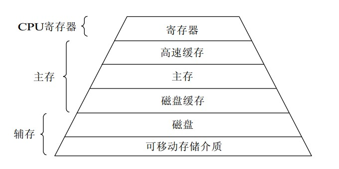
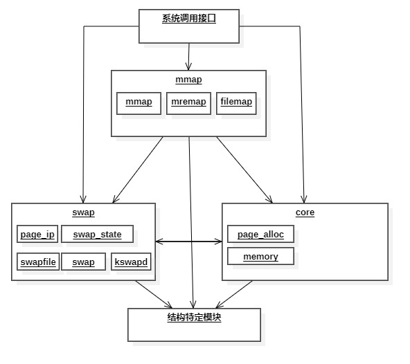
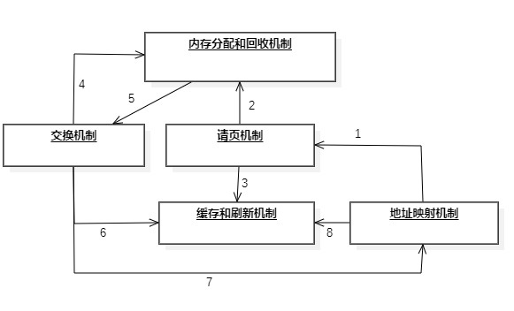

# Linux内存管理前言
存储器是许多存储单元的集合，是用来存储程序和各种数据信息的记忆部件。它能够为用户提供方便、安全和充分大的存储空间，因此对于存储器，系统必须对其进行仔细管理。一个存储器的质量可以通过其容量、访问速度和价格来度量。但由于技术限制，目前并没有一种无穷大的、访问快速的、内容不丢失的以及廉价的存储器。因此，当今大部分计算机都采用层次结构的思想将存储器组成多层存储器，并通过管理软件和辅助硬件等有机组合成统一的整体，使存放的程序和数据按层次分布各存储器中，具体方案为少量快速、昂贵、易变的高速缓存；若干兆字节的中等速度、中等价格、易变的主存储器（RAM）；以及数百兆或数千兆的低速、廉价、不易变的磁盘。资源的合理利用与否关系着系统的效率。
存储器的层次结构图解如图所示：

本部分主要对Linux内存管理部分的代码进行分析，包括其所涉及到的许多机制：比如内存的初始化机制、地址映射机制、请页机制、交换机制、内存分配和回收机制、缓存和刷新机制以及内存共享机制，还包括进程的创建与执行。
本部分按照：
* 初始化机制
* 内存分配及回收
* 地址映射机制
* 请页机制
* 交换机制
* 缓存和刷新机制
* 进程创建和执行

以上顺序进行叙述。
## Linux内存管理概述
Linux是为多用户多任务所设计的操作系统，因此在对于资源使用方面，存储资源有可能被多个进程有效共享；而且程序规模随发展而不断膨胀，如今计算机所需求的内存空间越来越大。因此Linux内存管理的设计选择利用计算机系统所提供的虚拟存储技术，从而实现了虚拟存储器管理。
Linux的内存管理主要体现在对虚拟内存的管理上，因此我们把Linux虚拟内存管理功能划分为以下几点：
* 大地址空间
* 进程保护
* 内存映射
* 公平的物理内存分配
* 共享虚拟内存
### Linux虚拟内存的实现结构
Linux对于实现虚拟内存的源代码大部分放在/mm目录下。根据负责功能的不同，我们可以将其分为以下四个模块：
* 内存映射模块（mmap）：该模块负责把磁盘文件的逻辑地址映射到虚拟地址，以及把虚拟地址映射到物理地址。
* 交换模块（swap）：该模块负责控制内存内容的换入和换出，它通过交换机制，使得在物理内存的页面（RAM页）中保留有效的页，即从主存中淘汰最近没被访问的页，保存近来访问过的页。
* 核心内存管理模块（core）：该模块负责核心内存管理功能，即对页的分配、回收、释放和请页处理等，这些功能将被别的内核子系统所使用。
* 结构特定模块：该模块负责给各种硬件平台提供通用接口，这个模块通过执行命令来改变硬件MMU的虚拟地址映射，并在发生页错误时，提供公用方法来通知别的内核子系统。该模块是实现虚拟内存的物理基础。
基于以上模块，我们画出Linux虚拟内存整体结构如图所示：

### 内核空间和用户空间
Linux虚拟空间为0~4G字节。Linux内核将这4G字节的空间分为两部分。将最高的1G字节（从虚拟地址0xC0000000到0xFFFFFFFF）供给内核使用，称为“内核空间”；又将较低的3G字节（从虚拟地址0x00000000到0xBFFFFFFF）供给各个进程使用，称为“用户空间”。
Linux内核由系统内的所有进程共享，每个进程可以通过系统调用进入内核。Linux使用两级保护机制：0级供内核使用；3级供用户程序使用，通过对虚拟空间结构图的观察，我们可以得出每个进程有各自的私有用户空间（对其他进程不可见），而最高的1G字节虚拟内核空间则为所有进程以及内核所共享。

* 虚拟内核空间到物理空间的映射：内核空间中存放的是内核代码和数据，而进程的用户空间中存放的是用户程序的代码和数据。不管是内核空间还是用户空间，它们都处于虚拟空间中。虽然内核空间占据了每个虚拟空间中的最高1G字节，但映射到物理内存却总是从最低地址（0x00000000）开始。对内核空间来说，其地址映射是很简单的线性映射，0xC0000000就是物理地址与线性地址之间的位移量，在Linux代码中就叫做PAGE_OFFSET。因此对于内核空间而言，如果物理内存小于950MB，则虚地址为x时，物理地址为“x-PAGE_OFFSET”；物理地址为x时，虚地址为“x+PAGE_OFFSET”。
* 内核映像：内核映像即内核的代码和数据。系统启动时将Linux内核映像安装在物理地址0x00100000开始的地方，即1MB开始的区间。而在正常运行时内核映像被放在虚拟内核空间中，因此连接程序在连接内核映像时需要在所有符号地址上加一个偏移量PAGE_OFFSET,因此内核映像在内核空间的起始地址为0xC0100000。
### 虚拟内存实现机制间的关系
Linux通过对各种实现机制的采用和联系，完成对虚拟内存的实现。总的来说，Linux的实现机制主要有以下几种：内存分配和回收机制；地址映射机制；缓存和刷新机制；请页机制；交换机制；内存共享机制。

在虚拟内存的实现过程中，内存管理程序首先通过映射机制把用户程序的逻辑地址映射到物理地址，如果没有对应的物理内存，就发出请页要求（过程1），如果内存有空间，则进行分配（过程2），并把物理页记录页缓存中（过程3）；如果内存无空间，则进行交换（过程4,5）。另外，在找寻物理页的过程中也会使用地址映射机制（过程8）、交换机制中也会用到交换缓存（过程6）、交换后也会修改页表来映射文件地址（过程7）。
