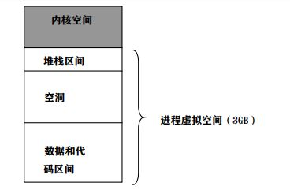
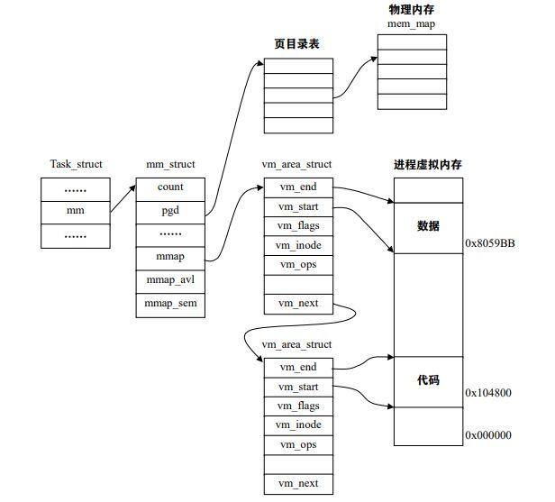

# 地址映射机制
地址映射就是建立几种存储媒介（内存，辅存，虚存）间的关联，完成地址间的相互转换，它既包括磁盘文件到虚拟内存的映射，也包括虚拟内存到物理内存的映射。我们先讨论磁盘文件到虚拟内存的映射。
## 描述虚拟空间的数据结构
虚拟空间的管理是以进程为基础的，每个进程都有各自的虚存空间（或叫用户空间，地址空间），每个进程的内核空间为所有的进程共享。
一个进程的虚拟地址空间主要由两个数据结构描述。一个是mm_struct，一个是vm_area_structs。mm_struct为最高层次，描述一个进程的整个虚拟地址空间；vm_area_structs为较高层次，描述虚拟地址空间的一个区间（虚拟区）。
### mm_struct结构
定义在/include/linux/sched.h中：
```
struct mm_struct {
struct vm_area_struct * mmap; /* 指向虚拟区间（VMA）链表 */
rb_root_t mm_rb; /*指向 red_black 树*/
struct vm_area_struct * mmap_cache; /* 指向最近找到的虚拟区间*/
pgd_t * pgd; ／*指向进程的页目录*/
atomic_t mm_users; /* 用户空间中的有多少用户*/
atomic_t mm_count; /* 对"struct mm_struct"有多少引用*/
int map_count; /* 虚拟区间的个数*/
struct rw_semaphore mmap_sem;
spinlock_t page_table_lock; /* 保护任务页表和 mm->rss */
struct list_head mmlist; /*所有活动（active）mm 的链表 */
unsigned long start_code, end_code, start_data, end_data;
unsigned long start_brk, brk, start_stack;
unsigned long arg_start, arg_end, env_start, env_end;
unsigned long rss, total_vm, locked_vm;
unsigned long def_flags;
unsigned long cpu_vm_mask;
unsigned long swap_address;
unsigned dumpable:1; /* Architecture-specific MM context */
mm_context_t context;
};
```
以下是对该结构的具体描述：
* 每个进程只有一个mm_struct结构，在每个进程的task_struct结构中有一个指向该进程的结构。
* 一个进程的虚拟空间中可能有多个虚拟区间。对这些虚拟区间的组织方式有两种：一种是对于虚拟区间较少时，采用单链表，由mmap指针指向这个链表；另一种是对于虚拟区间较多时，采用“红黑树”结构，由mm_rb指向这棵树。
* 最近用到的虚拟区间结构会放入高速缓存，这个虚拟区间就由mmap_cache指向。
* 指针pgd指向该进程的页目录，当调度程序调度一个程序运行时，就将这个地址转成物理地址并写入控制寄存器CR3。
* 虚拟空间以及虚拟区间结构为了互斥而设置了用于P、V操作的信号量mmap_sem。此外，page_table_lock也是相同目的。
* 每个进程的虚拟地址空间可以被别的进程共享。用mm_user和mm_count进行计数。

### VM_AREA_STRUCT结构
该结构描述进程的一个虚拟地址区间，其结构说明在/include/linux/mm.h中：
```
struct vm_area_struct
struct mm_struct * vm_mm; /* 虚拟区间所在的地址空间*/
unsigned long vm_start; /* 在 vm_mm 中的起始地址*/
unsigned long vm_end; /*在 vm_mm 中的结束地址 */
/* linked list of VM areas per task, sorted by address */
struct vm_area_struct *vm_next;
pgprot_t vm_page_prot; /* 对这个虚拟区间的存取权限 */
unsigned long vm_flags; /* 虚拟区间的标志 */
rb_node_t vm_rb;
/*
* For areas with an address space and backing store,
* one of the address_space->i_mmap{,shared} lists,
* for shm areas, the list of attaches, otherwise unused.
*/
struct vm_area_struct *vm_next_share;
struct vm_area_struct **vm_pprev_share;
/*对这个区间进行操作的函数 */
struct vm_operations_struct * vm_ops;
/* Information about our backing store: */
unsigned long vm_pgoff; /* Offset （within vm_file） in PAGE_SIZE units, *not* PAGE_CACHE_SIZE */
struct file * vm_file; /* File we map to （can be NULL）. */
unsigned long vm_raend; /* XXX: put full readahead info here. */
void * vm_private_data; /* was vm_pte （shared mem） */
};
```
其中vm_flag是描述对虚拟区间的操作的标志，其定义如下所示：

| 标志名 | 描述 |
|  :-----|  ----:  |
|VM_DENYWRITE|在这个区间映射一个打开后不能写的文件|
|VM_EXEC|页可以被执行|
|VM_EXECUTABLE|页含有可执行代码|
|VM_GROWSDOWN|该区间可以向低地址扩展|
|VM_GROWSUP|该区间可以向高地址扩展|
|VM_IO|该区间映射一个设备的I/O地址空间|
|VM_LOCKED|页被锁住不能被交换出去|
|VM_MAYEXEC|VM_EXEC标志可以被设置|
|VM_MAYREAD|VM_READ可以被设置|
|VM_MAYSHARE|VM_SHARE可以被设置|
|VM_MAYRITE|VM_WRITE可以被设置|
|VM_READ|页是可读的|
|VM_SHARED|页可以被多个进程共享|
|VM_SHM|页用于IPC共享内存|
|VM_WRITE|页是可写的|

vm_area_struct结构是由双向链表链接的，按照虚地址的降顺序排列，每个结构对应描述一个相邻的地址空间范围。
对于每个虚拟区间，Linux采用面向对象的思想，把每个虚拟区间看成一个对象，用vm_area_struct描述对象属性。vm_operations-struct结构描述在该对象上的操作，定义位于/include/linux/mm.h：
```
/*
* These are the virtual MM functions - opening of an area, closing and
* unmapping it （needed to keep files on disk up-to-date etc）, pointer
* to the functions called when a no-page or a wp-page exception occurs.
*/
struct vm_operations_struct {
void （*open）（struct vm_area_struct * area）;
void （*close）（struct vm_area_struct * area）;
struct page * （*nopage）（struct vm_area_struct * area, unsigned long address, int unused）;
};
```
描述如下：
* open用于虚拟区间的打开。
* close用于虚拟区间的关闭。
* nopage用于当虚拟页面不在物理内存而引起的“缺页异常”时所应该调用的函数。

### 红黑树
Linux对虚拟区间的组织是采用红黑树的形式。红黑树的简单介绍如下：
* 红黑树是二叉树。
* 红黑树每个节点有颜色，或者为红，或者为黑。
* 根节点为黑色。
* 如果一个节点为红色，则其子节点必须为黑色。
* 从一个节点到叶子节点上的所有路劲都包含相同的黑色节点数。

其结构定义如下：
```
typedef struct rb_node_s
{
struct rb_node_s * rb_parent;
int rb_color;
#define RB_RED 0
#define RB_BLACK 1
struct rb_node_s * rb_right;
struct rb_node_s * rb_left;
} rb_node_t;
```
## 进程的虚拟空间
每个进程拥有3GB字节的用户虚拟空间。但虚存空间得映射到某个物理存储空间才能真正使用，因此用户进程并不能在3GB的范围内任意使用。
进程虚拟空间被划分为两部分，分别为代码段和数据段，代码段在下，数据段在上。如图：



堆栈空间在虚存空间的顶部，运行时由顶向下延伸；代码段和数据段位于底部。中间的空洞即进程运行时可以自由分配的空间（也叫动态内存）。
Linux采用数据结构跟踪进程的虚拟地址。在进程的task_struct结构中包含一个指向mm_struct结构的指针。进程的mm_struct则包含装入的可执行影像信息以及进程的页目录指针pgd。该结构还包含有指向vm_area_struct结构的几个指针，每个vm_area_struct代表进程的一个虚拟地址区间。



如图可知，系统以虚拟内存地址的降序排列vm_area_struct。在进程的运行过程中，Linux会经常为进程分配虚拟地址区间或修改虚拟地址信息。因此，vm_area_struct结构的访问时间就成了性能的关键因素。为此，Linux使用红黑树来组织vm_area_struct。
当进程利用系统调用动态分配内存时，Linux首先分配一个vm_area_struct结构，并链接到进程的虚拟内存链表中，当后续的指令访问这一内存区间时，因为Linux尚未分配相应的物理内存，因此处理器在进行虚拟地址到物理地址的映射时会产生缺页异常，当Linux处理该问题时，就能为新的虚拟内存区分配实际的物理内存。
## 内存映射
当程序的映像开始执行时，可执行映像必须装入到进程的虚拟地址空间。如果该进程用到了共享库则共享库也需装入虚拟地址空间。随着程序的运行，被引用的程序部分会由操作系统装入到物理内存，这种将映像链接到进程地址空间的方法称为“内存映射”。
当可执行映像映射到进程的虚拟地址空间时，将产生一组vm_area_struct结构描述虚拟内存区的起始点和终止点，每个vm_area_struct代表可执行映像的一部分，可能是可执行代码、初始化的变量或未初始化的数据（由do_mmap()实现）。但这时还没有建立从虚拟内存到物理内存的影射，即未建立页表页目录。
do_mmap()为当前进程创建并初始化一个新的虚拟区，如果分配成功就把新的虚拟区与进程已有的其他虚拟区进行合并，其代码在include/linux/mm.h中：
```
static inline unsigned long do_mmap（struct file *file, unsigned long addr, unsigned long len, unsigned long prot, unsigned long flag, unsigned long offset）
{
unsigned long ret = -EINVAL;
if （（offset + PAGE_ALIGN（len）） < offset）
goto out;
if （!（offset & ~PAGE_MASK））
ret = do_mmap_pgoff（file, addr, len, prot, flag, offset >> PAGE_SHIFT）;
out:
return ret;
}
```
以下是描述：
* file：表示要映射的文件。
* offset：文件的偏移量。
* len：要映射的文件部分的长度。
* addr：虚拟空间的一个地址，表示从这个地址开始查找一个空闲的虚拟区。
* prot：指定对虚拟区所包含页的存取权限。
* flag：指定虚拟区的其他标志，包括MAP_GROWSDOWN、MAP_LOCKED、MAP_DENYWRITE、MAP_EXECUTABLE（这些的含义上文已经提出），另外还有MAP_SHARED（虚拟区中的页可以被许多进程共享）、MAP_PRIVATE（独享）等。

观察代码可以得知，do_mmap()只对offset进行合法性检查，然后调用do_mmap_pgoff()，代码位于mm/mmap.c中。由于代码过长，我们只分析主要思想。
* 首先检查参数的值是否正确，所提的请求是否能够被满足，如果不满足则终止函数并返回负值。
* 调用get_unmapped_area()函数在当前进程的用户空间中获得一个未映射区间的起始地址给addr。
* 如果flag参数指定的新虚拟区中的页必须锁在内存，且进程加锁页的总数超过了保存在进程的task_struct结构rlim[RLIMIT.MEMLOCK].rlim_cur的上限，则返回负值。
* 如果file指针为0，则目的在于创建虚拟区间，此时并没有真正的映射发生；如果不为0，则目的在于建立从文件到虚拟区间的映射，此时需要根据标志指定的映射种类，把为文件设置的访问权考虑进去。
* 调用find_vma_prepare()函数，其与find_vma()基本相同。函数扫描当前进程地址空间的vm_area_struct结构所形成的红黑树，试图找到结束地址高于addr的第一个区间；如果找到了一个虚拟区，说明addr所在的虚拟区已经在使用，即有映射存在，因此要调用do_munmap()把该虚拟区从进程地址空间中撤销，如果撤销成功就继续查找，直到红黑树中找不到addr所在的虚拟区；如果不成功则返回一个负数。
* 然后进行各种检查：首先检查total_vm（进程地址空间的页面数）是否超过rlim[RLIMIT.MEMLOCK].rlim_cur上限（返回负数）；然后检查flag参数是否设置了MAP_NORESERVE标志，新的虚拟区是否含有私有可写页，空闲页面数是否小于要映射的虚拟区大小（返回负数）；最后检查是否是匿名映射（file为空）且虚拟区为非共享（将虚拟区与前一个虚拟区合并）。
* 检查过后，为新的虚拟区分配一个vm_area_struct结构并初始化。（通过调用Slab分配函数kmem_cache_alloc()实现）
* 如果建立的是从文件到虚存区间的映射，则分为两种情况：当参数flags中的VM_GROWSDOWN或VM_GROWSUP标志位为1时，说明该区间可以向低地址或高地址扩展，但从文件映射的区间不能进行扩展，因此转到free_vma，释放给vm_area_struct分配的Slab，并返回一个错误；当flags中的VM_DENYWRITE标志位为1时，表示不允许通过常规的文件操作访问该文件，所以要调用deny_write_access()排斥常规的文件操作。
* 每个文件系统都有个file_operation数据结构，其中的函数指针mmap提供用来建立该类文件到虚存区间进行映射的操作，对于大部分文件系统来说为generic_file_mmap()实现，执行以下操作：初始化vm_area_struct结构中的xm_ops域；从索引节点的i_mode域检查要映射的文件是否是一个常规文件（不是则报错）；从索引节点的i_op域检查是否定义了readpage()索引节点操作（没有则报错）；调用update_atime()函数把当前时间存放在文件索引节点的i_atime域中，并把这个索引节点标记成脏；如果flags参数中的MAP_SHARED标志位为1，则调用shmem_zero_setup()进行共享内存的映射。

除此之外，do_mmap()中还有以下代码：
```
/* Can addr have changed?? *
*
Answer: Yes, several device drivers can do it in their
* f_op->mmap method. -DaveM
*/
addr = vma->vm_start;
```
这里的意思是，addr有可能被驱动程序改变，因此，把新的虚拟区的起始地址给addr。
此时，应该把新建的虚拟区插入到进程的地址空间，这是由vma_link()完成的，其代码如下：
```
vma_link（mm, vma, prev, rb_link, rb_parent）;
if （correct_wcount）
atomic_inc（&file->f_dentry->d_inode->i_writecount）;
```
该函数有以下功能：
* 把vma插入到虚拟区链表中。
* 把vma插入到虚拟区形成的红黑树中。
* 把vma插入到索引节点（inode）共享链表中。

atomic_inc(x)给*x加1。这是一个原子操作（操作过程中不会被中断）。
此时，do_mmap()函数准备退出，代码为：
```
out:
mm->total_vm += len >> PAGE_SHIFT;
if （vm_flags & VM_LOCKED） {
mm->locked_vm += len >> PAGE_SHIFT;
make_pages_present（addr, addr + len）;
}
return addr;
```
首先增加进程地址空间的长度，然后看一下对该区间是否加锁，如果加锁则代表准备访问该区间，则调用make_pages_present()函数，建立虚拟页面到物理页面的映射，即完成文件到物理内存的真正调入。返回正数，代表映射成功。
而如果对文件的操作不成功，则解除对该虚拟区间的页面映射。
总的来说，页面映射的建立在generic_file_mmap()函数中实现。而此时，文件到虚存的映射仅仅建立了一种映射关系，虚存页面到物理页面之间的映射还没有建立。当某个可执行映像映射到进程虚拟内存中并开始执行时，可能会遇到所访问的数据不在物理内存的情况（因为只有很少一部分虚拟内存区间装入到了物理内存）。这时，处理器将向Linux报告一个页故障和故障原因，这就需要用到请页机制。
