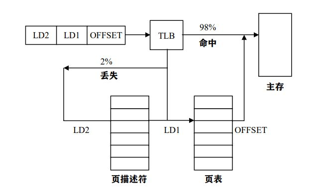

# 缓存和刷新机制
## Linux使用的缓存
### 缓冲区高速缓存
缓冲区高速缓存包含由块设备使用的数据缓冲区。这些缓冲区中包含了从设备中读取的数据块或写入设备的数据块。缓冲区高速缓存由设备标识号和块标号索引，因此可以快速找出数据块。
缓冲区高速缓存的大小可以变换。当需要新缓冲区而又没有可用缓冲区时，就按需分配页面。当空闲内存变得不足时，就释放缓冲区并反复使用相应的页面。
### 页面高速缓存
页面高速缓存是页面I/O操作访问数据所使用的磁盘高速缓存。其保留的信息单元是一个整页面。一个页面包含的数据未必是物理上相邻的磁盘块，因此不能使用设备号和块号标识页面，而是通过文件的索引节点和文件中的偏移量来标识页面。
### 交换高速缓存
只有修改后的（脏）页面才保存在交换文件中。修改后的页面写入交换文件后，如果该页面再次被交换但未被修改时，就没有必要写入交换文件，相反，只需丢弃该页面。交换高速缓存实际包含了一个页面表项链表，系统的每个物理页面对应一个页面表项。对交换出的页面，该页面表项包含保存该页面的交换文件信息，以及该页面在交换文件中的位置信息。 如果某个交换页面表项非零，则表明保存在交换文件中的对应物理页面没有被修改。如果这一页面在后续的操作中被修改，则处于交换缓存中的页面表项被清零。Linux需要从物理内 存中交换出某个页面时，它首先分析交换缓存中的信息，如果缓存中包含该物理页面的一个非零页面表项，则说明该页面交换出内存后还没有被修改过，这时，系统只需丢弃该页面。
## 缓冲区高速缓存
Linux采用缓冲区高速缓存机制，当把一个数据写入文件时，内核将把数据写入内存缓冲区，而不是直接写入磁盘。
这其中需要用到buffer_head数据结构，其用来描述缓冲区，缓冲区的大小一般比页面尺寸小，所以一个页面可以包含数个缓冲区，同一页面中的缓冲区用链表链接。之前提过的页面结构page，其中的buffer_head buffer就是指向缓冲区的。
然而，使用了缓冲技术有可能导致写磁盘的命令已经返回，而实际的写入磁盘的操作还未执行的情况。这时，可以使用正常的关机命令关机；用户也可以使用sync命令刷新缓冲区高速缓存，从而把缓冲区中的数据强制写到磁盘。同时，在Linux中还有dbflush进程，可以频繁运行不完整的sync从而避免有时候sync命令超负荷磁盘操作而造成的磁盘冻结。
### 页面缓存的详细描述
经内存映射的文件每次只读取一页面内容，读取后的页面保存在页面缓存，利用页面缓存可以提高文件的访问速度。页面缓存的示意图如下所示：


页面缓存由page_hash_table组成，它是一个mem_map_t的指针向量。页面缓存的结构是哈希表结构。其折中了线性结构（访问快速）和非线性结构（能够处理大量数据）的优点。访问数据时，首先利用哈希函数以目标元素的某个特征值为函数自变量生成哈希值作为索引，然后利用索引访问哈希表的线性指针向量。哈希线性表中的指针代表一个链表，在该链表中可访问到指定的数据。
Linux页面缓存中，访问page_hash_table的索引由文件的VFS（虚拟文件系统）索引节点inode和内存页面在文件中的偏移量生成。
当系统要从内存映射文件中读取某一未加锁的页面时，首先用到函数find_page()：
首先在“页面缓存”中查找，如果发现该页面保存在缓存中，则可以免除实际文件读取，而只需从页面缓存中读取，这时，指向mm_map_t数据结构的指针被返回到页面故障的处理代码。
如果页面不在缓存中，则从实际的文件系统映像中读取页面，这时Linux内核首先分配物理页面然后从磁盘读取页面内容。
随着映像的读取和执行，页面缓存中的内容可能会增多，这时，Linux 可移走不再需要的页面。当系统中可用的物理内存量变小时，Linux也会通过缩小页面缓存的大小而释放更
多的物理内存页面。 

## 翻译后援存储器（TLB）
页表的实现对虚拟内存系统效率是极为关键的。例如把一个寄存器的内容复制到另一个寄存器中的一条指令，在不使用分页时，只需访问内存一次取指令，而在使用分页时需要额外的内存访问去读取页表。根据局部性原理，只有一小部分页表项经常被用到，其他的很少被使用。
对此，为计算机装备一个不需要经过页表就能把虚拟地址映射成物理地址，叫做TLB（翻译后援存储器）。如图：



每个TLB寄存器的每个条目包含一个页面的信息：有效位、虚页面号、修改位、保护码和页面所在的物理页面号，其与页表中的表项一一对应。
当一个虚地址送到MMU翻译时，硬件首先把它和TLB中所有条目同时比较。如果虚页面号在其中且访问没有违反保护位，则页面会直接从TLB中取出而不访问页表；如果虚页面号在TLB中且指令试图写一个只读的页面，则产生缺页异常，与直接访问页表相同。
如果虚页面号不在TLB中，则进行一次常规的页表查找，然后从TLB中淘汰一个条目并把它替换为之前的页表项。

## 刷新机制
### 软件管理TLB
前面我们介绍的TLB管理和TLB故障的处理都完全由MMU硬件完成，只有一个页面不在内存时才会陷入操作系统。
而在现代的一些RISC机中，几乎全部的这种页面管理工作都由软件完成。在这些机器中，TLB条目是由操作系统显式地装入，在TLB没有命中时，MMU不是到页表中找到并装入需要的页面信息，而是产生一个TLB故障把问题交给操作系统。操作系统找到页面并从TLB中淘汰一个条目并装入，然后重新启动产生异常的指令。TLB不命中频率远比页面异常大。
如果TLB尺寸取一个合理的较大值以减少不命中的频率，那么软件管理的TLB效率可能会变得相当高。
无论是硬件还是软件，处理TLB不命中的一般方法是对页表执行索引操作找出所引用的页面。用软件执行这个搜索的一个问题是保存页表的页面本身可能就不在TLB中，这将在处理过程中再一次引发一个TLB异常，这种异常可以通过保持一个大的(比如4KB)TLB 条目的软件高速缓存而得到减少，这个高速缓存保持在固定位置，它的页面总是保持在TLB中，操作系统通过首先检查软件高速缓存可以大大减少TLB不命中的次数。
### 刷新机制
用软件管理TLB和其他缓存的重要前提是保持TLB和其他缓存中的内容的同步性，这样就需要刷新一些内容：
* 保证在任何时刻内存管理硬件所看到的进程的内核映射和内核页表一致。
* 如果负责内存管理的内核代码对用户进程页面进行了修改，那么用户的进程在被允许继续执行前，要求必须在缓存中看到正确的数据。

### 通常当地址空间的状态改变时，调用适当的刷新机制来描述状态的改变
Linux中刷新机制的实现是通过一系列函数或宏来完成的。比如：
```
flush_cache_foo（ ）;
flush_tlb_foo（ ）;
```
这两个函数的调用是有一定顺序的，它们的逻辑意义如下所述。
在地址空间改变前必须刷新缓存，防止缓存中存在非法的空映射。函数flush_cache_*（）会把缓存中的映射变成无效（这里的缓存指的是MMU中的缓存，它负责虚地址到物理地 址的当前映射关系；注意在这里由于各种处理器中MMU的内部结构不同，换存刷新函数也不尽相同。在刷新地址后，由于页表的改变，必须刷新TBL以便硬件可以把新的页表信息装入TLB。
此外还有许多刷新函数，由于篇幅不做描述。其代码大部分都在include/asm/pttable.h中定义。


