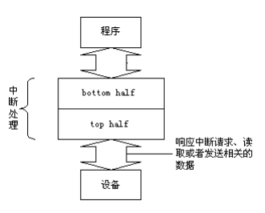

# 1.中断的后半部分处理机制
> 从之前的分析中可以得出,从上面的讨论我们知道，Linux 并不是一口气把中断所要求的事情全部做完，而是分两部分来做，本节我们将具体描述内核怎样处理中断的后半部分。
## 1.1 将中断分为两部分的原因
中断服务例程一般都是在中断请求关闭的条件下执行的,以避免嵌套而使中断控制复杂化。但是，中断是一个随机事件，它随时会到来，如果关中断的时间太长，CPU 就不能及时响应其他的中断请求，从而造成中断的丢失。因此，内核的目标就是尽可能快地处理完中断请求，尽其所能把更多的处理向后推迟。    

因此，内核把中断处理分为两部分：前半部分（top half）和后半部分（bottom half），前半部分内核立即执行，而后半部分留着稍后处理，如图所示。

首先，一个快速的“前半部分”来处理硬件发出的请求，它必须在一个新的中断产生之前终止。 

然后，就让一些与中断处理相关的有限个函数作为“后半部分”来运行： 
## 1.2 实现机制
Linux 内核为将中断服务分为两部分提供了方便，并设立了相应的机制，这就是软中断机制
## 1.3 数据结构的定义
在具体介绍软中断处理机制之前，我们先介绍一下相关的数据结构，这些数据结构大部分都在`include/linux/interrupt.h`中。  
### 1.3.1 与软中断相关的数据结构
[1] 内核定义的软中断
```c
enum 
 { 
 HI_SOFTIRQ=0, 
 NET_TX_SOFTIRQ, 
 NET_RX_SOFTIRQ, 
 TASKLET_SOFTIRQ 
 }; 
```
内核中用枚举类型定义了 4 种类型的软中断，其中 NET_TX_SOFTIRQ 和 NET_RX_SOFTIRQ两个软中断是专为网络操作而设计的，而 HI_SOFTIRQ 和 TASKLET_SOFTIRQ 是针对 bh 和tasklet 而设计的软中断。  
[2] 软中断向量  
```c
struct softirq_action 
{ 
 void (*action) (struct softirq_action *); 
 void *data; 
} 
 static struct softirq_action softirq_vec[32] __cacheline_aligned;
```
从定义可以看出，内核定义了 32 个软中断向量，每个向量指向一个函数，但实际上，内核目前只定义了上面的 4 个软中断，而我们后面主要用到的为 HI_SOFTIRQ 和TASKLET_SOFTIRQ 两个软中断  
[3] 软中断控制／状态结构 
softirq_vec［］是个全局量，系统中每个 CPU 所看到的是同一个数组。但是，每个 CPU各有其自己的“软中断控制／状态”结构，这些数据结构形成一个以 CPU 编号为下标的数组
irq_stat[]（定义在 `include/i386/hardirq.h`) 中
```c
typedef struct { 
 unsigned int __softirq_pending; 
 unsigned int __local_irq_count; 
 unsigned int __local_bh_count; 
 unsigned int __syscall_count; 
 struct task_struct * __ksoftirqd_task; /* waitqueue is too large */ 
 unsigned int __nmi_count; /* arch dependent */ 
} ____cacheline_aligned irq_cpustat_t; 
irq_cpustat_t irq_stat[NR_CPUS]; 
```
irq_stat[]数组也是一个全局量，但是各个 CPU 可以按其自身的编号访问相应的域。于是，内核定义了如下宏（在 include/linux/irq_cpustat.h 中):
```c
#ifdef CONFIG_SMP
#define __IRQ_STAT(cpu, member)	(irq_stat[cpu].member)
#else
#define __IRQ_STAT(cpu, member)	((void)(cpu), irq_stat[0].member)
#endif	

  /* arch independent irq_stat fields */
#define softirq_pending(cpu)	__IRQ_STAT((cpu), __softirq_pending)
#define local_irq_count(cpu)	__IRQ_STAT((cpu), __local_irq_count)
#define local_bh_count(cpu)	__IRQ_STAT((cpu), __local_bh_count)
#define syscall_count(cpu)	__IRQ_STAT((cpu), __syscall_count)
#define ksoftirqd_task(cpu)	__IRQ_STAT((cpu), __ksoftirqd_task)
  /* arch dependent irq_stat fields */
#define nmi_count(cpu)		__IRQ_STAT((cpu), __nmi_count)		/* i386, ia64 */
```
## 1.4 软中断的初始化
首先通过 open_softirq()函数打开软中断:
```c
void open_softirq(int nr, void (*action)（struct softirq_action*）, void *data) 
{ 
 softirq_vec[nr].data = data; 
 softirq_vec[nr].action = action; 
} 
```
然后，通过`softirq_init()`函数对软中断进行初始化:
```c
void __init softirq_init() 
{ 
 int i; 
 for(i=0; i<32; i++) 
 tasklet_init(bh_task_vec+i, bh_action, i); 
 open_softirq（TASKLET_SOFTIRQ, tasklet_action, NULL）; 
 open_softirq（HI_SOFTIRQ, tasklet_hi_action, NULL）; 
} 
```
## 1.5 软中断后半部分的执行
内核每当在 do_IRQ()中执行完一个中断请求队列中的中断服务例程以后，都要检查是否有软中断请求在等待执行。下面是 do_IRQ()中的一条语句:
```c
if （softirq_pending（cpu）） 
 do_softirq(); 
```
在检测到软中断请求以后，就要通过`do_softirq()`执行软中断服务例程，其代码在`kernel/softirq.c`中：
```c
asmlinkage void do_softirq() 
{ 
 int cpu = smp_processor_id(); 
 __u32 pending; 
 long flags; 
 __u32 mask; 
 if （in_interrupt()） 
 return; 
 local_irq_save（flags）;/*把 eflags 寄存器的内容保存在 flags 变量中＊／ 
 pending = softirq_pending（cpu）; 
 if （pending） { 
 struct softirq_action *h; 
 mask = ~pending; 
 local_bh_disable(); 
restart: 
 /* Reset the pending bitmask before enabling irqs */ 
softirq_pending（cpu） = 0; 
 local_irq_enable(); ／*开中断*/ 
 h = softirq_vec; 
 do { 
 if （pending & 1） 
 h->action（h）; 
 h++; 
 pending >>= 1; 
 } while （pending）; 
 local_irq_disable(); / *关中断*/ 
 pending = softirq_pending（cpu）; 
 if （pending & mask） { 
 mask &= ~pending; 
 goto restart; 
 } 
 __local_bh_enable(); 
 if （pending） 
 wakeup_softirqd（cpu）; 
 } 
 local_irq_restore（flags）; ／＊恢复 eflags 寄存器的内容*／ 
}
```
从 do_softirq()的代码可以看出，使 CPU 不能执行软中断服务例程的“关卡”只有一个，那就是 in_interrupt()，这个宏限制了软中断服务例程既不能在一个硬中断服务例程内部执行，也不能在一个软中断服务例程内部执行（即嵌套）。但这个函数并没有对中断服务例程的执行进行“串行化”限制。这也就是说，不同的 CPU 可以同时进入对软中断服务例程的执行，每个 CPU 分别执行各自所请求的软中断服务。从这个意义上说，软中断服务例程的执行是“并发的”、“多序的”。但是，这些软中断服务例程的设计和实现必须十分小心，不能让它们相互干扰（例如通过共享的全局变量）。

