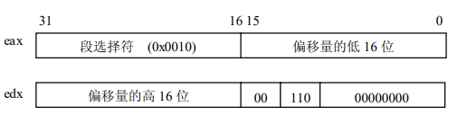

# 中断机制
中断机制是计算机发展中的一种重要技术，是指在CPU正常运行期间，由于内外部事件或由程序预先安排的事件引起的CPU暂时停止正在运行的程序，转而为该内部或外部事件或预先安排的事件服务的程序中去，服务完毕后再返回去继续运行被暂时中断的程序。
# 1.中断基本知识
## 1.1中断向量
> `Intel x86`系列微机共支持 256 种向量中断，为使处理器较容易地识别每种中断源，将它们从 0～256 编号，即赋予一个中断类型码 n，Intel 把这个 8 位的无符号整数叫做一个向量，因此，也叫`中断向量`  
所有 256 种中断可分为两大类：异常和中断。异常又分为`故障`(Fault)和`陷阱`(Trap),它们的共同特点是既不使用中断控制器，又不能被屏蔽。中断又分为外部可屏蔽中断（INTR）和外部非屏蔽中断（NMI），所有 I/O 设备产生的中断请求（IRQ）均引起屏蔽中断，而紧急的事件（如硬件故障）引起的故障产生非屏蔽中断

Linux对256个向量的分配如下:
* 0-31的向量对应异常和非屏蔽中断
* 32-47的向量(即由I/O设备引起的中断)分配给屏蔽中断
* 剩余的48-255的向量用来标识软中断,Linux只用了一个来实现系统调用，即`0x80`，当用户态的进程执行一条`int 0x80`的汇编指令时，CPU就切换到内核态，并开始执行`system_call()`内核函数
## 1.2 外设可屏蔽中断
> `Intel x86`通过两片中断控制器`8259A`来响应 15 个外中断源，每个 8259A 可管理 8 个中断源。第 1 级（称主片）的第 2 个中断请求输入端，与第 2 级 8259A（称从片）的中断输出端 INT 相连,我们把与中断控制器相连的每条线叫做中断线，要使用中断线，就得进行中断线的申请，就是`IRQ`(Interrupt ReQuirement)，我们也常把申请一条中断线称为申请一个 IRQ 或者是申请一个中断号。IRQ 线是从 0 开始顺序编号的，因此，第一条 IRQ线通常表示成 IRQ0。IRQn 的缺省向量是 n+32；如前所述，IRQ 和向量之间的映射可以通过中断控制器端口来修改，中断结构如下所示

中断控制器 8259A 执行如下操作。  
1. 监视中断线，检查产生的中断请求（IRQ）信号。 
2. 如果在中断线上产生了一个中断请求信号。   
a. 把接受到的 IRQ 信号转换成一个对应的向量。   
b. 把这个向量存放在中断控制器的一个 I/O 端口，从而允许 CPU 通过数据总线读此向量。   
c. 把产生的信号发送到 CPU 的 INTR 引脚——即发出一个中断。   
d. 等待，直到 CPU 确认这个中断信号，然后把它写进可编程中断控制器（PIC）的一个 I/O 端口；此时，清 INTR 线。  
3. 返回到第一步。   
* 对于外部 I/O 请求的屏蔽可分为两种情况，一种是从 CPU 的角度，也就是清除 eflag 的
中断标志位（IF），当 IF=0 时，禁止任何外部 I／O 的中断请求，即关中断；一种是从中断控
制器的角度，因为中断控制器中有一个 8 位的中断屏蔽寄存器（IMR），每位对应 8259A 中的
一条中断线，如果要禁用某条中断线，则把 IRM 相应的位置 1，要启用，则置 0。
## 1.3异常和非屏蔽中断
> `异常`就是 CPU 内部出现的中断，也就是说，在 CPU 执行特定指令时出现的非法情况。`非屏蔽中断`就是计算机内部硬件出错时引起的异常情况

在 CPU 执行一个异常处理程序时，就不再为其他异常或可屏蔽中断请求服务，也就是说，当某个异常被响应后，CPU 清除 eflag 的中 IF 位，禁止任何可屏蔽中断。但如果又有异常产生，则由 CPU 锁存(CPU 具有缓冲异常的能力)  
Intel x86 处理器发布了大约 20 种异常（具体数字与处理器模式有关）。Linux 内核必
须为每种异常提供一个专门的异常处理程序。这里特别说明的是，在某些异常处理程序开始
执行之前，CPU 控制单元会产生一个硬件错误码，内核先把这个错误码压入内核栈中。  
|向量|异常名|类别|描述
|:---|---|---|---|
|0 |除法出错| 故障 |被 0 除 
|1 |调试| 故障／陷阱| 当对一个程序进行逐步调试时 |
|2 |非屏蔽中断（NMI）| 为不可屏蔽中断保留 |
|3 |断点 |陷阱|由 int3（断点指令）指令引起 
|4 |溢出 |陷阱 |当 into（check for overflow）指令被执行 
|5 |边界检查 |故障 |当 bound 指令被执行 
|6 |非法操作码 |故障| 当 CPU 检查到一个无效的操作码 
|7 |设备不可用 |故障 |随着设置 cr0 的 TS 标志，ESCAPE 或 MMX 指令被执行 
|8 |双重故障 |故障 |处理器不能串行处理异常而引起的
|9 |协处理器段越界| 故障 |因外部的数学协处理器引起的问题（仅用在 80386） 
|10 |无效TSS |故障 |要切换到的进程具有无效的 TSS 
|11 |段不存在 |故障 |引用一个不存在的内存段 
|12 |栈段异常| 故障| 试图超过栈段界限，或由 ss 标识的段不在内存 
|13 |通用保护 |故障| 违反了 Intelx86 保护模式下的一个保护规则 
|14 |页异常 |故障 |寻址的页不在内存，或违反了一种分页保护机制 
|15 |Intel保留| ／ |保留 
|16 |浮点出错 |故障 |浮点单元用信号通知一个错误情形，如溢出 
|17 |对齐检查 |故障 |操作数的地址没有被正确地排列 
## 1.4 中断描述符表
> 在实模式下，中断向量表中的表项由 8 个字节组成，如图所示
中断向量表也改叫做中断描述符表 IDT（Interrupt Descriptor Table）。其中的每个表项叫
做一个门描述符（Gate Descriptor），“门”的含义是当中断发生时必须先通过这些门，然后
才能进入相应的处理程序。   
其中类型占三位，表示门描述符的类型，这些描述符如下:
1. 任务门(Task Gate)  
其类型码为 101，门中包含了一个进程的 TSS 段选择符，但偏移量部分没有使用
2. 中断门(Interrupt gate)  
其类型码为 110，中断门包含了一个中断或异常处理程序所在段的选择符和段内偏移量。当控制权通过中断门进入中断处理程序时，处理器清 IF 标志，即关中断，以避免嵌套中断的发生，因此，用户态的进程不能访问
Intel 的中断门。所有的中断处理程序都由中断门激活，并全部限制在内核态。
3. 陷阱门  
其类型码为111,与中断门类似,其唯一的区别是,控制权通过陷阱门进入处理程序时维持`IF`标志位不变，也就是说，不关中断。 
4. 系统门
这是 Linux 内核特别设置的，用来让用户态的进程访问 Intel的陷阱门，因此，门描述符的`DPL`为 3。通过系统门来激活4个Linux 异常处理程序，它们的向量是 3、4、5 及 128，也就是说，在用户态下，可以使用 int3、into、bound 及 int0x80 四条汇编指令。  
CPU 中增设了一个中断描述符表寄存器 IDTR，用来存放中断描述符表在内存的起始地址。中断描述符表寄存器 IDTR 是一个 48 位的寄存器，其低 16位保存中断描述符表的大小，高 32 位保存 IDT 的基址，其图示如下:
## 1.5 相关汇编指令
### 1.5.1 调用过程指令CALL
指令格式：CALL 过程名   
说明：i386 在取出 CALL 指令之后及执行 CALL 指令之前，使指令指针寄存器 EIP 指向紧接 CALL 指令的下一条指令。CALL 指令先将 EIP 值压入栈内，再进行控制转移。当遇到 RET指令时，栈内信息可使控制权直接回到 CALL 的下一条指令
### 1.5.2 调用中断过程指令INT
指令格式：INT 中断向量 
说明：EFLAG、CS 及 EIP 寄存器被压入栈内。控制权被转移到由中断向量指定的中断处理程序。在中断处理程序结束时，IRET 指令又把控制权送回到刚才执行被中断的地方。
### 1.5.3 调用溢出处理程序的指令INTO
指令格式：INTO 
说明：在溢出标志为1时，INTO调用中断向量为4的异常处理程序，EFLAG、CS 及 EIP寄存器被压入栈内。控制权被转移到由中断向量 4 指定的异常处理程序。在中断处理程序结束时，IRET 指令又把控制权送回到刚才执行被中断的地方。
### 1.5.4 中断返回指令IRET
指令格式:IRET 
说明:IRET 与中断调用过程相反：它将 EIP、CS 及 EFLAGS 寄存器内容从栈中弹出，并将控制权返回到发生中断的地方。IRET 用在中断处理程序的结束处。
### 1.5.5 加载中断描述符表的指令LIDT
格式：LIDT 48 位的伪描述符 
说明：LIDT 将指令中给定的 48 位伪描述符装入中断描述符寄存器 IDTR。伪描述符和中断描述符表寄存器的结构相同，都是由两部分组成：在低字（低 16 位）中装的是界限，在高双字（高 32 位）中装的是基址。这条指令只能出现在操作系统的代码中。 
# 2.中断描述符表的初始化
`Linux`内核在系统的初始化阶段要进行大量的初始化工作，其与中断相关的工作有：初始化可编程控制器`8259A`；将中断向量 IDT 表的起始地址装入 IDTR 寄存器，并初始化表中的每一项。  

用户进程可以通过 INT 指令发出一个中断请求，其中断请求向量在 0～255 之间。为了防止用户使用 INT 指令模拟非法的中断和异常，必须对 IDT 表进行谨慎的初始化。其措施之一就是将中断门或陷阱门中的 DPL 域置为 0。如果用户进程确实发出了这样一个中断请求，CPU 会检查出其 CPL（3）与 DPL（0）有冲突，因此产生一个“通用保护”异常。 
但是，有时候必须让用户进程能够使用内核所提供的功能（比如系统调用），也就是说从用户空间进入内核空间，这可以通过把中断门或陷阱门的 DPL 域置为 3 来达到。 
## 2.1 外部中断向量的设置
前面我们已经提到，Linux 把向量 0～31 分配给异常和非屏蔽中断，而把 32～47 之间的向量分配给可屏蔽中断，可屏蔽中断的向量是通过对中断控制器的编程来设置的。前面介绍了 8259A 中断控制器，下面我们通过对其初始化的介绍，来了解如何设置中断向量。  

8259A 通过两个端口来进行数据传送，对于单块的 8259A 或者是级连中的 8259A_1 来说，这两个端口是 0x20 和 0x21。对于 8259A_2 来说，这两个端口是 0xA0 和 0xA1。8259A 有两种编程方式，一是初始化方式，二是工作方式。在操作系统启动时，需要对 8959A 做一些初始化工作，这就是初始化方式编程。  

先简介`8259A`内部的 4 个中断命令字（ICW）寄存器的功能，它们都是用来启动初始化编程的。
* ICW1：初始化命令字。 
* ICW2：中断向量寄存器，初始化时写入高 5 位作为中断向量的高五位，然后在中断 响应时由 8259 根据中断源（哪个管脚）自动填入形成完整的 8 位中断向量（或叫中断类型号）。 
* ICW3：8259 的级连命令字，用来区分主片和从片。 
* ICW4：指定中断嵌套方式、数据缓冲选择、中断结束方式和 CPU 类型。  

其Linux中对`8259A`的初始化部分在`/arch/i386/kernel/i8259.c`的函数`init_8259A()`中: 
```c
 outb（0xff, 0x21）； /* 送数据到工作寄存器 OCW1（又称中断屏蔽字）, 屏蔽所有外部中断, 因为此时系统尚未初始化完毕, */
 outb（0xff, 0xA1）； /* 不能接收任何外部中断请求 */ 
 outb_p（0x11, 0x20）; /*送 0x11 到 ICW1（通过端口 0x20），启动初始化编
程。0x11 表示外部中断请求信号为上升沿有效，系统中有多片 8295A 级连，还表示要向 ICW4
送数据 */ 
 outb_p（0x20 + 0, 0x21）; /* 送 0x20 到 ICW2，写入高 5 位作为中断向量的
高 5 位，低 3 位根据中断源（管脚）填入中断号 0～7，因此把 IRQ0-7 映射到向量 0x20-0x27 
*/ 
 outb_p（0x04, 0x21）; /* 送 0x04 到 ICW3，ICW3 是 8259 的级连命令字， 0x04
表示 8259A-1 是主片 */ 
 outb_p（0x11, 0xA0）; /* 用 ICW1 初始化 8259A-2 */ 
 outb_p（0x20 + 8, 0xA1）; /* 用 ICW2 把 8259A-2 的 IRQ0-7 映射到 0x28-0x2f 
*/ 
 outb_p（0x02, 0xA1）; /* 送 0x04 到 ICW3。表示 8259A-2 是从片，并连接在 8259A_1 的 2 号管脚上*/ 
 outb_p（0x01, 0xA1）; /* 把 0x01 送到 ICW4 */ 
```
`outb_p()`函数就是把第一个操作数拷贝到由第二个操作数指定的 I/O 端口，并通过一个空操作来产生一个暂停。 
## 2.2 中断描述符表IDT的预初始化
当计算机运行在实模式时，IDT 被初始化并由 BIOS 使用。然而，一旦真正进入了 Linux内核，IDT 就被移到内存的另一个区域，并进行进入实模式的初步初始化。
### 2.2.1 中断描述表寄存器 IDTR 的初始化
1.用汇编指令 LIDT 对中断向量表寄存器 IDTR 进行初始化，其代码在arch/i386/boot/setup.S 中：
```armasm
lidt	idt_48				# load idt with 0,0
	xorl	%eax, %eax			# Compute gdt_base,这里好像是清空eax的意思
	movw	%ds, %ax			# (Convert %ds:gdt to a linear ptr)
	shll	$4, %eax            # 将eax内寄存器左移动四位
	addl	$gdt, %eax
	movl	%eax, (gdt_48+2)
	lgdt	gdt_48				# load gdt with whatever is
```
2.把 IDT 表的起始地址装入 IDTR
用汇编指令 LIDT 装入 IDT 的大小和它的地址，这段代码在`arch/i386/kernel/head.S`中：
用汇编指令 LIDT 装入 IDT 的大小和它的地址（在 arch/i386/kernel/head.S 中）： 
```c
#define IDT_ENTRIES 256 
.globl SYMBOL_NAME（idt） 
lidt idt_descr 

idt_descr: 
 .word IDT_ENTRIES*8-1 # idt contains 256 entries 

SYMBOL_NAME（idt）: 
 .long SYMBOL_NAME（idt_table） 
```
其中 idt 为一个全局变量，内核对这个变量的引用就可以获得 IDT 表的地址。表的长度为 256×8＝2048 字节。 

3.用 setup_idt()函数填充 idt_table 表中的 256 个表项  
我们首先要看一下 idt_table 的定义（在 arch/i386/kernel/traps.c 中):
```c
 struct desc_struct idt_table[256] __attribute__（（__section__（".data.idt"））） = { {0, 
0}, }; 
 
 desc_struct 结构定义为： 
 struct desc_struct ｛ 
 unsigned long a,b } 
```
对 idt_table 变量还定义了其属性(`__attribute__`)，`__section__`是汇编中的“节”，指定了 idt_table 的起始地址存放在数据节的 idt 变量中，如上面第“2.把 IDT 表的起始地址装入 IDTR”所述。 
在对 idt_table 表进行填充时，使用了一个空的中断处理程序 ignore_int()。因为现在处于初始化阶段，还没有任何中断处理程序，因此用这个空的中断处理程序填充每个表项。  
`ignore_int()`是一段汇编程序(在 `head.S` 中):
```armasm
ignore_int: 
 cld ＃方向标志清 0，表示串指令自动增长它们的索引寄存器（esi 和
edi） 
 pushl %eax 
 pushl %ecx 
 pushl %edx 
 pushl %es 
 pushl %ds 
 movl $（__KERNEL_DS）,%eax 
 movl %eax,%ds 
 movl %eax,%es 
 pushl $int_msg 
 call SYMBOL_NAME（printk） 
 popl %eax 
 popl %ds 
 popl %es 
 popl %edx 
 popl %ecx 
 popl %eax 
 iret 
int_msg: 
 .asciz "Unknown interrupt\n" 
 ALIGN 
```
在此中断处理程序中，执行了如下操作:
* 在栈中保存一些寄存器的值； 
* 调用 printk()函数打印“Unknown interrupt”系统信息；
* 从栈中恢复寄存器的内容； 
* 执行 iret 指令以恢复被中断的程序。 
最后，我们来看 setup_idt()函数如何对 IDT 表进行填充:
```armasm
setup_idt: 
 lea ignore_int,%edx /*计算 ignore_int 地址的偏移量,并将其装入%edx*/
 movl $（__KERNEL_CS << 16）,%eax /* selector = 0x0010 = cs */ 
 movw %dx,%ax 
 movw $0x8E00,%dx /* interrupt gate - dpl=0, present */ 
 lea SYMBOL_NAME（idt_table）,%edi 
 mov $256,%ecx 
rp_sidt: 
 movl %eax,（%edi） 
 movl %edx,4（%edi） //地址增4
 addl $8,%edi 
 dec %ecx 
 jne rp_sidt //循环256次
 ret 
```
这段程序的理解要对照门描述符的格式。8 个字节的门描述符放在两个 32 位寄存器 eax和 edx 中，如图所示，从 rp_sidt 开始的那段程序是循环填充 256 个表项。
