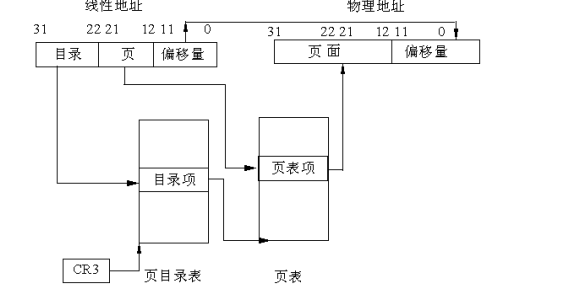

# Linux硬件基础
了解`Linux`内核，首先要认识到操作系统和一般软件的不同，操作系统是一种充分挖掘硬件潜能的软件，因此要想深入解析操作系统内在的运作机制，就必须搞清楚相关的硬件机制。
Linux 把与硬件相关的代码全部放在 arch目录下，在这个目录下，有 arm、alpha,i386、m68k、mips 等十多种，在这众多的平台中，大家熟悉的就是 i386，即 Inte l80386。
因此，我们所介绍的硬件基础也是以此为背景的。
# i386寄存器
## 通用寄存器
8 个通用寄存器是 8086 寄存器的超集，它们的名称和用途分别为：
* EAX：一般用作累加器。 
* EBX：一般用作基址寄存器（Base）。 
* ECX：一般用来计数（Count）。 
* EDX：一般用来存放数据（Data）。 
* EBP：一般用作堆栈指针（Stack Pointer）。 
* EBP：一般用作基址指针（Base Pointer）。 
* ESI：一般用作源变址（Source Index）。 
* EDI：一般用作目标变址（Destinatin Index）。 
> 这 8 个通用寄存器既可以支持 1 位、8 位、16 位和 32 位数据运算，也支持 16 位和 32 位存储
器寻址。 
## 段寄存器
8086 中有 4 个 16 位的段寄存器：CS、DS、SS、ES，分别用于存放可执行代码的代码段、数据段、堆栈段和其他段的基地址
> CS：代码段寄存器。 
> DS：数据段寄存器。 
> SS：堆栈段寄存器。 
> ES、FS 及 GS：附加数据段寄存器。
## 状态和控制寄存器
### 指令指针寄存器和标志寄存器
* 指令指针寄存器（EIP）中存放下一条将要执行指令的偏移量，这个偏移量是相对于目前正在运行的代码段寄存（CS）而言的。偏移量加上当前代码段的基地址，就形成了下一条指令的地址
* 标志寄存器定义图


...([其他的寄存器链接如下](https://blog.csdn.net/weixin_45611297/article/details/124284991))
## 内存地址
在计算机内，都存在一个程序能产生的内存地址的集合，当程序执行如下指令:
`MOVE REG,ADDR`,它把地址为 ADDR（假设为 10000）的内存单元的内容复制到 REG 中，地址 ADDR 可以通过索引、基址寄存器、段寄存器和其他方式产生。
在 8086 的实模式下，把某一段寄存器左移 4 位，然后与地址 ADDR 相加后被直接送到内
存总线上，这个相加后的地址就是内存单元的物理地址，而程序中的这个地址就叫逻辑地址，在 80386 的保护模式下，这个逻辑地址不是被直接送到内存总线，而是被送到内存管理单元（MMU）,`MMU` 由一个或一组芯片组成，其功能是把逻辑地址映射为物理地址，即进行地址转换，如图所示。

80386的三种不同的地址:
* 逻辑地址
* 线性地址
* 物理地址
> MMU把逻辑地址转换为物理地址的过程

## 描述符概念
所谓描述符（Descriptor），就是描述段的属性的一个 8 字节存储单元。在实模式下，段的属性不外乎是代码段、堆栈段、数据段、段的起始地址、段的长度等，而在保护模式下则复杂一些。80386 将它们结合在一起用一个 8 字节的数表示，称为描述符
* 用户段描述符如下:

## 描述符表
> 各种各样的用户描述符和系统描述符，都放在对应的全局描述符表、局部描述符表和中断描述符表中，描述符表（即段表）定义了 386 系统的所有段的情况。所有的描述符表本身都占据一个字节为 8 的倍数的存储器空间，

1.全局描述符表(GDT)

2.中断描述符表(IDT)

3.局部描述符(LDT)

* Linux下段机制的寻址过程:


* 描述符投影寄存器:投影寄存器容纳有相应段寄存器寻址的段的基地址、界限及属性。每当用选择符装入段寄存器时，CPU 硬件便自动地把描述符的全部内容装入对应的投影寄存器
## Linux中段代码分析
1.首先，Linux在启动的过程中设置了段寄存器的值和全局描述符GDT的内容，其中段的定义在`include/asm-i386/segment.h`中，具体代码如下
``` c
#define __KERNEL_CS0x10 ／＊内核代码段，index=2,TI=0,RPL=0＊／ 
#define __KERNEL_DS0x18 ／＊内核数据段, index=3,TI=0,RPL=0＊／ 
#define __USER_CS 0x23 ／＊用户代码段, index=4,TI=0,RPL=3＊／ 
#define __USER_DS 0x2B ／＊用户数据段, index=5,TI=0,RPL=3＊／ 

```
可以看出，没有定义堆栈段，是因为Linux不区分堆栈段和数据段，因为没有使用LDT，因此TI=0，内核代码段和数据段具有最高特权，因此其 `RPL`为 0，而用户代码段和数据段具有最低特权，因此其 `RPL` 为 3

全局描述符的定义在`arch/i386/kernel/head.S`中
```armasm
ENTRY（gdt_table） 
 .quad 0x0000000000000000 /* NULL descriptor */ 
 .quad 0x0000000000000000 /* not used */ 
 .quad 0x00cf9a000000ffff /* 0x10 kernel 4GB code at 0x00000000 */ 
 .quad 0x00cf92000000ffff /* 0x18 kernel 4GB data at 0x00000000 */ 
 .quad 0x00cffa000000ffff /* 0x23 user 4GB code at 0x00000000 */ 
 .quad 0x00cff2000000ffff /* 0x2b user 4GB data at 0x00000000 */ 
 .quad 0x0000000000000000 /* not used */ 
 .quad 0x0000000000000000 /* not used */ 
 /* 
 * The APM segments have byte granularity and their bases 
 * and limits are set at run time. 
 */ 
 .quad 0x0040920000000000 /* 0x40 APM set up for bad BIOS's */ 
 .quad 0x00409a0000000000 /* 0x48 APM CS code */ 
 .quad 0x00009a0000000000 /* 0x50 APM CS 16 code （16 bit） */ 
 .quad 0x0040920000000000 /* 0x58 APM DS data */ 
 .fill NR_CPUS*4,8,0 /* space for TSS's and LDT's */ 
```
从代码可以看出，GDT 放在数组变量 gdt_table 中。按 Intel 规定，GDT 中的第一项为空，这是为了防止加电后段寄存器未经初始化就进入保护模式而使用 GDT 的。第二项也没用。从下标 2～5 共 4 项对应于前面的 4 种段描述符值,从描述符的数值可以得出:
(将16进制转为2进制后与描述符具体位进行比对)
* 段的基地址全部为 0x00000000； 
* 段的上限全部为 0xffff； 
* 段的粒度 G 为 1，即段长单位为 4KB； 
* 段的 D 位为 1，即对这 4 个段的访问都为 32 位指令； 
* 段的 P 位为 1，即 4 个段都在内存。 
## 分页机制
> 80386使用4K大小的页，因此将4G字节的线性地址空间划分为1G个页面，分页机制由CR0中的PG位启用，若PG=1，启用分页机制
### 分页机构
1.两级页表结构(上课讲过，不多赘述)

2.页目录项32位具体含义
* 第 31~12 位是 20 位页表地址，由于页表地址的低 12 位总为 0，所以用高 20 位指出32 位页表地址就可以了。因此，一个页目录最多包含 1024 个页表地址。 
* 第 0 位是存在位，如果 P=1，表示页表地址指向的该页在内存中，如果 P=0，表示不在内存中。 
* 第 1 位是读/写位，第 2 位是用户/管理员位，这两位为页目录项提供硬件保护。当特权级为 3 的进程要想访问页面时，需要通过页保护检查，而特权级为 0 的进程就可以绕过页
保护。 
* 第 3 位是 PWT（Page Write-Through）位，表示是否采用写透方式，写透方式就是既写内存（RAM）也写高速缓存,该位为 1 表示采用写透方式。 
* 第 4 位是 PCD（Page Cache Disable）位，表示是否启用高速缓存，该位为 1 表示启用高速缓存。 
* 第 5 位是访问位，当对页目录项进行访问时，A 位=1。 
* 第 7 位是 Page Size 标志，只适用于页目录项。如果置为 1，页目录项指的是 4MB 的页面，请看后面的扩展分页。 
* 第 9~11 位由操作系统专用，Linux 也没有做特殊之用。 

3.TLB
## Linux下的分页机制
> Linux定义了三种类型的页表
* 总目录 PGD（Page Global Directory） 
* 中间目录 PMD（Page Middle Derectory） 
* 页表 PT（Page Table） 

### 1.与页相关的数据结构和宏定义
如上所述，可以看出PGD,PMD和PT表的表项都占4个字节，因此将他们定义为无符号长整数，分别为pgd_t,pmd_t,pte_t,定义在page.h中
```c
typedef struct { unsigned long pte_low; } pte_t; 
typedef struct { unsigned long pmd; } pmd_t; 
typedef struct { unsigned long pgd; } pgd_t; 
typedef struct { unsigned long pgprot; } pgprot_t; 
```
Linux并未将这几种类型直接定义为长整数而是定义为一个结构，是为了gcc在编译时能够进行严格类型检查，此外还定义了几个宏来访问这些结构:
```c
#define pte_val（x） （（x）.pte_low） 
#define pmd_val（x）（（x）.pmd） 
#define pgd_val（x） （（x）.pgd） 
```
字段pgrot的值与页面项的低12位相对应，在`pgtalbe.h`中定义了对应的宏
```c
 #define _PAGE_PRESENT 0x001 
 #define _PAGE_RW 0x002 
 #define _PAGE_USER 0x004 
 #define _PAGE_PWT 0x008 
 #define _PAGE_PCD 0x010 
 #define _PAGE_ACCESSED 0x020 
 #define _PAGE_DIRTY0x040 
 #define _PAGE_PSE 0x080 /* 4 MB （or 2MB） page, Pentium+, if present.. */ 
 #define _PAGE_GLOBAL 0x100 /* Global TLB entry PPro+ */ 
```
从上述描述，我们也可以体会到，把标志位定义为宏而不是位段更有利于编码
而对于页目录和页表，则是利用数组进行定义，定义在`pgtable.h`中，定义如下
```c
extern pgd_t swapper_pg_dir[1024]; 
extern unsigned long pg0[1024]; 
```
其中swapper_pg_dir为页目录表，pg0为临时页表，每个表最多都有1024项

### 2.线性地址域的定义
lntel的线性地址的结构如下:

其线性地址的定义在`page.h`文件中，偏移量的位数如下
```c
 #define PAGE_SHIFT 12 
 #define PAGE_SIZE （1UL << PAGE_SHIFT） 
 #define PTRS_PER_PTE 1024 
 #define PAGE_MASK （~（PAGE_SIZE-1））
```
其中`PAGE_SHIFT`宏定义了偏移量的位数为12，因此页大小`PAGE_SIZE`为2<sup>12</sup>=4096字节;`PTR_PER_PTE`为页表的项数;最后`PAGE_MASK`的值定义为`0xffff000`，用以屏蔽偏移量域的所有位

---
```c
 #define PGDIR_SHIFT22 
 #define PTRS_PER_PGD 1024 
 #define PGDIR_SIZE （1UL << PGDIR_SHIFT） 
 #define PGDIR_MASK （~（PGDIR_SIZE-1））
```
其中`PGDIR_SHIFT`是页表所能映射区域线性地址的位数，其位数为22(12位的偏移量加上10位的页表);`PTR_PER_PGD`为页目录的目录项数;`PGDIR_SIZE`为页目录的大小，为2<sup>22</sup>,即4MB;`PGDIR_MASK`为0xffc0000,用来屏蔽偏移量位和页表域的所有位

---
```c
#define PMD_SHIFT 22 
#define PTRS_PER_PMD
```
`PMD_SHIFT` 为中间目录表映射的地址位数，其值也为 22，但是因为 Linux在386中只用了两级页表结构，因此，让其目录项个数为 1，这就使得中间目录在指针序列中的位置被保存，以便同样的代码在 32 位系统和 64 位系统下都能使用。后面的讨论我们不再提及中间目录。
## 3.对于页目录项和页表的处理
> 在`page.h`,`pgtable.h`,`pgtable.h3`这三个文件中，还定义有大量的宏，用于对页目录，页表和表项的处理，在此介绍一些主要的宏和函数
### 3.1 表项值的确立
```c
static inline int pgd_none（pgd_t pgd） { return 0; } 
static inline int pgd_present（pgd_t pgd） { return 1; } 
#define pte_present（x） （（x）.pte_low & （_PAGE_PRESENT | _PAGE_PROTNONE））
```
`pgd_none()`函数直接返回0，表示尚未为该页目录建立映射，因此页目录项为空;`pgd_present()`函数直接返回1，表示该映射虽然未建立，但页目录映射的页表仍存在于内存中。

`pte_present` 宏的值为 1 或 0，表示 P 标志位。如果页表项不为 0，但标志位为 0，则表示映射已经建立，但所映射的物理页面不在内存。
### 3.2 清除相应表的表项
```c
#define pgd_clear（xp） do { } while （0） 
#define pte_clear（xp） do { set_pte（xp, __pte（0））; } while （0） 
``` 
`pgd_clear` 宏实际上什么也不做，定义它可能是为了保持编程风格的一致。`pte_clear`是把 0 写到页表表项中。

而`set_pte`的具体定义，经查询在`page.h`中，具体代码如下:
```c
#define set_pte(pteptr, pteval) (*(pteptr) = pteval)
```
可以看出该函数的作用就是指针赋值使用
### 3.3 对页表表项标志值进行操作的宏
> 这些宏的定义都在`pgtable.h`文件中,下表给出宏名和定义

|宏名|功能|
|:--------|:------|
|Set_pte（）    | 把一个具体的值写入表项
|Pte_read（）| 返回 User/Supervisor 标志值（由此可以得知是否可以在用户态下访问此页）
|Pte _write（）| 如果 Present 标志和 Read/Write 标志都为 1，则返回 1（此页是否存在并可写）
|Pte _exec（） |返回 User/Supervisor 标志值 
|Pte _dirty（） |返回 Dirty 标志的值（说明此页是否被修改过） 
|Pte _young（） |返回 Accessed 标志的值（说明此页是否被存取过） 
|Pte _wrprotect（） |清除 Read/Write 标志 
|Pte _rdprotect（） |清除 User/Supervisor 标志 
|Pte _mkwrite |设置 Read/Write 标志 
|Pte _mkread |设置 User/Supervisor 标志 
|Pte _mkdirty（） |把 Dirty 标志置 1 
|Pte _mkclean（） |把 Dirty 标志置 0 
|Pte _mkyoung 把 |Accessed 标志置 1 
|Pte _mkold（） |把 Accessed 标志置 0 
|Pte _modify（p,v） |把页表表项 p 的所有存取权限设置为指定的值 
|Mk_pte（） |把一个线性地址和一组存取权限合并来创建一个 32 位的页表表项 
|Pte _pte_phys（） |把一个物理地址与存取权限合并来创建一个页表表项 
|Pte _page（） |从页表表项来返回页的线性地址 


