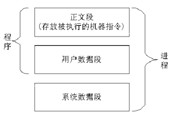
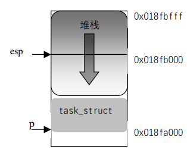

# 1.进程和程序

进程是一个动态实体，如图所示，进程实体由三个独立的部分组成:
* 正文段(Text)：存放被执行的机器指令。这个段是只读的(所以，在这里不能写自己能修改的代码)，它允许系统中正在运行的两个或多个进程之间能够共享这一代码
* 用户数据段(User Segment)：存放进程在执行时直接进行操作的所有数据，包括进程使用的全部变量在内。显然，这里包含的信息可以被改变。虽然进程之间可以共享正文段，但是每个进程需要有它自己的专用用户数据段
* 系统数据段(System Segment)：该段有效地存放程序运行的环境。事实上，这正是程序和进程的区别所在。
# 2.Linux中的进程概述
> Linux 中的每个进程由一个 task_struct 数据结构来描述，在 Linux 中，任务(Task)和进程(Process)是两个相同的术语，task_struct 其实就是通常所说的“进程控制块”即PCB。task_struct 容纳了一个进程的所有信息，是系统对进程进行控制的唯一手段
# 3.task_struct结构描述
## 3.1 进程状态(State)
进程状态是调度和对换的依据,Linux的进程主要有以下状态
|内核表示|含义
|:--|:--
|TASK_RUNNING |可运行 
|TASK_INTERRUPTIBLE |可中断的等待状态 
|TASK_UNINTERRUPTIBLE |不可中断的等待状态
|TASK_ZOMBIE |僵死 
|TASK_STOPPED |暂停 
|TASK_SWAPPING |换入/换出

[1] 可运行状态  

处于这种状态的进程，要么正在运行、要么正准备运行。正在运行的进程就是当前进程(由 current 所指向的进程)，而准备运行的进程只要得到 CPU 就可以立即投入运行，CPU 是这些进程唯一等待的系统资源。系统中有一个运行队列`run_queue`,用来容纳所有处于可运行状态的进程，调度程序执行时，从中选择一个进程投入运行。在后面我们讨论进程调度的时候，可以看到运行队列的作用。当前运行进程一直处于该队列中，也就是说，current总是指向运行队列中的某个元素，只是具体指向谁由调度程序决定。   
[2] 等待状态  

处于该状态的进程正在等待某个事件(Event)或某个资源，它肯定位于系统中的某个等待队列(wait_queue)中。Linux 中处于等待状态的进程分为两种：可中断的等待状态和不可中断的等待状态。处于可中断等待态的进程可以被信号唤醒，如果收到信号，该进程就从等待状态进入可运行状态，并且加入到运行队列中，等待被调度；而处于不可中断等待态的进程是因为硬件环境不能满足而等待，例如等待特定的系统资源，它任何情况下都不能被打断，只能用特定的方式来唤醒它，例如唤醒函数 wake_up()等。   
[3] 暂停状态
此时的进程暂时停止运行来接受某种特殊处理。通常当进程接收到 SIGSTOP、SIGTSTP、SIGTTIN 或 SIGTTOU 信号后就处于这种状态。例如，正接受调试的进程就处于这种状态。 

[4] 僵死状态  

进程虽然已经终止，但由于某种原因，父进程还没有执行 wait()系统调用，终止进程的信息也还没有回收。顾名思义，处于该状态的进程就是死进程，这种进程实际上是系统中的垃圾，必须进行相应处理以释放其占用的资源。
## 3.2 进程调度信息
调度程序利用这部分信息决定系统中哪个进程最应该运行，并结合进程的状态信息保证系统运转的公平和高效。这一部分信息通常包括进程的类别(普通进程还是实时进程)、进程的优先级等
|域名|定义
|:--|:--
|need_resched |调度标志 
|Nice |静态优先级 
|Counter |动态优先级 
|Policy |调度策略 
|rt_priority |实时优先级 

当 need_resched 被设置时，在“下一次的调度机会”就调用调度程序 schedule()counter 代表进程剩余的时间片，是进程调度的主要依据，也可以说是进程的动态优先级，因为这个值在不断地减少；nice 是进程的静态优先级，同时也代表进程的时间片，用于对 counter 赋值，可以用 nice()系统调用改变这个值；policy
是适用于该进程的调度策略，实时进程和普通进程的调度策略是不同的；rt_priority 只对实时进程有意义，它是实时进程调度的依据。
## 3.3 标识符
每个进程有进程标识符、用户标识符、组标识符    
进程标识符(PID，process identifier)，每个进程都有一个唯一的标识符，内核通过这个标识符来识别不同的进程，同时，进程标识符 PID 也是内核提供给用户程序的接口，用户程序通过 PID 对进程发号施令。PID 是 32 位的无符号整数，它被顺序编号：新创建进程的 PID通常是前一个进程的 PID 加 1。然而，为了与 16 位硬件平台的传统 Linux 系统保持兼容，在Linux 上允许的最大 PID 号是 32767，当内核在系统中创建第 32768 个进程时，就必须重新开始使用已闲置的 PID 号。 
|域名|含义
|:--|:--
|Pid |进程标识符 
|Uid、gid |用户标识符、组标识符 
|Euid、egid |有效用户标识符、有效组标识符 
|Suid、sgid |备份用户标识符、备份组标识符 
|Fsuid、fsgid |文件系统用户标识符、文件系统组标识符 
## 3.4 进程间通信
Linux 支持多种不同形式的通信机制。它支持典型的 UNIX 通信机制(IPC Mechanisms)：信号(Signals)、管道(Pipes)，也支持 System V 通信机制：共享内(Shared Memory)、信号量和消息队列(Message Queues),如表所示
|域名|含义
|:--|:--
|Spinlock_t |sigmask_lock 信号掩码的自旋锁 
|Long blocked |信号掩码 
|Struct signal *sig |信号处理函数 
|Struct sem_undo *semundo |为避免死锁而在信号量上设置的取消操作 
|Struct sem_queue *semsleeping |与信号量操作相关的等待队列
## 3.5 进程链接
程序创建的进程具有父/子关系。因为一个进程能创建几个子进程，而子进程之间有兄
弟关系，在 task_struct 结构中有几个域来表示这种关系。    

在 Linux 系统中，除了初始化进程 init，其他进程都有一个父进程(Parent Process)或称为双亲进程。可以通过 fork()或 clone()系统调用来创建子进程，除了进程标识符(PID)等必要的信息外，子进程的 task_struct 结构中的绝大部分的信息都是从父进程中拷贝

每个进程的 task_struct 结构有许多指针，通过这些指针，系统中所有进程的
task_struct结构就构成了一棵进程树，这棵进程树的根就是初始化进程 init的 task_struct结构(init 进程是 Linux 内核建立起来后人为创建的一个进程，是所有进程的祖先进程)。
下图为所有进程的链接信息
|名称|英文解释|中文解释
|:--|:--|:--
|p_opptr |Original parent |祖先 
|p_pptr|Parent |父进程 
|p_cptr |Child |子进程 
|p_ysptr |Younger sibling |弟进程 
|p_osptr |Older sibling |兄进程 
|Pidhash_next,Pidhash_pprev | | 进程在哈希表中的链接 
|Next_task,prev_task | |进程在双向循环链表中的链接 
|Run_list | |运行队列的链表 
## 3.6 时间和定时器信息
一个进程从创建到终止叫做该进程的生存期(lifetime)。进程在其生存期内使用 CPU的时间，内核都要进行记录，以便进行统计、计费等有关操作。进程耗费 CPU 的时间由两部分组成：一是在用户模式(或称为用户态)下耗费的时间、一是在系统模式(或称为系统态)下耗费的时间。每个时钟滴答，也就是每个时钟中断，内核都要更新当前进程耗费 CPU 的时间信息  
下表是和时间有关的域:
|域名|含义
|:--|:--
|Start_time |进程创建时间 
|Per_cpu_utime |进程在某个 CPU 上运行时在用户态下耗费的时间 
|Per_cpu_stime |进程在某个 CPU 上运行时在系统态下耗费的时间 
|Counter |进程剩余的时间片

|定时器类型|解释|更新时间|表示该定时器的域
|:--|:--|:--|:--
|ITIMER_REAL |实时定时器  |实时更新，即不论该进程是否运行|it_real_value <br>it_real_incr<br> real_timer
|ITIMER_VIRTUAL |虚拟定时器 |只在进程运行于用户态时更新 |it_virt_incr<br>it_virt_value 
|ITIMER_PROF |概况定时器| 进程运行于用户态和系统态时更新| it_prof_incr  <br> it_prof_value

进程有 3 种类型的定时器：实时定时器、虚拟定时器和概况定时器。这 3 种定时器的特征共有 3 个：到期时间、定时间隔和要触发的事件。  
每个时钟中断，当前进程所有和时间有关的信息都要更新：当前进程耗费的 CPU 时间更新，以便于最后的计费；时间片计数器 counter 要更新，如果 counter<=0，则要执行调度程序；进程申请的延时要更新，如果延时时间到了，则唤醒该进程；所有的定时器都要更新，Linux 内核检测这些定时器是否到期，如果到期，则执行相应的操作。在这里，“更新”的具体操作是不同的：对 counter，内核要对它减值，而对于所有的定时器，就是检测它的值，内核把系统当前时间和其到期时间作一比较，如果到期时间小于系统时间，则表示该定时器到期。   
此外，Linux 内核对这 3 种定时器的处理是不同的，虚拟定时器和概况定时器到期时，内核向当前进程发送相应的信号：SIGVTALRM 、SIGPROF ；而实时定时器要执行的操作由real_timer 决定，real_time 是 timer_list 类型的变量(定义： struct timer_list real_timer)，其中容纳了实时定时器的到期时间、定时间隔等信息
## 3.7 文件系统信息
进程可以打开或关闭文件，文件属于系统资源，Linux 内核要对进程使用文件的情况进行记录。task_struct 结构中有两个数据结构用于描述进程与文件相关的信息。其中，fs_struct 中描述了两个 VFS 索引节点(VFS inode)，这两个索引节点叫做 root 和 pwd，分别指向进程的可执行映像所对应的根目录(Home Directory)和当前目录或工作目录。
file_struct 结构用来记录了进程打开的文件的描述(Descriptor)。如下表所示。
|定义形式|解释
|:--|:--
Sruct fs_struct *fs| 进程的可执行映像所在的文件系统 
Struct files_struct |*files 进程打开的文件

在文件系统中，每个 VFS 索引节点唯一描述一个文件或目录，同时该节点也是向更低层的文件系统提供的统一的接口。
## 3.8 虚拟内存信息
除了内核线程(Kernel Thread)，每个进程都拥有自己的地址空间(也叫虚拟空间)，用 mm_struct 来描述。另外 Linux 2.4 还引入了另外一个域 active_mm，这是为内核线程而引入的。因为内核线程没有自己的地址空间，为了让内核线程与普通进程具有统一的上下文切换方式，当内核线程进行上下文切换时，让切换进来的线程的 active_mm 指向刚被调度出去的进程的 active_mm(如果进程的 mm 域不为空，则其 active_mm 域与 mm 域相同)。内存信息如下表所示。 
|定义形式|解释
Struct mm_struct *mm |描述进程的地址空间 
Struct mm_struct *active_mm |内核线程所借用的地址空间
## 3.9 页面管理
当物理内存不足时，Linux 内存管理子系统需要把内存中的部分页面交换到外存，其交换是以页为单位的。
|定义形式|解释
|:--|:--
Int swappable |进程占用的内存页面是否可换出 
Unsigned long min_flat,maj_flt,nswap |进程累计的次(minor)缺页次数、主(major)次数及累计换出、换入页面数 
Unsigned long cmin_flat,cmaj_flt,cnswap |本进程作为祖先进程，其所有层次子进程的累计的次(minor)缺页次数、主(major)次数及累计换出、换入页面数 
## 3.10 SMP信息
Linux2.4对SMP进行了全面支持，相关域如下:
|定义形式|解释
|:--|:--
Int has_cpu| 进程当前是否拥有 CPU 
Int processor |进程当前正在使用的 CPU 
Int lock_depth |上下文切换时内核锁的深度
## 3.11 和处理器相关环境信息
即为该进程建立完整的环境时，处理器(Processor)的寄存器、
堆栈等是必不可少的。因为不同的处理器对内部寄存器和堆栈的定义不尽相同，所以叫做“和处理器相关的环境”，也叫做“处理机状态”。当进程暂时停止运行时，处理机状态必须保存在进程的 task_struct 结构中，当进程被调度重新运行时再从中恢复这些环境，也就是恢复这些寄存器和堆栈的值，其处理机信息如下:
|定义形式|解释
|:--|:--
Struct thread_struct *tss |任务切换状态 
## 3.12 其他
[1] struct wait_queue *wait_chldexit   
在进程结束时,或发出系统调用 wait4 时，为了等待子进程的结束，而将自己(父进程)睡眠在该等待队列上，设置状态b标志为TASK_INTERRUPTIBLE，并且把控制权转给调度程序。  

[2] Struct rlimit rlim[RLIM_NLIMITS]   
每一个进程可以通过系统调用 setlimit 和 getlimit 来限制它资源的使用  

[3] Int exit_code exit_signal   
程序的返回代码以及程序异常终止产生的信号，这些数据由父进程(子进程完成后)轮流查询。

[4] Char comm[16] 
这个域存储进程执行的程序的名字，这个名字用在调试中。  

[5] Unsigned long personality 
Linux 可以运行 X86 平台上其他 UNIX 操作系统生成的符合 iBCS2 标准的程序, personality 进一步描述进程执行的程序属于何种 UNIX 平台的“个性”信息

[6]  int did_exec:1 
按 POSIX 要求设计的布尔量，区分进程正在执行老程序代码，还是用系统调用 execve()装入一个新的程序。

[7]struct linux_binfmt *binfmt 
指向进程所属的全局执行文件格式结构，共有 a.out、script、elf、java 等 4 种。
# 4.task_struct结构在内存中的存放
## 4.1 进程内核栈
每个进程都有自己的内核栈。当进程从用户态进入内核态时，CPU 就自动地设置该进程的内核栈，也就是说，CPU 从任务状态段 TSS 中装入内核栈指针 esp   
`x86`内核栈的分布如图所示

在 Intel 系统中，栈起始于末端，并朝这个内存区开始的方向增长。从用户态刚切换到内核态以后，进程的内核栈总是空的，因此，esp 寄存器直接指向这个内存区的顶端在图中，从用户态切换到内核态后，esp 寄存器包含的地址为`0x018fc00`。进程描述符存放在从`0x015fa00`开始的地址。只要把数据写进栈中，esp 的值就递减  
在`/include/linux/sched.h`中定义了如下结构:
```c
union task_union { 
struct task_struct task; 
unsigned long stack[2408]; 
};
```
从这个结构可以看出，内核栈占 8KB 的内存区。实际上，进程的 task_struct 结构所占的内存是由内核动态分配的，更确切地说，内核根本不给 task_struct 分配内存，而仅仅给内核栈分配 8KB 的内存，并把其中的一部分给 task_struct 使用。  
task_struct 结构大约占 1K 字节左右，其具体数字与内核版本有关，因为不同的版本其域稍有不同。因此，内核栈的大小不能超过 7KB，否则，内核栈会覆盖 task_struct 结构，从而导致内核崩溃。不过，7KB 大小对内核栈已足够。   
将`task_struct`结构与内核栈放在一起有以下好处:
* 内核可以方便而快速地找到这个结构,用伪代码描述如下:
`task_struct = (struct task_struct *) STACK_POINTER & 0xffffe000`
* 避免在创建进程时动态分配额外内存
* `task_struct`结构的起始地址总是开始于页大小(PAGE_SIZE)的边界。  
## 4.2 当前进程(current宏)
当一个进程在某个 CPU 上正在执行时,内核如何获得指向它的 task_struct 的指针,上面所提到的存储方式为达到这一目的提供了方便。在`linux/include/i386/current.h`中定义了current宏,这是一段与体系结构相关的代码:
```c
static inline struct task_struct * get_current(void) 
{ 
struct task_struct *current; 
__asm__("andl %%esp,%0; ":"=r" (current) : "0" (~8191UL)); 
return current; 
} 
```
实际上，这段代码相当于如下一组汇编指令(设 p 是指向当前进程 task_struc 结构的指针):
```armasm
movl $0xffffe000, %ecx 
andl %esp, %ecx 
movl %ecx, p
```
只需检查栈指针的值，而根本无需存取内存，内核就可以导出`task_struct`结构的地址。   
current 宏，在内核代码中也随处可见，可以把它看作全局变量来用，例如，current->pid 返回在 CPU 上正在执行的进程的标识符。  
在`include/ i386/processor.h`中定义了两个函数`free_task_struct()`和 
`alloc_task_struct()`，前一个函数释放8KB的`task_union`内存区，而后一个函数分配 8KB的`task_union`内存区。 

