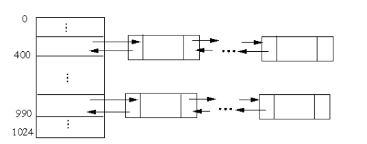
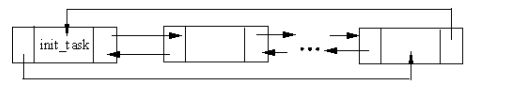
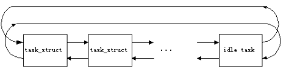

# 5.进程组织方式
在 Linux 中，可以把进程分为用户任务和内核线程，不管是哪一种进程，它们都有自己的task_struct,对于Linux中的众多进程,Linux采用了如下组织方式:
## 5.1 哈希表
哈希表是进行快速查找的一种有效的组织方式。Linux 在进程中引入的哈希表叫做
pidhash，在`include/linux/sched.h`中定义如下
```c
#define PIDHASH_SZ (4096 >> 2) 
extern struct task_struct *pidhash[PIDHASH_SZ]; 
#define pid_hashfn(x) ((((x) >> 8) ^ (x)) & (PIDHASH_SZ - 1))
```
其中，PIDHASH_SZ 为表中元素的个数，表中的元素是指向 task_struct 结构的指针。pid_hashfn 为哈希函数，把进程的 PID 转换为表的索引。通过这个函数，可以把进程的 PID均匀地散列在它们的域（0 到 PID_MAX-1）中。   

同时我们也知道,哈希函数并不能确保PID和表的索引一一对应,两个不同的PID散列到相同的索引称为冲突  

Linux 利用链地址法来处理冲突的 PID：也就是说，每一表项是由冲突的 PID 组成的双向链表，这种链表是由 task_struct 结构中的 pidhash_next pidhash_pprev 域实现的，同一链表中 pid 的大小由小到大排列。如图所示。

哈希表 pidhash 中插入和删除一个进程时可以调用 hash_ pid() 和 unhash_ pid()函数。对于一个给定的 pid，可以通过 find_task_by_pid()函数快速地找到对应的进程
```c
static inline struct task_struct *find_task_by_pid（int pid） 
{
    struct task_struct *p, *htable = &pidhash[pid_hashfn(pid)]; 
    for（p = *htable; p && p->pid != pid; p = p->pidhash_next） 
                 ; 
    return p; 
} 
```
## 5.2 双向循环链表
哈希表的主要作用是根据进程的 pid 可以快速地找到对应的进程，但它没有反映进程创建的顺序，也无法反映进程之间的亲属关系，因此引入双向循环链表。每个进程 task_struct 结构中的 prev_task 和 next_task 域用来实现这种链表，如图所示。

宏`SET_LINK`用来在该链表中插入一个元素
```c
#define SET_LINKS（p） do { \ 
 （p）->next_task = &init_task; \ 
 （p）->prev_task = init_task.prev_task; \ 
 init_task.prev_task->next_task = （p）; \ 
 init_task.prev_task = （p）; \ 
 （p）->p_ysptr = NULL; \ 
 if （（（p）->p_osptr = （p）->p_pptr->p_cptr） != NULL） \ 
 （p）->p_osptr->p_ysptr = p; \ 
 （p）->p_pptr->p_cptr = p; \ 
 } while （0） 
```
从代码中我们可以看出,链表的头和尾都为`init_task`,它对应的进程为0，也就是空进程，这是所有进程的祖先，这个宏把进程之间的亲属关系也链接起来，此外还有一个宏`for_rach_task()`
```
#define for_each_task（p） \ 
 for （p = &init_task ; （p = p->next_task） != &init_task ; ）
```
因为进程的双向循环链表是一个临界资源，因此使用该宏时一定要加锁，使用之后再开锁
## 5.3 运行队列
当内核要寻找一个新的进程在 CPU 上运行时，必须只考虑处于可运行状态的进程（即在TASK_RUNNING 状态的进程），因为扫描整个进程链表是相当低效的，所以引入了可运行状态进程的双向循环链表，也叫运行队列（runqueue)  
运行队列容纳了系统中所有可以运行的进程，它是一个双向循环队列，其结构如图所示
## 5.4 进程的运行队列链表
该队列通过 task_struct 结构中的两个指针 run_list 链表来维持。队列的标志有两个：一个是“空进程”idle_task，一个是队列的长度。   

有两个特殊的进程永远在运行队列中待着：当前进程和空进程。前面我们讨论过，当前进程就是由 cureent 指针所指向的进程，也就是当前运行着的进程;空进程是个比较特殊的进程，只有系统中没有进程可运行时它才会被执行，Linux 将它看作运行队列的头，当调度程序遍历运行队列，是从 idle_task 开始、至 idle_task 结束的，在调度程序运行过程中，允许队列中加入新出现的可运行进程，新出现的可运行进程插入到队尾，这样的好处是不会影响到调度程序所要遍历的队列成员  
另一个重要标志是队列长度，也就是系统中处于可运行状态（TASK_RUNNING）的进程数目，用全局整型变量`nr_running`表示，在`/kernel/fork.c`中定义如下：
```c
int nr_running=1;
```
若 nr_running 为 0,就表示队列中只有空进程,在这里要说明一下:若 nr_running 为0,则系统中的当前进程和空进程就是同一个进程。但是 Linux 会充分利用CPU而尽量避免出现这种情况
## 5.5 等待队列
1. 通用双向链表
在`include/linux/list.h` 中定义了这种链表： 
```c
struct list_head { 
 struct list_head *next, *prev; 
}; 
```
这是双向链表的一个基本框架，在其他使用链表的地方就可以使用它来定义任意一个双
向链表，例如： 
```c
struct foo_list { 
 int data; 
 struct list_head list; 
}; 
```
对于 list_head 类型的链表，Linux 定义了 5 个宏：
```c
#define LIST_HEAD_INIT（name） { &（name）, &（name） } 
#define LIST_HEAD（name） \ 
 struct list_head name = LIST_HEAD_INIT（name） 
#define INIT_LIST_HEAD（ptr） do { \ 
 （ptr）->next = （ptr）; （ptr）->prev = （ptr）; \ 
} while （0） 
#define list_entry（ptr, type, member） \ 
 （（type *）（（char *）（ptr）-（unsigned long）（&（（type *）0）->member））） 
#define list_for_each（pos, head） \ 
 for （pos = （head）->next; pos != （head）; pos = pos->next） 
```
前 3 个宏都是初始化一个空的链表，但用法不同，LIST_HEAD_INIT()在声明时使用，用来初始化结构元素，第 2 个宏用在静态变量初始化的声明中，而第 3 个宏用在函数内部。 
其中，最难理解的宏为 list_entry（），在内核代码的很多处都用到这个宏，例如，在
调度程序中，从运行队列中选择一个最值得运行的进程，部分代码如下：
```c
static LIST_HEAD（runqueue_head）; 
struct list_head *tmp; 
struct task_struct *p; 
list_for_each（tmp, &runqueue_head） { 
 p = list_entry（tmp, struct task_struct, run_list）; 
 if （can_schedule（p）） { 
 int weight = goodness（p, this_cpu, prev->active_mm）; 
 if （weight > c） 
 c = weight, next = p; 
 } 
} 
```
从这段代码可以分析出 list_entry(ptr, type, member)宏及参数的含义： ptr 是
指向 list_ head 类型链表的指针，type 为一个结构，而 member 为结构 type 中的一个域，类型为 list_head，这个宏返回指向 type 结构的指针 

另 外 ， 对 list_head类型的链表进行删除和插入(头或尾)的宏为`list_del()/list_add()/list_ add_tail()`，在内核的其他函数中可以调用这些宏。例如，从运行队列中删除、增加及移动一个任务的代码如下：
```c
static inline void del_from_runqueue（struct task_struct * p） 
{ 
 nr_running--; 
 list_del（&p->run_list）; 
 p->run_list.next = NULL; 
} 
static inline void add_to_runqueue（struct task_struct * p） 
{ 
 list_add（&p->run_list, &runqueue_head）; 
 nr_running++; 
} 
static inline void move_last_runqueue（struct task_struct * p） 
{ 
 list_del（&p->run_list）; 
 list_add_tail（&p->run_list, &runqueue_head）; 
} 
static inline void move_first_runqueue（struct task_struct * p） 
{ 
 list_del（&p->run_list）; 
 list_add（&p->run_list, &runqueue_head）; 
} 
```
2. 等待队列
运行队列链表把处于 TASK_RUNNING 状态的所有进程组织在一起。当要把其他状态的进程分组时，不同的状态要求不同的处理,Linux选择了下列方式之一。   
* TASK_STOPPED 或 TASK_ZOMBIE 状态的进程不链接在专门的链表中，也没必要把它们分组，因为父进程可以通过进程的 PID 或进程间的亲属关系检索到子进程。 
* 把 TASK_INTERRUPTIBLE 或 TASK_UNINTERRUPTIBLE 状态的进程再分成很多类，其每一类对应一个特定的事件。在这种情况下，进程状态提供的信息满足不了快速检索进程，因此，有必要引入另外的进程链表。这些链表叫等待队列。  

等待队列表示一组睡眠的进程,当某一条件变为真时，由内核唤醒它们，等待队列由循环链表实现,等待队列的定义如下:
```c
struct __wait_queue { 
 unsigned int flags; 
 struct task_struct * task; 
 struct list_head task_list; 
} ; 
typedef struct __wait_queue wait_queue_t ;
```
关于等待队列另一个重要的数据结构—等待队列首部的描述如下
```c
struct __wait_queue_head { 
 wq_lock_t lock; 
 struct list_head task_list; 
}; 
typedef struct __wait_queue_head wait_queue_head_t; 
```
对于等待队列的操作函数,主要函数如下:
* init_waitqueue_head（）—对等待队列首部进行初始化 
* init_waitqueue_entry（）－对要加入等待队列的元素进行初始化 
* waitqueue_active（）—判断等待队列中已经没有等待的进程 
* add_wait_queue（）—给等待队列中增加一个元素 
* remove_wait_queue（）—从等待队列中删除一个元素 
注意,在以上函数的实现 中 ， 都 调 用 了 对 list_head 类型链表的操作函数（list_del()/list_add()/list_add_tail()），因此可以说，list_head 类型相当于 C++中的基类型   

sleep_on()函数对当前的进程起作用，我们把当前进程叫做 P：
```c
sleep_on（wait_queue_head_t *q） 
{ 
 SLEEP_ON_VAR ／＊宏定义，用来初始化要插入到等待队列中的元素＊／ 
 current->state = TASK_UNINTERRUPTIBLE; 
 SLEEP_ON_HEAD ／＊宏定义，把 P 插入到等待队列 ＊／ 
schedule（）; 
 SLEEP_ON_TAIL ／＊宏定义把 P 从等待队列中删除 ＊／ 
} 
```
这个函数把 P 的状态设置为 TASK_UNINTERRUPTIBLE，并把 P 插入等待队列。然后，它调用调度程序恢复另一个程序的执行。当 P 被唤醒时，调度程序恢复 sleep_on( )函数的执行，把 P 从等待队列中删除
* interruptible_sleep_on()与 sleep_on()函数是一样的，但稍有不同，前者把
进程 P 的状态设置为 TASK_INTERRUPTIBLE 而不是 TASK_UNINTERRUPTIBLE ，因此，通过接受一个信号可以唤醒 P。
* sleep_on_timeout() 和 interruptible_sleep_on_timeout()与前面情况类似，
但它们允许调用者定义一个时间间隔，过了这个间隔以后，内核唤醒进程。为了做到这点，它们调用 schedule_timeout()函数而不是 schedule()函数。   
利用 wake_up 或者 wake_up_interruptible 宏，让插入等待队列中的进程进入
TASK_RUNNING 状态，这两个宏最终都调用了 try_to_wake_up()函数：
```c
static inline int try_to_wake_up（struct task_struct * p, int synchronous） 
 { 
 unsigned long flags; 
 int success = 0; 
 spin_lock_irqsave（&runqueue_lock, flags）; /＊加锁＊／ 
 p->state = TASK_RUNNING; 
 if （task_on_runqueue（p）） ／＊判断 p 是否已经在运行队列＊／ 
 goto out; 
 add_to_runqueue（p）; ／＊不在，则把 p 插入到运行队列＊／ 
 if （!synchronous || !（p->cpus_allowed & （1 << smp_processor_id（）））） ／ 
 reschedule_idle（p）; 
 success = 1; 
 out: 
 spin_unlock_irqrestore（&runqueue_lock, flags）; ／＊开锁＊／ 
 return success; 
 }
```
在这个函数中，p 为要唤醒的进程。如果 p 不在运行队列中，则把它放入运行队列。如果重新调度正在进行的过程中，则调用 reschedule_idle（）函数，这个函数决定进程 p 是
否应该抢占某一 CPU 上的当前进程   

实际上，在内核的其他部分，最常用的还是 wake_up 或者 `wake_up_interruptible`宏，也就是说，如果你要在内核级进行编程，只需调用其中的一个宏。例如一个简单的实时时钟
（RTC）中断程序如下
```c
static DECLARE_WAIT_QUEUE_HEAD（rtc_wait）; ／＊初始化等待队列首部＊／ 
void rtc_interrupt（int irq, void *dev_id, struct pt_regs *regs）
{ 
 spin_lock（&rtc_lock）; 
 rtc_irq_data = CMOS_READ（RTC_INTR_FLAGS）; 
 spin_unlock（&rtc_lock）; 
 wake_up_interruptible（&rtc_wait）; 
} 
```
这个中断处理程序通过从实时时钟的 I/O 端口（CMOS_READ 宏产生一对 outb/inb）读取数据，然后唤醒在 rtc_wait 等待队列上睡眠的任务。 
# 6.内核线程
内核线程（thread）或叫守护进程（daemon），在操作系统中占据相当大的比例，当 Linux操作系统启动以后，尤其是 Xwindow 也启动以后，你可以用“ps”命令查看系统中的进程，这时会发现很多以“d”结尾的进程名，这些进程就是内核线程   
在 Linux 中，内核线程与普通进程有一些本质的区别:
* 内核线程执行的是内核中的函数，而普通进程只有通过系统调用才能执行内核中的函
数。 
* 内核线程只运行在内核态，而普通进程既可以运行在用户态，也可以运行在内核
态。 
* 因为内核线程指只运行在内核态，因此，它只能使用大于 PAGE_OFFSET（3G）的地址
空间。另一方面，不管在用户态还是内核态，普通进程可以使用 4GB 的地址空间。
# 7.内核同步
内核中的很多操作在执行的过程中都不允许受到打扰，最典型的例子就是对队列的操
作。如果两个进程都要将一个数据结构链入到同一个队列的尾部，要是在第 1 个进程完成了一半的时候发生了调度，让第 2 个进程插了进来，就可能造成混乱。类似的干扰可能来自某个中断服务程序或 bh 函数。在多处理机 SMP 结构的系统中，这种干扰还有可能来自另一个处理器。这种干扰本质上表项为对临界资源（如队列）的互斥使用。下面介绍几种避免这种干扰的同步方式:
# 7.1 信号量
进程间对共享资源的互斥访问是通过“信号量”机制来实现的。Linux 内核中提供了两个函数 down()和 up()，分别对应于操作系统教科书中的 P、V 操作。   
信号量在内核中定义为`semaphore`数据结构，位于`include/i386/semaphore.h`：
```c
struct semaphore { 
 atomic_t count; 
 int sleepers; 
 wait_queue_head_t wait; 
 #if WAITQUEUE_DEBUG 
 long __magic; 
 #endif 
 }; 
```
其中的 count 域就是“信号量”中的那个“量”，它代表着可用资源的数量。如果该值
大于 0，那么资源就是空闲的，也就是说，该资源可以使用。相反，如果 count 小于 0，那么这个信号量就是繁忙的，也就是说，这个受保护的资源现在不能使用。在后一种情况下，count的绝对值表示了正在等待这个资源的进程数。该值为 0 表示有一个进程正在使用这个资源，但没有其他进程在等待这个资源。 mmm
Wait 域存放等待链表的地址，该链表中包含正在等待这个资源的所有睡眠的进程。当然，如果 count 大于或等于 0，则等待队列为空。为了明确表示等待队列中正在等待的进程数，引入了计数器 sleepers。
down()和 up()函数主要应用在文件系统和驱动程序中，把要保护的临界区放在这两个函
数中间，用法如下： 
```c
down(); 
临界区 
up(); 
```
## 7.2 原子操作
有两种类型的原子操作，即位图操作和数学的加减操作。
1. 位图操作
在内核的很多地方用到位图，例如内存管理中对空闲页的管理，位图还有一个广泛的用
途就是简单的加锁，例如提供对打开设备的互斥访问。关于位图的操作函数如下：

在以下函数的参数中,`addr`指向位图
* void set_bit(int nr, volatile void *addr)：设置位图的第 nr 位。 
* void clear_bit(int nr, volatile void *addr): 清位图的第 nr 位。 
* void change_bit(int nr, volatile void *addr): 改变位图的第 nr 位。 
* int test_and_set_bit(int nr, volatile void *addr): 设置第 nr 位，并返回该位原来的值，且两个操作是原子操作，不可分割。 
* int test_and_clear_bit(int nr, volatile void *addr): 清第 nr 位，并返回该位原来的值，且两个操作是原子操作。 
* int test_and_change_bit(int nr, volatile void *addr)：改变第 nr 位，并返回该位原来的值，且这两个操作是原子操作。 
2. 算术操作   
执行算术操作，即加、减操作及加 1、减1 操作。典型的例子是很多数据结构中的引用计数域 count（如 inode 结构）。这些操作的原子性是由 `atomic_t` 数据类型和下表中的函数保证的。atomic_t 的类型在`include/i386/atomic.h`,定义如下：
|函数|说明
|:--|:--
|atomic_read(v)| 返回*v 
|atomic_set(v,i) |把*v 设置成 i 
|Atomic_add(i,v) |给*v 增加 i 
|Atomic_sub(i,v) |从*v 中减去 i 
|Atomic_inc(v)| 给*v 加 1 
|Atomic_dec(v) |从*v 中减去 1 
|Atomic_dec_and_test(v) |从*v 中减去 1，如果结果非空就返回 1；否则返回 0 
|Atomic_inc_and_test_greater_zero(v) |给*v 加 1，如果结果为正就返回 1；否则就返回 0 
|Atomic_clear_mask(mask,addr) |清除由 mask 所指定的 addr 中的所有位 
|Atomic_set_mask(mask,addr)| 设置由 mask 所指定的 addr 中的所有位
## 7.3 自旋锁,读写自旋锁和大读者自旋锁
在 Linux 内核中，临界区的代码或者是由进程上下文来执行，或者是由中断上下文来执
行。在单 CPU 上，可以用 cli/sti 指令来保护临界区的使用，例如：
```c
unsigned long flags; 
save_flags(flags); 
cli(); 
/* critical code */ 
restore_flags(flags);
```
但是，在 SMP 上，这种方法明显是没有用的，因为同一段代码序列可能由另一个进程同
时执行,而 cli()仅能单独地为每个 CPU 上的中断上下文提供对竞争资源的保护，它无法对运行在不同 CPU 上的上下文提供对竞争资源的访问。因此，必须用到自旋锁。
具体代码部分在后续章节中会进行详细解释