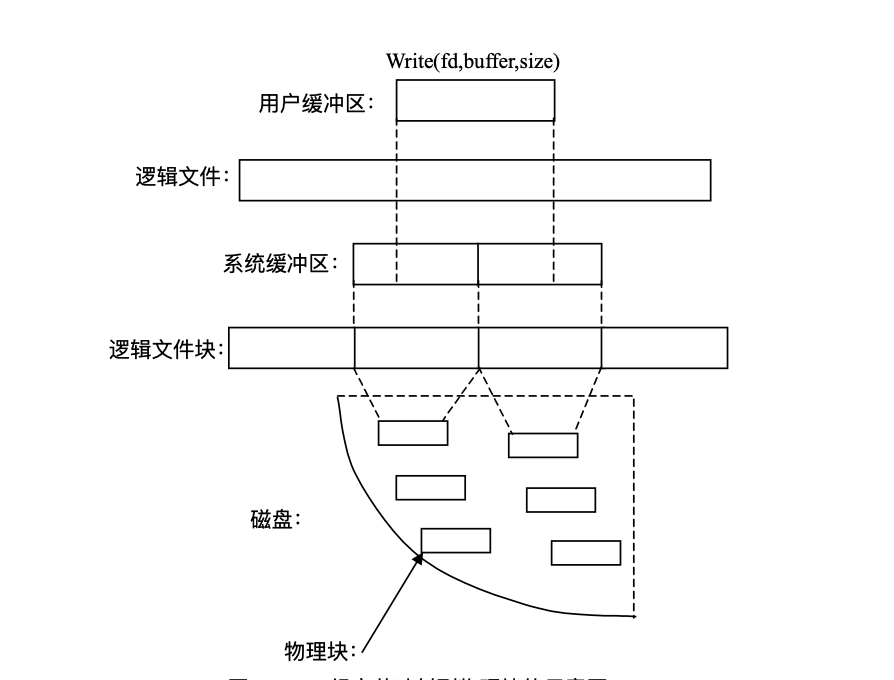
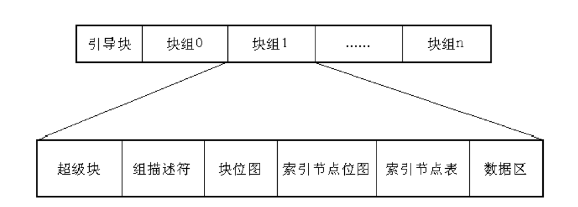
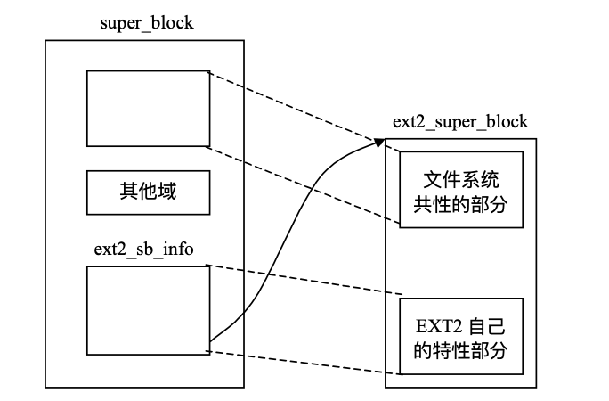
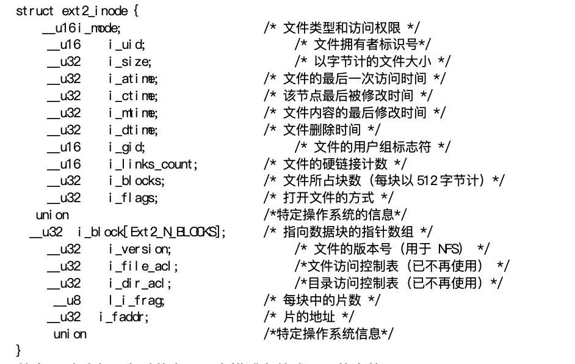
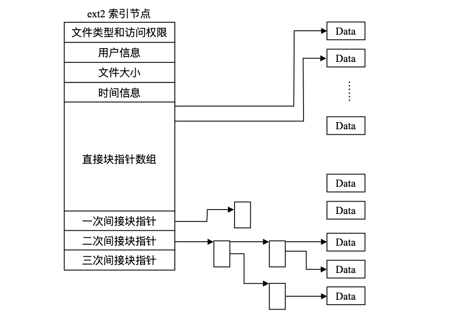

# 9. Ext2 文件系统

Ext2（第二扩充文件系统）是一种功能强大、易扩充、性能上进行了全面的优化的文件系统，也是当前 Linux 实际上的标准文件系统。

在Linux刚刚诞生的时候所采用的文件系统是Minix文件系统，但是由于Minix有如下的几个缺陷：

* 磁盘分区大小必须小于 64MB
* 必须使用 14 个字符定长的文件名
* 难于扩展

所以在VFS系统被加入Linux标准后，Linux 内核立即将Ext文件系统合并到了代码中。Ext 使 Minix 的缺陷得以改进，一是它最大可支持 2GB 的磁盘分区，二是其文件名最长可达 255 个字符。但它仍有自己的缺陷：

* 它使用链表管理未分配的数据块和节点，这样当文件系统投入使用后，链表变得杂乱无序，文件系统中会产生很多碎片。

所以后来又诞生了 Ext2 文件系统，有如下几个方面的优点：

* 节点中使用了 15 个数据块指针，这样它最大可支持 **4TB** 的磁盘分区。
* 使用变长的目录项，这样既可以不浪费磁盘空间，又能支持最长255个字符的文件名。
* 使用**位图（bitmap）**来管理数据块和节点的使用情况，解决了 Ext 出现的问题。
* 在磁盘上的布局做了改进，即使用了**块组（block group）**的概念，从而使数据的读和写更快、更有效，也便系统变得更安全可靠
* 易于扩展

## 9.1 基本概念

作为具体文件系统，Ext2 管理的是一个逻辑空间，这个逻辑空间通过一定的方法映射到实际的地址空间内。文件系统操作的基本单位是**逻辑块（Logic Block）**，逻辑块是连续的、同时从0开始编号的。

与逻辑块相对的是**物理块**，物理块是数据在磁盘上的存取单位，也就是每进行一次I/O操作， 最小传输的数据大小。在 Ext2 中，物理块的大小是可变化的，这取决于你在创建文件系统时的选择，之所以不限制大小，也正体现了 Ext2 的灵活性和可扩充性。

Ext2 系统通过对于逻辑块的操作，避免了大量的实际I/O操作，大大提高了效率。但是对于具体的文件系统而言，通常一个文件占用的多个物理块在磁盘上是不连续存储的，因为如果连续存储，则经过频繁的删除、建立、移动文件等操作，最后磁盘上将形成大量的碎片，很快磁盘上将无空间可供使用。

因此，必须提供一种方法将一个文件占用的多个逻辑块映射到对应的非连续存储的物理块上去，Ext2 等类文件系统是用**索引节点**解决这个问题的。



在 Ext2 中，还有一个重要的概念:**片(fragment)**。每个文件在文件系统中必然占用整数倍个逻辑块，但是在实际情况中，除非文件大小都恰好是逻辑大小块的整数倍，否则最后一个逻辑块必然有空间未被使用，如此一来则必然造成物理空间的浪费。Ext2 系统就使用了**片（fragment）**来管理这个问题。

片也是一个属于逻辑块的概念。其大小在 1KB 至 4KB 之间，但片的大小**总是不大于逻辑 块**。在实际的文件存储中，系统把不能被逻辑块大小整除的文件分开存储，能整除的部分用完整的逻辑块存储，剩下的部分用片存储。


## 9.2 Ext2 的磁盘布局以及逻辑结构

### 9.2.1 Ext2 的磁盘布局

文件系统的逻辑空间最终要通过逻辑块到物理块的映射转化为磁盘等介质上的物理空间，因此，对逻辑空间的组织和管理的好坏必然影响到物理空间的使用情况。一个文件系统在磁盘上如何布局，要综合考虑以下几个方面的因素：

* 首先也是最重要的是要保证数据的**安全性**，也就是说当在向磁盘写数据时发生错误， 要能保证文件系统不遭到破坏。
* 其次，数据结构要能高效地支持所有的操作。Ext2 中最复杂的操作是**硬链接**操作。 硬链接允许一个文件有多个名称，通过任何一个名称都将访问相同的数据。
* 第三，磁盘布局应使数据查找的时间尽量短以提高效率。驱动器查找分散的数据要比查找相邻的数据花多得多的时间。一个好的磁盘布局应该让相关的数据尽量连续分布。
* 最后，磁盘布局应该考虑节省空间。

Ext2 是一种安全高效，同时兼顾了存储性价比的文件系统。Ext2 的磁盘逻辑布局如下图：



Ext2 的磁盘布局由一个引导块和重复的块组构成的，每个块组又由**超级块、组描述符表、块位图、索引节点位图、索引节点表、 数据区**构成。引导块中含有可执行代码，启动计算机时，硬件从引导设备将引导块读入内存， 然后执行它的代码。系统启动后，引导块不再使用。

### 9.2.2 Ext2 的超级块结构

Ext2 的超级块结构如下：

```c
struct ext2_super_block {
    __u32 s_inodes_count; 
    __u32 s_blocks_count;
    __u32 s_r_blocks_count;
    __u32 s_free_blocks_count;
    __u32 s_free_inodes_count; /*文件系统中空闲索引节点总数*/
    __u32 s_first_data_block; /* 文件系统中第一个数据块 */
    __u32 s_log_block_size; /* 用于计算逻辑块大小 */
    __u32 s_log_frag_size;
	__u32 s_blocks_per_group; /* 每组中块数 */
	__u32 s_frags_per_group; /* 每组中片数 */ 
	__u32 s_inodes_per_group; /* 每组中索引节点数 */
	__u32 s_mtime; /*最后一次安装操作的时间 */
	__u32 s_wtime; /*最后一次对该超级块进行写操作的时间 */ 
	__u32 s_mnt_count; /* 安装计数 */
	__u32 s_max_mnt_count; /* 最大可安装计数 */
	__u32 s_magic; /* 用于确定文件系统版本的标志 */
	__u32 s_state; /* 文件系统的状态*/
	__u32 s_errors; /* 当检测到有错误时如何处理 */
	__u32 s_minor_rev_level; /* 次版本号 */
	__u32 s_lastcheck; /* 最后一次检测文件系统状态的时间 */
	__u32 s_checkinterval; /* 两次对文件系统状态进行检测的间隔时间 */
	__u32 s_rev_level; /* 版本号 */
	__u32 s_def_resuid; /* 保留块的默认用户标识号 */
	__u32 s_def_resgid; /* 保留块的默认用户组标识号*/
    
    	__u32   s_first_ino;
	__u16   s_inode_size;
	__u16	s_block_group_nr;
	__u32	s_feature_compat;
	__u32	s_feature_incompat;
	__u32	s_feature_ro_compat;
	__u8	s_uuid[16];
	char	s_volume_name[16];
	char    s_last_mounted[64];
	__u32	s_algorithm_usage_bitmap;
	/* 第一个非保留的索引节点 */ 
	/* 索引节点的大小 */
	/* 该超级块的块组号 */
	/* 兼容特点的位图*/
	/* 非兼容特点的位图 */
	/* 只读兼容特点的位图*/
	/* 128 位的文件系统标识号*/ 
	/* 卷名 */
	/* 最后一个安装点的路径名 */ 
	/* 用于压缩*/
	/*
	* Performance hints.  Directory preallocation should only
	* happen if the EXT2_COMPAT_PREALLOC flag is on.
	*/
	 __u8    s_prealloc_blocks;
	 __u8    s_prealloc_dir_blocks;/* 预分配的块数*/
	 __u16   s_padding1; /* 给目录预分配的块数 */
	 __u32   s_reserved[204]; /* 用 NULL 填充块的末尾 */
	};
}
```

这个数据结构描述了整个文件系统的信息，从中我们可以看出：

* 文件系统中并非所有的块普通用户都可以使用，有一些块是保留给root用户专用 的，这些块的数目就是在 `s_r_blocks_count` 中定义的。一旦空闲块总数等于保留块数，普 通用户无法再申请到块了。如果保留块也被使用，则系统就可能无法启动了。

* 逻辑块是从 0 开始编号的.

* Ext2 要定期检查自己的状态，它的状态取下面两个值之一。

  `#define EXT2_VALID_FS 0x0001`文件系统没有出错。
  `#define EXT2_ERROR_FS 0x0002`内核检测到错误。

  `s_lastcheck `就是用来记录最近一次检查状态的时间，而` s_checkinterval `则规定了两 次检查状态的最大允许间隔时间。

超级块被读入内存后，主要用于填写 VFS 的超级块，下图是与超级块相关的数据结构的示意图：



### 9.2.3 Ext2 的索引节点结构

Ext2 和 UNIX 类的文件系统一样，使用索引节点来记录文件信息。每一个普通文件和目 录都有唯一的索引节点与之对应，索引节点中含有文件或目录的重要信息。当你要访问一个 文件或目录时，通过文件或目录名首先找到与之对应的索引节点，然后通过索引节点得到文 件或目录的信息及磁盘上的具体的存储位置。Ext2的索引节点的数据结构叫ext2_inode。



在Ext2 索引节点中，数据块指针数组共有 15 项，前 12 个为直接块指针，后 3 个分别为“一次 间接块指针”、“二次间接块指针”、“三次间接块指针”，如下图：



“直接块”，是指该块直接用来存储文件的数据，而“一次间接块”是指该块不存 储数据，而是存储直接块的地址，同样，“二次间接块”存储的是“一次间接块”的地址。 这里所说的块，指的都是物理块。。Ext2 默认的物理块大小为 1KB，块地址占 4 个字节(32 位)， 所以每个物理块可以存储 256 个地址。

系统是以逻辑块号为索引查找物理块的。例如，要找到第 100 个逻辑块对应的物理块， 因为 256+12>100+12，所以要用到一次间接块，在一次间接块中查找第 88 项，此项内容就是 对应的物理块的地址。而如果要找第 1000 个逻辑块对应的物理块，由于 1000>256+12，所以要用到二次间接块了.

### 9.2.4 组描述符

块组中，紧跟在超级块后面的是组描述符表，其每一项称为组描述符，是一个叫`ext2_group_desc` 的数据结构，共 32 字节。它是用来描述某个块组的整体信息的。

每个块组都有一个相应的组描述符来描述它，所有的组描述符形成一个组描述符表，组描述符表可能占多个数据块。组描述符就相当于每个块组的超级块，一旦某个组描述符遭到破坏，整个块组将无法使用，所以组描述符表也像超级块那样，在每个块组中进行备份，以防遭到破坏。组描述符表所占的块和普通的数据块一样，在使用时被调入块高速缓存。

### 9.2.5 位图

在 Ext2 中，是采用位图来描述数据块和索引节点的使用情况的，每个块组中都有两个 块，一个用来描述该组中数据块的使用情况，另一个描述该组中索引节点的使用情况。这两 个块分别称为数据位图块和索引节点位图块。数据位图块中的每一位表示该组中一个块的使 用情况，如果为 0，则表示相应数据块空闲，为 1，则表示已分配，索引节点位图块的使用情 况类似。

Ext2 在安装后，用两个高速缓存分别来管理这两种位图块。每个高速缓存最多同时只能 装入 `Ext2_MAX_GROUP_LOADED` 个位图块或索引节点块，当前该值定义为 8，所以也应该采用 一些算法来管理这两个高速缓存，Ext2 中采用的算法类似于 LRU 算法。

### 9.2.6 Ext2的目录项及文件的定位

文件系统一个很重要的问题就是文件的定位，如何通过一个路径来找到一个文件的具体 位置，就要依靠` ext2_dir_entry` 这个结构。

在 Ext2 中，目录是一种特殊的文件，它是由 ext2_dir_entry 这个结构组成的列表。这 个结构是变长的，这样可以减少磁盘空间的浪费，但是，它还是有一定的长度方面的限制， 一是文件名最长只能为 255 个字符。二是尽管文件名长度可以不限(在 255 个字符之内)， 但系统自动将之变成 4 的整数倍，不足的地方用 NULL 字符(\0)填充。目录中有文件和子目录，每一项对应一个 ext2_dir_entry。该结构在 include/Linux/ext2_fs.h 中定义如下:

```c
struct ext2_dir_entry_2 {
    __u32 inode;
	__u16 rec_len;
	__u8 name_len;
    __u8 file_type;
 	char name[EXT2_NAME_LEN];
};
```

```
文件的定位是一个复杂的过程，我们先看一个具体的例子，然后再结合上面的数据结构
具体介绍一下如何找到一个目录项的过程。
  如果要找的文件为普通文件，则可通过文件所对应的索引节点找到文件的具体位置，如
果是一个目录文件，则也可通过相应的索引节点找到目录文件具体所在，然后再从这个目录
文件中进行下一步查找，来看一个具体的例子。
```

假设路径为/home/user1/file1，home 和 user1 是目录名，而 file1 为文件名。为了找 到这个文件，有两种途径，一是从根目录开始查找，二是从当前目录开始查找。假设我们从 根目录查找，则必须先找到根目录的节点，这个节点的位置在 VFS 中的超级块中已经给出， 然后可找到根目录文件，其中必有 home 所对应的目录项，由此可先找到 home 节点，从而找 到 home 的目录文件，然后依次是 user1 的节点和目录文件，最后，在该目录文件中的 file1 目录项中找到 file1 的节点，至此，已经可以找到 file1 文件的具体所在了。

目录中还有两个特殊的子目录:“.”和“. .”，分别代表当前目录和父目录。它们是 无法被删除的，其作用就是用来进行相对路径的查找。