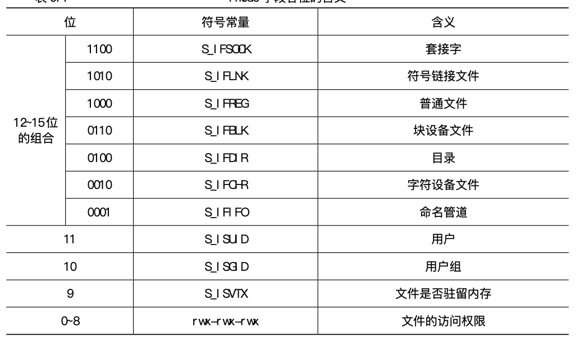

# 9.3 文件的访问权限以及安全

Linux 作为一种网络操作系统，允许多个用户使用。为了保护用户的个人文件不被其他 用户侵犯，Linux 提供了文件权限的机制。这种机制使得一个文件或目录归一个特定的用户 所有，这个用户有权对他所拥有的文件或目录进行存取或其他操作，也可以设置其他用户对 这些文件或目录的操作权限。

Linux 还用到了用户组的概念。每个用户在建立用户目录时都被放到至少一个用户组中 (当然，系统管理员可以将用户编进多个用户组中)。用户组通常是根据使用计算机的用户的 种类来划分的。例如，普通用户通常属于 usrs 组。另外，还有几个系统定义的组(如 bin和 admin)，系统使用这些组来控制对资源的访问。

普通文件的权限有 3 部分:读、写和执行。分别用“r”、“w”、“x”来表示。目录也有这 3 种表示方式，分别表示:列出目录内容、在目录中建立或删除文件、进入和退出目 录。以一个例子来解释文件权限的概念。如下：

```shell
/ $ ls -l /home/user1/file1
-rw-r--r-- 1 user1 usrs 490 JUN 28 21:50 file1
```

在这个文件的长格式信息中，第 1 列代表的就是文件的类型和权限。其中，第 1 个字母 表示文件的类型，“-”表明这是一个普通文件。接下来9个字符每3个一组依次代表文件的 所有者、所有者所在用户组和组外其他用户对该文件的访问权限，代表文件权限的 3 个字符 依次是读、写和执行权限，当用户没有相应的权限时，系统在该权限对应的位置上用“-”表 示。所以，本例表示用户 user1 自己对该文件有读和写的权限，但没有执行权限，而 user1 所在 usrs 组的其他用户和组外的用户对该文件只有读权限，没有写和执行权限。

一个进程，除了进程标识号(PID)外，还有 4 个标识号表示进程的权限。它们是:

* real user ID 实际用户标识号
* real group ID 实际用户组标识号
* effective user ID 有效用户标识号
* effective group ID 有效用户组标识号

实际用户标识号就是运行该进程的用户的 UID，实际用户组标识号就是运行该进程的用户的 GID。一般情况下，有效用户标识号、有效用户组标识号分别和实际用户标识号、实际 用户组标识号相同。但如果设置 setuid 位和 setgid 位，则这两个标识号在对文件进行操作 时自动转换成该文件所有者和所有组的标识号。setuid 位和 setgid 位设置与否，就是看文件权限位上是否有“s”，如果用户的执行权限位为“s”，则设置了 setuid 位，如果用户组的执行权限位为“s”，则设置了 setgid 位。

创建一个新文件时，需要提供文件的访问权限位，但是，新文件的权限位并不就是根据这个数设置的，还必须参考另一个值:文件权限的掩码，这是一个 9 位的二进制数，对应于 9 个权限位，如果这个数某一位上置 1，则新创建文件相应权限位被强制置 0，而不管所提供 的权限位是怎样的。这种机制使的一个新文件在创建时被限制为一个合适的权限。可以用 `umask` 命令看到这个值，它以 3 位八进制数显示，默认为 022，即 000010010，所以一个新文 件创建时，除了文件拥有者外，其他用户是没有写权限的。在 VFS 的 `fs_struct` 结构中有一 个 `umask` 域，存储的就是这个文件权限的掩码。

文件建立后，文件拥有者可以用 `chmod` 改变访问权限。每一组权限位的设置可以用一个 八进制数表示，这样，用 3 个八进制数就可以表示 9 个权限位了。例如

` chmod 755/home/user1/file1`

则该文件的权限表示为 wxr-xr-xr。如果要设置 setuid、setgid 位，则需要用到第 4 个八进制数，该数为 4，则 setuid 位被设置;该数为 2，则 setgid 位被 设置，该数为 1，则是其他用户的执行位被设置成“t”.

Ext2 索引节点中的 i_mode 就是用来存储文件的属性、用户标识号、用户组标识号和访问权限等信息的，这是一个 16 位的字段，其中 0 到 8 位用来表示文件的访问权限，第 9 位用 来控制文件是否驻留内存，10、11 位即 setgid、setuid 位，12 到 15 位的组合用来表示文件 类型。如下：

