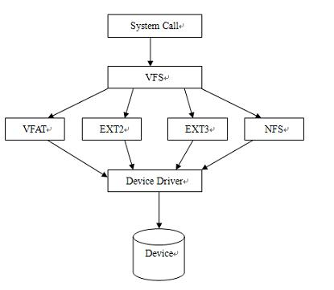

# 1. 虚拟文件系统概述

在Linux系统中，我们可以使用多种文件系统如ext2，ext3、nfs等来挂载(`mounting`)不同的存储设备（诸如硬盘，CD-ROM以及其他共享资源等）。但是在用户层，Linux隐去了文件系统的细节，为用户提供了一个统一的、抽象的、虚拟的文件处理接口，这就是所谓的“虚拟文件系统”，又叫做**虚拟文件转换(Virtual FileSystem Switch, VFS)**。

虚拟文件系统并不是真正的文件系统，其对应的数据结构并不在磁盘上存储，而是在运行以后才建立，并在卸载时删除。VFS并不能单独工作，而是必须依赖于Ext2、Minix、VFAT、nfs等实际的文件系统相结合才能够进行正常的系统工作。与VFS相对应，我们称Ext2、Minix、VFAT、nfs等为**具体文件系统**。

通过引入虚拟文件系统，Linux可以无需关心具体的文件属于什么文件系统以及具体文件系统的设计与实现，从而将所有的文件看作一致的、抽象的VFS文件。特别是由于Linux继承了Unix中「**一切皆文件**」的理念，无论是普通文件、目录还是I/O设备在Linux中都被看作文件，因此VFS的引入大大降低了系统的耦合程度，提高了Linux对于不同设备的兼容性。


## 1.1虚拟文件系统的作用

虚拟文件系统为不同的文件系统定义了一套规范，同时提供了一个统一的接口（实际上就是file_operation数据结构）各个文件系统必须按照虚拟文件系统的规范编写才能接入到虚拟文件系统中。VFS 主要为用户和内核架起一道桥梁，用户可以通过 VFS 提供的接口访问不同的文件系统，如下图所示：



所以对于内核、其他子系统以及运行在操作系统之上的用户程序而言，所有的文件系统都是一样的。对于Linux系统，支持一个新的文件系统主要任务就是编写这些接口函数。

概括来说：VFS系统有如下几个作用：

1. 对具体文件系统的数据结构进行抽象，以一种统一的数据结构进行管理。
2. 接受用户层的系统调用，例如 `write` `open` `stat` `link`等。
3. 支持多种具体文件系统之间相互访问。
4. 接受内核其他子系统的操作请求，特别是内存管理子系统。


上图是Linux中文件系统的逻辑关系示意图。

通过 VFS，Linux 可以支持很多种具体文件系统，下表是 Linux 支持的部分具体文件系统：

| 文件系统 | 含义                                                         |
| :------- | :----------------------------------------------------------- |
| Minix    | Linux 最早支持的文件系统。主要缺点是最大 64MB 的磁盘分区和最 长 14 个字符的文件名称的限制 |
| Ext      | Linux 专用的文件系统，支持 2GB 磁盘分区，255 字符的文件名称，但性能比较差 |
| Xiafs    | 在 Minix 基础上发展起来，克服了 Minix 的主要缺点。           |
| Ext2     | 当前实际上的 Linux 标准文件系统。性能强大，易扩充，可移植    |
| Ext3     | 日志文件系统。Ext3 文件系统是对稳定的 Ext2 文件系统的改进    |
| SystemV  | UNIX 早期支持的文件系统，也有与 Minix 同样的限制             |
| NFS      | 网络文件系统。使得用户可以像访问本地文件一样访问远程主机上的文件 |
| ISO9660  | 光盘使用的文件系统                                           |
| /proc    | 一个反映内核运行情况的虚的文件系统，并不实际存在于磁盘上     |
| Msdos    | DOS所采用的文件系统                                          |
| UMSDOS   | 该文件系统允许 MSDOS 文件系统可以当作 Linux 固有的文件系统一样使用 |
| Vfat     | fat 文件系统的扩展，支持长文件名                             |
| NTFS     | Windows NT的文件系统                                         |
| Hpfs     | OS/2 的文件系统                                              |

## 1.2 VFS所处理的系统调用

下表是VFS所处理的涉及到文件系统的系统调用，这些系统调用涉及文件系统、常规文件、目录及符号链接。


| 文件系统                                               | 含义                 |
| :----------------------------------------------------- | :------------------- |
| mount( )/ umount( )                                    | 挂载/卸载文件系统    |
| sysfs( )                                               | 获取文件系统信息     |
| statfs(  )/ fstatfs(  ) /ustat(  )                     | 获取文件系统统计信息 |
| chroot( )                                              | 更改根目录           |
| chdir(  ) / fchdir(  ) / getcwd(  )                    | 更改当前目录         |
| mkdir(  ) /rmdir(  )                                   | 创建/删除目录        |
| getdents( ) /readdir( )/ link( ) unlink( ) /rename( )  | 对目录项进行操作     |
| readlink(  ) /symlink(  )                              | 对软链接进行操作     |
| chown(  ) /fchown(  ) /lchown(  )                      | 更改文件所有者       |
| chmod(  )/ fchmod(  ) /utime(  )                       | 更改文件属性         |
| open(  ) /close(  ) /creat(  ) /umask(  )              | 打开/关闭文件        |
| dup(  ) /dup2(  ) /fcntl(  )                           | 对文件描述符进行操作 |
| select(  ) /poll(  )                                   | 异步 I/O 通信        |
| truncate(  ) /ftruncate(  )                            | 更改文件长度         |
| lseek(  ) /_llseek(  )                                 | 更改文件指针         |
| read( )/ write( ) / readv( ) / writev( ) / sendfile( ) | 文件 I/O 操作        |
| pread(  )/ pwrite(  )                                  | 搜索并访问文件       |
| mmap(  ) /munmap(  )                                   | 文件内存映射         |
| fdatasync(  ) /fsync(  ) /sync(  )/ msync(  )          | 同步访问文件数据     |
| flock(  )                                              | 处理文件锁           |

VFS实质上是应用程序和文件系统中之间的一个层。但是在某些情况下，一个文件操作可能只由VFS本身进行操作而无需调用下一层程序。比如，如果系统调用 `lseek()`修改一个文件指针，而这个文件指针指向有关打开的文件与 进程交互的一个属性，那么 VFS 只需修改对应的文件对象，而不必访问磁盘上的文件，因此， 无需调用具体的文件系统子程序。从某种意义上说，可以把 VFS 看成「通用」文件系统，它只在必要时依赖某种具体的文件系统。

# 2. 虚拟文件系统中的数据结构

Linux奉行了Unix的理念：**一切皆文件**，比如一个目录是一个文件，一个设备也是一个文件等，因而文件系统在Linux中占有非常重要的地位。虚拟文件系统所隐含的主要思想在于引入了一个通用的文件模型，这个模型能够表示所有支持的文件系统。

出于为不同类型的文件系统定义统一接口层的需求，VFS定义了一系列的规范，同时为了真实文件系统能够按照VFS的规范来编写程序，VFS抽象了几个数据结构来组织和管理不同的文件系统。分别是：`超级块（super_block）`、`索引节点（inode）`、`目录结构（dentry）` 和 `文件结构（file）`

## 2.1 超级块(super_block)

`超级块（super_block）`对象是为了存放系统中已安装文件系统的有关信息而产生的，超级块是大部分具体文件系统中最重要的数据结构，可以说是一个全局的数据结构。对于基于磁盘 的文件系统，这类对象通常对应于存放在磁盘上的文件系统控制块。对于系统中的每一个具体文件系统，都有一个与之相对应的`超级块（super_block）`对象。

VFS超级块只存在于内存当中，在具体文件系统挂载到系统中时建立，并在这些文件系统卸载时自动删除。VFS超级块定义在`include/fs.h`中，定义如下：

```C
struct file_system_type {
    const char *name;
    int fs_flags;
    struct super_block *sget_fc(struct fs_context *fc,
			    int (*test)(struct super_block *, struct fs_context *),
			    int (*set)(struct super_block *, struct fs_context *));
struct super_block *sget(struct file_system_type *type,
			int (*test)(struct super_block *,void *),
			int (*set)(struct super_block *,void *),
			int flags, void *data);
    ...
};

struct super_operations {
   	struct inode *(*alloc_inode)(struct super_block *sb);
	void (*destroy_inode)(struct inode *);
	void (*free_inode)(struct inode *);

   	void (*dirty_inode) (struct inode *, int flags);
	int (*write_inode) (struct inode *, struct writeback_control *wbc);  // 把inode的数据写入到磁盘中
	int (*drop_inode) (struct inode *);
	void (*evict_inode) (struct inode *);
	void (*put_super) (struct super_block *); // 释放超级块占用的内存
	int (*sync_fs)(struct super_block *sb, int wait);
	int (*freeze_super) (struct super_block *);
	int (*freeze_fs) (struct super_block *);
	int (*thaw_super) (struct super_block *);
	int (*unfreeze_fs) (struct super_block *);
	int (*statfs) (struct dentry *, struct kstatfs *);
	int (*remount_fs) (struct super_block *, int *, char *);
	void (*umount_begin) (struct super_block *);

	int (*show_options)(struct seq_file *, struct dentry *);
	int (*show_devname)(struct seq_file *, struct dentry *);
	int (*show_path)(struct seq_file *, struct dentry *);
	int (*show_stats)(struct seq_file *, struct dentry *);
#ifdef CONFIG_QUOTA
	ssize_t (*quota_read)(struct super_block *, int, char *, size_t, loff_t);
	ssize_t (*quota_write)(struct super_block *, int, const char *, size_t, loff_t);
	struct dquot **(*get_dquots)(struct inode *);
#endif
	long (*nr_cached_objects)(struct super_block *,
				  struct shrink_control *);
	long (*free_cached_objects)(struct super_block *,
				    struct shrink_control *);
};


struct super_block {
	struct list_head	s_list;		/* Keep this first */
	dev_t			s_dev;		/* search index; _not_ kdev_t */ // 设备号
	unsigned char		s_blocksize_bits;
	unsigned long		s_blocksize; // 数据块大小
	loff_t			s_maxbytes;	/* Max file size */
	struct file_system_type	*s_type; // 文件系统类型
	const struct super_operations	*s_op; // 超级块相关的操作列表
	const struct dquot_operations	*dq_op;
	const struct quotactl_ops	*s_qcop;
	const struct export_operations *s_export_op;
	unsigned long		s_flags;
	unsigned long		s_iflags;	/* internal SB_I_* flags */
	unsigned long		s_magic;
	struct dentry		*s_root;   // 挂载的根目录
	struct rw_semaphore	s_umount;
	int			s_count;
	atomic_t		s_active;
#ifdef CONFIG_SECURITY
	void                    *s_security;
#endif
	const struct xattr_handler **s_xattr;
#ifdef CONFIG_FS_ENCRYPTION
	const struct fscrypt_operations	*s_cop;
	struct key		*s_master_keys; /* master crypto keys in use */
#endif
#ifdef CONFIG_FS_VERITY
	const struct fsverity_operations *s_vop;
#endif
#if IS_ENABLED(CONFIG_UNICODE)
	struct unicode_map *s_encoding;
	__u16 s_encoding_flags;
#endif
	struct hlist_bl_head	s_roots;	/* alternate root dentries for NFS */
	struct list_head	s_mounts;	/* list of mounts; _not_ for fs use */ // 指向超级块链表的指针
	struct block_device	*s_bdev;
	struct backing_dev_info *s_bdi;
	struct mtd_info		*s_mtd;
	struct hlist_node	s_instances;
	unsigned int		s_quota_types;	/* Bitmask of supported quota types */
	struct quota_info	s_dquot;	/* Diskquota specific options */

	struct sb_writers	s_writers;

	/*
	 * Keep s_fs_info, s_time_gran, s_fsnotify_mask, and
	 * s_fsnotify_marks together for cache efficiency. They are frequently
	 * accessed and rarely modified.
	 */
	void			*s_fs_info;	/* Filesystem private info */

	/* Granularity of c/m/atime in ns (cannot be worse than a second) */
	u32			s_time_gran;
	/* Time limits for c/m/atime in seconds */
	time64_t		   s_time_min;
	time64_t		   s_time_max;
#ifdef CONFIG_FSNOTIFY
	__u32			s_fsnotify_mask;
	struct fsnotify_mark_connector __rcu	*s_fsnotify_marks;
#endif

	char			s_id[32];	/* Informational name */
	uuid_t			s_uuid;		/* UUID */

	unsigned int		s_max_links;
	fmode_t			s_mode;

	/*
	 * The next field is for VFS *only*. No filesystems have any business
	 * even looking at it. You had been warned.
	 */
	struct mutex s_vfs_rename_mutex;	/* Kludge */

	/*
	 * Filesystem subtype.  If non-empty the filesystem type field
	 * in /proc/mounts will be "type.subtype"
	 */
	const char *s_subtype;

	const struct dentry_operations *s_d_op; /* default d_op for dentries */

	struct shrinker s_shrink;	/* per-sb shrinker handle */

	/* Number of inodes with nlink == 0 but still referenced */
	atomic_long_t s_remove_count;

	/*
	 * Number of inode/mount/sb objects that are being watched, note that
	 * inodes objects are currently double-accounted.
	 */
	atomic_long_t s_fsnotify_connectors;

	/* Being remounted read-only */
	int s_readonly_remount;

	/* per-sb errseq_t for reporting writeback errors via syncfs */
	errseq_t s_wb_err;

	/* AIO completions deferred from interrupt context */
	struct workqueue_struct *s_dio_done_wq;
	struct hlist_head s_pins;

	/*
	 * Owning user namespace and default context in which to
	 * interpret filesystem uids, gids, quotas, device nodes,
	 * xattrs and security labels.
	 */
	struct user_namespace *s_user_ns;

	/*
	 * The list_lru structure is essentially just a pointer to a table
	 * of per-node lru lists, each of which has its own spinlock.
	 * There is no need to put them into separate cachelines.
	 */
	struct list_lru		s_dentry_lru;
	struct list_lru		s_inode_lru;
	struct rcu_head		rcu;
	struct work_struct	destroy_work;

	struct mutex		s_sync_lock;	/* sync serialisation lock */

	/*
	 * Indicates how deep in a filesystem stack this SB is
	 */
	int s_stack_depth;

	/* s_inode_list_lock protects s_inodes */
	spinlock_t		s_inode_list_lock ____cacheline_aligned_in_smp;
	struct list_head	s_inodes;	/* all inodes */

	spinlock_t		s_inode_wblist_lock;
	struct list_head	s_inodes_wb;	/* writeback inodes */
} __randomize_layout;

```

在这其中，比较重要的成员有：

- s_dev：用于保存设备的设备号
- s_blocksize：用于保存文件系统的数据块大小（文件系统是以数据块为单位的）
- s_type：文件系统的类型（提供了读取设备中文件系统超级块的方法）
- s_op：超级块相关的操作列表
- s_root：挂载的根目录

所有的超级块对象以双向环形链表的方式链接在一起。链表中第一个元素和最后一个元素的地址分别存放在super_blocks变量的s_list域的 next 和 prev 域中。s_list 域的数据类型为 struct list_head，其实仅仅包含指向链表中的前一个元素和后一个元素的指针。下图说明了list_head，next以及prev是如何嵌入到超级块对象当中的。

### 

## 2.2 索引节点（inode）

`索引节点（inode）`是VFS中最为重要的一个结构，用于描述一个文件的元信息（meta info），其包含的是诸如文件的大小、拥有者、创建时间、磁盘位置等和文件相关的信息。对于一个文件而言，文件名可以随时更改，但是元数据或者说索引节点对于文件来讲是唯一的，并且随文件的存在而存在。具体文件系统的索引节点是存储在磁盘上 的，是一种静态结构，要使用它，必须调入内存，填写 VFS 的索引节点，因此，也称 VFS 索引节点为动态节点。

所有文件都有一个对应的 `inode` 结构。`inode` 的定义在`include/fs.h`如下（由于inode的成员也是非常多，所以这里也只列出部分成员）：

```c
struct inode {
	umode_t			i_mode;
	unsigned short		i_opflags;
	kuid_t			i_uid;
	kgid_t			i_gid;
	unsigned int		i_flags;

#ifdef CONFIG_FS_POSIX_ACL
	struct posix_acl	*i_acl;
	struct posix_acl	*i_default_acl;
#endif

	const struct inode_operations	*i_op;
	struct super_block	*i_sb;
	struct address_space	*i_mapping;

#ifdef CONFIG_SECURITY
	void			*i_security;
#endif

	/* Stat data, not accessed from path walking */
	unsigned long		i_ino;
	/*
	 * Filesystems may only read i_nlink directly.  They shall use the
	 * following functions for modification:
	 *
	 *    (set|clear|inc|drop)_nlink
	 *    inode_(inc|dec)_link_count
	 */
	union {
		const unsigned int i_nlink;
		unsigned int __i_nlink;
	};
	dev_t			i_rdev;
	loff_t			i_size;
	struct timespec64	i_atime;
	struct timespec64	i_mtime;
	struct timespec64	i_ctime;
	spinlock_t		i_lock;	/* i_blocks, i_bytes, maybe i_size */
	unsigned short          i_bytes;
	u8			i_blkbits;
	u8			i_write_hint;
	blkcnt_t		i_blocks;

#ifdef __NEED_I_SIZE_ORDERED
	seqcount_t		i_size_seqcount;
#endif

	/* Misc */
	unsigned long		i_state;
	struct rw_semaphore	i_rwsem;

	unsigned long		dirtied_when;	/* jiffies of first dirtying */
	unsigned long		dirtied_time_when;

	struct hlist_node	i_hash;
	struct list_head	i_io_list;	/* backing dev IO list */
#ifdef CONFIG_CGROUP_WRITEBACK
	struct bdi_writeback	*i_wb;		/* the associated cgroup wb */

	/* foreign inode detection, see wbc_detach_inode() */
	int			i_wb_frn_winner;
	u16			i_wb_frn_avg_time;
	u16			i_wb_frn_history;
#endif
	struct list_head	i_lru;		/* inode LRU list */
	struct list_head	i_sb_list;
	struct list_head	i_wb_list;	/* backing dev writeback list */
	union {
		struct hlist_head	i_dentry;
		struct rcu_head		i_rcu;
	};
	atomic64_t		i_version;
	atomic64_t		i_sequence; /* see futex */
	atomic_t		i_count;
	atomic_t		i_dio_count;
	atomic_t		i_writecount;
#if defined(CONFIG_IMA) || defined(CONFIG_FILE_LOCKING)
	atomic_t		i_readcount; /* struct files open RO */
#endif
	union {
		const struct file_operations	*i_fop;	/* former ->i_op->default_file_ops */
		void (*free_inode)(struct inode *);
	};
	struct file_lock_context	*i_flctx;
	struct address_space	i_data;
	struct list_head	i_devices;
	union {
		struct pipe_inode_info	*i_pipe;
		struct cdev		*i_cdev;
		char			*i_link;
		unsigned		i_dir_seq;
	};

	__u32			i_generation;

#ifdef CONFIG_FSNOTIFY
	__u32			i_fsnotify_mask; /* all events this inode cares about */
	struct fsnotify_mark_connector __rcu	*i_fsnotify_marks;
#endif

#ifdef CONFIG_FS_ENCRYPTION
	struct fscrypt_info	*i_crypt_info;
#endif

#ifdef CONFIG_FS_VERITY
	struct fsverity_info	*i_verity_info;
#endif

	void			*i_private; /* fs or device private pointer */
}

```

下面也介绍一下 `inode` 中几个比较重要的成员：

- `i_uid`：文件所属的用户
- `i_gid`：文件所属的组
- `i_rdev`：文件所在的设备号
- `i_size`：文件的大小
- `i_atime`：文件的最后访问时间
- `i_mtime`：文件的最后修改时间
- `i_ctime`：文件的创建时间
- `i_op`：inode相关的操作列表
- `i_fop`：文件相关的操作列表
- `i_sb`：文件所在文件系统的超级块

对于`inode`数据结构：

* 每个`inode`都有一个索引节点号`i_ino`。在同一个文件系统中，每个索引的节点号都是唯一的，内核根据索引节点号的哈希值查找其 inode 结构。
* 每个文件都有个文件所属用户，其最初的文件主是创建了这个文件的用户，但以后可以改变。 每个用户都有一个用户组，且属于某个用户组，因此，`inode` 结构中就有相应的 `i_uid`、`i_gid`，以指明文件所属用户的身份。
* `inode` 中有两个设备号，`i_dev` 和 `i_rdev`。首先，除特殊文件外，每个节点都存储在 某个设备上，这就是 `i_dev`。其次，如果索引节点所代表的并不是常规文件，而是某个设备，那就还得有个设备号，这就是 `i_rdev`。
* `i_op` 成员定义对目录相关的操作方法列表，譬如 `mkdir()`系统调用会触发 `inode->i_op->mkdir()` 方法，而 `link()` 系统调用会触发 `inode->i_op->link()` 方法。而 `i_fop` 成员则定义了对打开文件后对文件的操作方法列表，譬如 `read()` 系统调用会触发 `inode->i_fop->read()` 方法，而 `write()` 系统调用会触发 `inode->i_fop->write()` 方法。
* 每个索引节点都会复制磁盘中的`inode`节点包含的一些数据，比如文件所包含的磁盘块数。如果`i_state`的值等于 `I_DIRTY`，那么对应的磁盘索引节点必须被更新；如果`i_state`等于`I_LOCK`，那么意味着该索引节点对象已加锁；如果`i_state`等于`I_FREEING`，那么意味着该索引节点对象正在被释放。
* 每个索引节点对象总是出现在下列循环双向链表的某个链表中：
  * 未用索引节点链表。变量` inode_unused` 的` next` 域和 `prev` 域分别指向该链表中的首元素和尾元素。这个链表用做内存高速缓存。
  * 正在使用索引节点链表。变量 `inode_in_use` 指向该链表中的首元素和尾元素。
  * 脏索引节点链表。由相应超级块的` s_dirty` 域指向该链表中的首元素和尾元素。这 3 个链表都是通过索引节点的 `i_list`域链接在一起的。

## 2.3 目录项（dentry）

每个文件除了有一个索引节点 inode 数据结构外，还有一个目录项 dentry(directory enrty)数据结构。目录项的主要作用是方便查找文件。一个路径的各个组成部分，不管是目录还是普通的文件，都是一个目录项对象。如，在路径 `/home/liexusong/example.c` 中，目录 `/`, `home/`, `liexusong/` 和文件 `example.c` 都对应一个目录项对象。

dentry结构代表的是逻辑意义上的文件，所描述的是文件逻辑上的属性，因此不同于前面的两个对象，目录项对象没有对应的磁盘数据结构，VFS 在遍历路径名的过程中现场将它们逐个地解析成目录项对象。dentry结构的定义在`include/linux/dcache.h`中：

```c
struct dentry {
	/* RCU lookup touched fields */
	unsigned int d_flags;		/* protected by d_lock */
	seqcount_spinlock_t d_seq;	/* per dentry seqlock */
	struct hlist_bl_node d_hash;	/* lookup hash list */
	struct dentry *d_parent;	// 当前目录项对应的父目录
	struct qstr d_name;         // 目录的名字
	struct inode *d_inode;		/* Where the name belongs to - NULL is
					 * negative */
	unsigned char d_iname[DNAME_INLINE_LEN];	/* small names */

	/* Ref lookup also touches following */
	struct lockref d_lockref;	/* per-dentry lock and refcount */
	const struct dentry_operations *d_op;
	struct super_block *d_sb;	// 所在文件系统的超级块对象
	unsigned long d_time;		/* used by d_revalidate */
	void *d_fsdata;			/* fs-specific data */

	union {
		struct list_head d_lru;		/* LRU list */
		wait_queue_head_t *d_wait;	/* in-lookup ones only */
	};
	struct list_head d_child;	/* child of parent list */
	struct list_head d_subdirs;	/* our children */
	/*
	 * d_alias and d_rcu can share memory
	 */
	union {
		struct hlist_node d_alias;	/* inode alias list */
		struct hlist_bl_node d_in_lookup_hash;	/* only for in-lookup ones */
	 	struct rcu_head d_rcu;
	} d_u;
} __randomize_layout;
```

其中，`d_inode`是一个指向相应的inode结构的指针，对于每一个有效的dentry结构必定有一个 inode 结构，因为在Linux「一切皆文件」思想的指引下，一个目录项要么代表着一个文件，要么代表着一个目录，而目录实际上也是文件，所以，只要 dentry 结构是有效的，则 其指针 d_inode 必定指向一个 inode 结构。


## 2.4 文件结构（file）

文件结构用于描述一个已打开的文件，其包含文件当前的读写偏移量，文件打开模式和文件操作函数列表等，文件结构定义如下：

```c
struct file {
	union {
		struct llist_node	fu_llist;
		struct rcu_head 	fu_rcuhead;
	} f_u;
	struct path		f_path;
	struct inode		*f_inode;	/* cached value */
	const struct file_operations	*f_op;

	/*
	 * Protects f_ep, f_flags.
	 * Must not be taken from IRQ context.
	 */
	spinlock_t		f_lock;
	atomic_long_t		f_count;
	unsigned int 		f_flags;
	fmode_t			f_mode;
	struct mutex		f_pos_lock;
	loff_t			f_pos;
	struct fown_struct	f_owner;
	const struct cred	*f_cred;
	struct file_ra_state	f_ra;

	u64			f_version;
#ifdef CONFIG_SECURITY
	void			*f_security;
#endif
	/* needed for tty driver, and maybe others */
	void			*private_data;

#ifdef CONFIG_EPOLL
	/* Used by fs/eventpoll.c to link all the hooks to this file */
	struct hlist_head	*f_ep;
#endif /* #ifdef CONFIG_EPOLL */
	struct address_space	*f_mapping;
	errseq_t		f_wb_err;
	errseq_t		f_sb_err; /* for syncfs */
} __randomize_layout
```

下图展示了各个数据结构之间的关系：


每个文件对象总是包含在下列的一个双向循环链表之中。

* 「未使用」文件对象的链表。该链表既可以用做文件对象的内存高速缓存，又可以当作root用户的备用存储器，也就是说，即使系统的动态内存用完，也允许超级用户打开文件。 由于这些对象是未使用的，它们的 `f_count` 域是 `NULL`，该链表首元素的地址存放在变量` free_list` 中，内核必须确认该链表总是至少包含 `NR_RESERVED_FILES` 个对象，通常该值设 为 10。

* 「正在使用」文件对象的链表。该链表中的每个元素至少由一个进程使用，因此，各 个元素的 `f_count `域不会为 `NULL`，该链表中第一个元素的地址存放在变量 `anon_list` 中。如果VFS需要分配一个新的文件对象，就调用函数`get_empty_filp( )`。该函数检测“未使用”文件对象链表的元素个数是否多于 `NR_RESERVED_FILES`，如果是，可以为新打开的文 件使用其中的一个元素;如果没有，则退回到正常的内存分配

## 2.5 有关操作的数据结构

VFS作为全局性的虚拟文件系统，无法涉及到具体文件系统的细节，所以Linux系统在VFS与具体文件系统之间设计了诸多接口，这就是 VFS 设计的一些有关操作的数据结构。从另一个角度来讲，这些数据结构就是VFS所提供的「标准」，任何具体文件系统想要被Linux系统所支持都必须对于这些接口有自己的实现。在挂载时，这些结构体的成员指针将被初始化，指向对应的函数。下图是VFS与具体文件系统的关系示意图。


有关操作的数据结构主要有以下几个，分别用来操作 VFS 中的几个重要的数据结构。

### 2.5.1 超级块操作

超级块操作是由 `super_operations` 数据结构来描述的，该结构的起始地址存放在超级块的 `s_op` 域中。该结构定义于`include/fs.h` 中:

```c
struct super_operations {
   	struct inode *(*alloc_inode)(struct super_block *sb);
	void (*destroy_inode)(struct inode *);
	void (*free_inode)(struct inode *);

   	void (*dirty_inode) (struct inode *, int flags);
	int (*write_inode) (struct inode *, struct writeback_control *wbc);
	int (*drop_inode) (struct inode *);
	void (*evict_inode) (struct inode *);
	void (*put_super) (struct super_block *);
	int (*sync_fs)(struct super_block *sb, int wait);
	int (*freeze_super) (struct super_block *);
	int (*freeze_fs) (struct super_block *);
	int (*thaw_super) (struct super_block *);
	int (*unfreeze_fs) (struct super_block *);
	int (*statfs) (struct dentry *, struct kstatfs *);
	int (*remount_fs) (struct super_block *, int *, char *);
	void (*umount_begin) (struct super_block *);

	int (*show_options)(struct seq_file *, struct dentry *);
	int (*show_devname)(struct seq_file *, struct dentry *);
	int (*show_path)(struct seq_file *, struct dentry *);
	int (*show_stats)(struct seq_file *, struct dentry *);
#ifdef CONFIG_QUOTA
	ssize_t (*quota_read)(struct super_block *, int, char *, size_t, loff_t);
	ssize_t (*quota_write)(struct super_block *, int, const char *, size_t, loff_t);
	struct dquot **(*get_dquots)(struct inode *);
#endif
	long (*nr_cached_objects)(struct super_block *,
				  struct shrink_control *);
	long (*free_cached_objects)(struct super_block *,
				    struct shrink_control *);
};
```

其中的每个函数都是超级块的一个方法，具体功能如下所述：

| 函数形式                                        | 描述                                                         |
| :---------------------------------------------- | :----------------------------------------------------------- |
| dirty_inode(inode)                              | 将inode标记为`dirty`                                         |
| write_inode(inode)                              | 用参数指定的 inode 更新某个文件系统的 inode。inode 的 i_ino 域标识 指定磁盘上文件系统的索引节点 |
| destroy_inode(inode)                            | 删除那些包含文件、磁盘索引节点及 VFS 索引节点的数据块        |
| put_super(super)                                | 释放超级块对象                                               |
| statfs(super, buf， bufsize)                    | 将文件系统的统计信息填写在 buf 缓冲区中                      |
| remount_fs(struct super_block *, int *, char *) | 用新的选项重新安装文件系统(当某个安装选项必须被修改时进行调用) |

### 2.5.2 索引节点操作 inode_operations

索引节点操作是由 `inode_operations` 结构来描述的，主要是用来将 VFS 对索引节点的操作转化为具体文件系统处理相应操作的函数，在 `include/fs.h` 中描述如下:

```c
struct inode_operations {
	int (*create) (struct inode *,struct dentry *,int);
	struct dentry * (*lookup) (struct inode *,struct dentry *); 
    int (*link) (struct dentry *,struct inode *,struct dentry *); 
    int (*unlink) (struct inode *,struct dentry *);
	int (*symlink) (struct inode *,struct dentry *,const char *); 
    int (*mkdir) 	(struct inode *,struct dentry *,int);
	int (*rmdir) (struct inode *,struct dentry *);
	int (*mknod) (struct inode *,struct dentry *,int,int);
	int (*rename) (struct inode *, struct dentry *,struct inode *, struct dentry *); 
    int (*readlink) (struct dentry *, char *,int);
	int (*follow_link) (struct dentry *, struct nameidata *);
	void (*truncate) (struct inode *);
	int (*permission) (struct inode *, int);
	int (*revalidate) (struct dentry *);
	int (*setattr) (struct dentry *, struct iattr *); 
    int (*getattr) (struct dentry *, struct iattr *);
};
```

| 函数形式                                         | 描述                                                         |
| :----------------------------------------------- | :----------------------------------------------------------- |
| Create(dir, dentry, mode)                        | 在某个目录下，为与 dentry 目录项相关的常规文件创建一个新的磁盘索引节点 |
| Lookup(dir, dentry)                              | 查找索引节点所在的目录，这个索引节点所对应的文件名就包含在 dentry 目录项中 |
| Link(old_dentry, dir，new_dentry)                | 创建一个新的名为new_dentry硬链接，这个新的硬连接指向dir目录 下名为 old_dentry 的文件 |
| unlink(dir, dentry)                              | 从 dir 目录删除 dentry 目录项所指文件的硬链接                |
| symlink(dir,dentry,symname)                      | 在某个目录下，为与目录项相关的符号链创建一个新的索引节点     |
| mkdir(dir, dentry, mode)                         | 在某个目录下，为与目录项对应的目录创建一个新的索引节点       |
| mknod(dir, dentry, mode, rdev)                   | 在 dir 目录下，为与目录项对象相关的特殊文件创建一个新的磁盘索 引节点。其中参数 mode 和 rdev 分别表示文件的类型和该设备的主码 |
| rename(old_dir, old_dentry, new_dir, new_dentry) | 将 old_dir 目录下的文件 old_dentry 移到 new_dir 目录下，新文件名 包含在 new_dentry 指向的目录项中 |
| readlink( dentry, buffer, burlen)                | 将dentry所指定的符号链中对应的文件路径名拷贝到buffer所指定的内存区 |
| follow_link(inode, dir)                          | 解释 inode 索引节点所指定的符号链;如果该符号链是相对路径名,从指定的 dir 目录开始进行查找 |
| truncate(inode)                                  | 修改索引节点 inode 所指文件的长度。在调用该方法之前，必须将 inode 对象的 i_size 域设置为需要的新长度值 |
| permission(inode, mask)                          | 确认是否允许对 inode 索引节点所指的文件进行指定模式的访问    |
| Setattr(dentry，attr)                            | 设置目录项的属性                                             |
| Getattr(dentry，attr)                            | 获得目录项的属性                                             |

### 2.5.3 目录项操作

目录项操作是由 `dentry_operations` 数据结构来描述的，定义于`include/linux/dcache.h` 中:

```c
struct dentry_operations {
	int (*d_revalidate)(struct dentry *, int);
	int (*d_hash) (struct dentry *, struct qstr *);
	int (*d_compare) (struct dentry *, struct qstr *, struct qstr *); 
    int (*d_delete)(struct dentry *);
	void (*d_release)(struct dentry *);
	void (*d_iput)(struct dentry *, struct inode *);
};
```

下表给出目录项对象的方法及其描述。

| 函数形式                      | 描述                                                         |
| :---------------------------- | :----------------------------------------------------------- |
| d_revalidate(dentry)          | 判定目录项是否有效。默认情况下，VFS 函数什么也不做，而网络文件系统可以指定自己的函数 |
| d_hash(dentry, hash)          | 生成一个哈希值。对目录项哈希表而言，这是一个具体文件系统的哈希函数。 参数 dentry 标识包含该路径分量的目录。参数 hash 指向一个结构，该结构 包含要查找的路径名分量以及由 hash 函数生成的哈希值 |
| d_compare(dir, name1,  name2) | 比较两个文件名。name1 应该属于 dir 所指目录。默认情况下，VFS 的这个函 数就是常用的字符串匹配函数。不过，每个文件系统可用自己的方式实现这 一方法。例如，MS-DOS 文件系统不区分大写和小写字母 |
| d_delete(dentry)              | 如果对目录项的最后一个引用被删除(d_count 变为“0”)，就调用该方法。 默认情况下，VFS 的这个函数什么也不做 |
| d_release(dentry)             | 当要释放一个目录项时(放入 slab 分配器)，就调用该方法。默认情况下， VFS 的这个函数什么也不做 |
| d_iput(dentry, ino)           | 当要丢弃目录项对应的索引节点时，就调用该方法。默认情况下，VFS 的这个 函数调用 iput()释放索引节点 |
