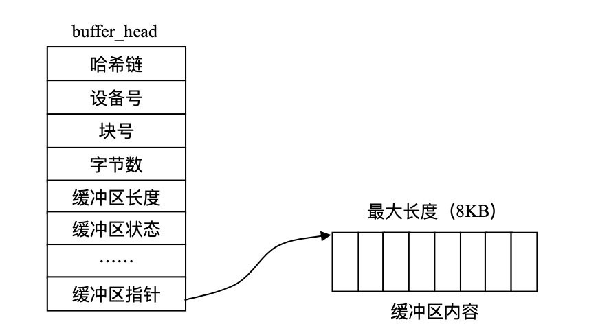

# 3. VFS中的高速缓存

## 3.1 块高速缓存

大多数Linux所支持或Linux所使用的文件系统都以**块（block）**的方式组织文件。为了减少对于物理块的访问以提高文件的访问速度，在文件以块的形式调入内存后，使用**块高速缓存(buffer_cache)**对它们进行管理。

每个缓冲区有两部分组成，第1部分称为缓冲区首部，用数据结构`buffer_head`表示，第 2 部分是真正的缓冲区内容(即所存储的数据)。由于缓冲区首部不与数据区域相连，数据区域独立存储。 因而在缓冲区首部中，有一个指向数据的指针和一个缓冲区长度的字段。如下图所示：



缓冲区首部包括以下内容：

* 用于描述缓冲区内容的信息，包括:所在设备号、起始物理块号、包含在缓冲区中的字节数
* 缓冲区状态的域:是否有有用数据、是否正在使用、重新利用之前是否要写回磁盘等。
* 用于管理的域

`buffer_head`数据结构在`include\linux\fs.h`中定义如下

```c
struct buffer_head {
    /* First cache line: */
 	struct buffer_head *b_next;
 	unsigned long b_blocknr;
 	unsigned short b_size;
 	unsigned short b_list;
	kdev_t b_dev;
	atomic_t b_count;
 	kdev_t b_rdev;
	unsigned long b_state;
	unsigned long b_flushtime;
	struct buffer_head *b_next_free;/* 指向 lru/free 链表中的下一个元素 */
	struct buffer_head *b_prev_free;/* 指向链表中的上一个元素*/ struct 	buffer_head *b_this_page;/* 每个页面中的缓冲区链表*/
	struct buffer_head *b_reqnext; /*请求队列 */
	struct buffer_head **b_pprev;
	char * b_data;
	struct page *b_page;
	void (*b_end_io)(struct buffer_head *bh, int uptodate); /* I/O 结束方法*/
    void *b_private;
    unsigned long b_rsector;
    wait_queue_head_t b_wait;
    struct inode *       b_inode;
	struct list_head    b_inode_buffers;
};

```

块高速缓存的管理很复杂，下面先对空缓冲区、空闲缓冲区、正使用的缓冲区、缓冲区的大小以及缓冲区的类型作一个简短的介绍。

缓冲区可以分为包含了有效数据以及空缓冲区两种。需要注意的是，缓冲区包含了有效数据并不能说明缓冲区正在被使用，因为系统或进程在同一时间内访问的只有有限的几个缓冲区。真正可以反映缓冲区是否被使用的是`buffer_head`中的`b_count`成员。如果`b_count`为0，则缓冲区是空闲的；否则缓冲区正在被进程访问，`b_count`的值就是访问该缓冲区的进程数，同时，系统维护一个hash table来记录所访问该缓冲区的进程。

缓冲区的大小不是固定的，当前 Linux 支持 5 种大小的缓冲区，分别是 512、1024、2048、4096、8192 Byte。Linux 所支持的文件系统都使用共同的块高速缓存，在同一时刻，块高速缓存中存在着来自不同物理设备的数据块，为了支持这些不同大小的数据块，Linux 使用了几种不同大小的缓冲区。

为了管理块高速缓存中的do多个不同的缓冲区，VFS使用了多个链表来进行操作。

对于包含了有效数据且正在被使用的缓冲区，系统使用一个Hash Table来进行管理，用`hash_table`来指向这个table。table的索引值由数据块号以及其所在的设备标示号进行Hash运算得到。所以在 buffer_head 这个结构中有一些用于哈希表管理的域。使用哈希表可以迅速地查找到所要寻 找的数据块所在的缓冲区。

对于未使用的有效缓冲区，系统维护一个LRU双向链表进行管理。由于共有 3 种类型的缓冲区，所以有 3 个这样的 LRU 链表。当需要访 问某个数据块时，系统采取如下算法：

* 首先系统根据块号和所在的设备号进行查找，如果找到则将他的`b_count`+1，代表访问这个块的进程增加了一个。如果这个缓冲区同时又处于 某个 LRU 链中，则将它从 LRU 链中解开。
* 如果数据块还没有调入缓冲区，则系统必须进行磁盘 I/O 操作，将数据块调入块高速缓 存，同时将空缓冲区分配一个给它。如果块高速缓存已满，则从某个LRU链首取下一个节点，如果该块已经置`dirty`位，则将它的内容写回磁盘，同时分配给新的数据块。
* 在缓冲区结束访问以后，将他的`b_count`减一，则将它放在某个 LRU 链尾，表示该缓冲区已可以重新利用。

Linux 中，用`bdflush`守护进程完成对于高速缓存的一般处理。bdflush 守护进程是一个简单的内核线程，在系统启动时运行，它在系统中注册的进程名称为 kflushd，你可以使用 ps 命令看到此系统进程。该进程最为重要的作用就是监视块高速缓存中的dirty缓冲区，同时对于dirty缓冲区的数目做一个统计。

在Linux系统中，使用`update`命令可以管理块高速缓存。update不仅仅是一个命令，而且是一个后台进程。当系统初始化时，系统以root用户的身份登陆，update会周期性调用系统的服务例程将已经置为dirty的缓冲区块（就像上文系统维护LRU链表的方法一样）“flush”到磁盘上去。

## 3.2 索引节点高速缓存

VFS也使用了一个高速缓存来加快对于索引节点的访问。由于`inode`结构中已经有了类似于块高速缓存中缓冲区首部的域，所以每个缓冲区只有存储数据一部分。索引节点高速缓存的实现代码全部在`fs/inode.c`中。

### 3.2.1 索引节点链表

每个索引节点可能处在系统维护的Hash Table中，也可能同时处于下列链表的一种当中：

* `in_use`：如果节点的`i_count > 0`且`i_nlink > 0`，则该节点是有效的索引节点，加入`in_use`链表。
* `dirty`：类似于`in_use`链表，但是其中的节点都是dirty节点。
* `unused`：`i_count = 0`的有效节点将被加入该链表

因此索引节点高速缓存的结构大致如下：

* 全局Hash Table`inode_hash_table`，其中哈希值是根据每个超级块指针的值和32位索引节点号而得到。对于没有超级块的索引节点(`i_node -> i_sb = NULL`)，则将其加入到`anon_hash_chain`链表的首部。
* 对于正在使用的索引节点链表，系统会维护一个全局变量`inode_in_use`来指向该链表的首尾元素。
* 未用索引节点链表。全局变量 `inode_unused` 的 `next` 域 和 `prev` 域分别指向该链表中 的首元素和尾元素。
* 脏索引节点链表。由相应超级块的 s_dirty 域指向该链表中的首元素和尾元素。

### 3.2.2 索引节点高速缓存的工作过程

下面以打开Ext2文件系统的一个常规文件时，系统的工作过程为例分析一下索引节点高速缓存的工作过程。

```c
fd = open("file", O_RDONLY); 
close(fd);
```

`open()`系统调用是由`fs/open.c`中的`sys_open`函数实现的，真正的工作是由`fs/open.c`中的`filp_open()`函数完成的。如下：

```c
struct file *filp_open(const char *filename, int flags, umode_t mode)
{
	struct filename *name = getname_kernel(filename);
	struct file *file = ERR_CAST(name);
	
	if (!IS_ERR(name)) {
		file = file_open_name(name, flags, mode);
		putname(name);
	}
	return file;
}
EXPORT_SYMBOL(filp_open);
```

`filp_open()`主要调用`file_open_name()`，这个函数主要用来填充文件所在目录的dentry结构以及vfsmount结构。在dentry结构中`dentry->d_inode`就指向目标文件的索引节点。

## 3.3 目录高速缓存

由于每次从磁盘中读入一个目录项并且在内存中构造这个目录对象都需要花费大量的时间。所以在完成对于目录项对象的操作后会在内存中的高速缓存区暂时保留这一对象。例如，我们经常需要编辑文件，随后进行编译或编辑，然后打印或拷贝，再进行编辑，诸如此类的 情况中，同一个文件需要被反复访问。

一个目录项对象有以下四种状态：

* 空闲状态：处于该状态的目录项对象不包含有效的信息，还没有被 VFS 使用。它对应 的内存区由 slab 分配器进行管理
* 未使用状态:处于该状态的目录项对象当前还没有被内核使用。该对象的引用计数器`d_count` 的值为 `NULL`。但其 `d_inode` 域仍然指向相关的索引节点。该目录项对象包含有效的信息，但为了在必要时回收内存，它的内容可能被丢弃.
* 正在使用状态:处于该状态的目录项对象当前正在被内核使用。该对象的引用计数器 `d_count` 的值为正数，而其` d_inode` 域指向相关的索引节点对象。该目录项对象包含有效的信息，并且不能被丢弃。
* 负状态：与目录项相关的索引节点不复存在，那是因为相应的磁盘索引节点已被删除。 该目录项对象的 `d_inode` 域置为 `NULL`，但该对象仍然被保存在目录项高速缓存中，以便后续对同一文件目录名的查找操作能够快速完成。

目录项高速缓存有以下两种类型的数据结构组成：

* 处于正在使用、未使用或副状态的目录项对象的集合。
* 一个Hash Table，从中能够获取与给定的文件名和目录名对应的目录项对象。如果访 问的对象不在目录项高速缓存中，哈希函数返回一个空值。

目录项高速缓存的作用也相当于索引节点高速缓存的控制器。内核内存中，目录项可能 已经不使用，但与其相关的索引节点并不被丢弃，这是由于目录项高速缓存仍在使用它们， 因此，索引节点的` i_count` 域不等于0。于是，这些索引节点对象还保存在内存中，并能够借 助相应的目录项快速引用它们。

哈希表是由 dentry_hashtable 数组实现的。数组中的每个元素是一个指向链表的指针， 这种链表就是把具有相同哈希表值的目录项进行散列而形成的。该数组的长度取决于系统已安装 RAM 的数量。目录项对象的 d_hash 域包含指向具有相同 hash 值的链表中的相邻元素。 哈希函数产生的值是由目录及文件名的目录项对象的地址计算出的。