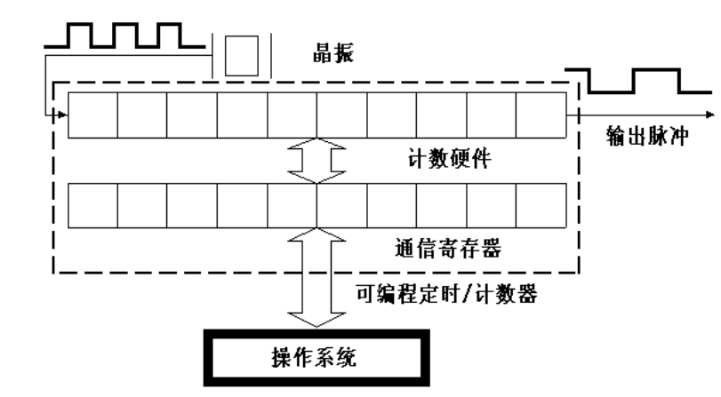
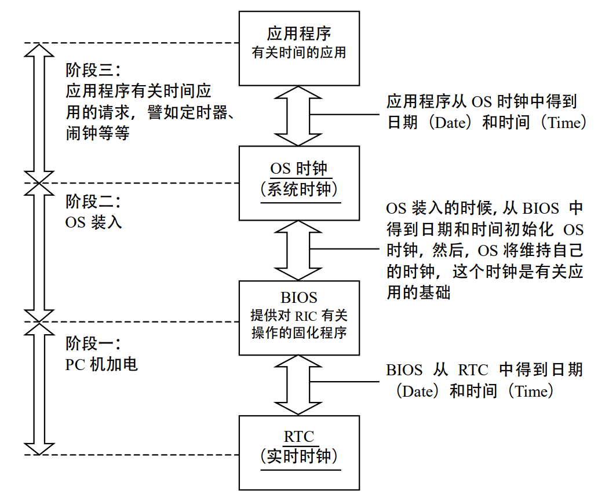

# 进程调度和切换

**进程调度**是多进程操作系统中一个全局性、关键性的问题，根据调度的结果所作的**进程切换**的速度，也是衡量一个操作系统性能的重要指标。进程调度算法的设计，还对系统的复杂性有着极大的影响，常常会由于实现的复杂程度而在功能与性能方面做出必要的权衡和让步。

## 1.进程调度基本知识

### 1.1Linux时间系统

> 时间系统是计算机系统非常重要的组成部分，特别是对于 UNIX 类分时系统尤为重要。 时间系统通常又被简称为时钟，它的主要任务是维持系统时间并且防止某个进程独占 CPU 及 其他资源，也就是驱动进程的调度。

#### 1.1.1时钟硬件

大部分PC机中有两个时钟源，一个是RTC时钟，一个是OS时钟。

**RTC（Real Time Clock）时钟**是PC主机板上的一块芯片，独立于操作系统，用于为整个计算机提供最原始最底层的时钟数据。Linux只用RTC来获得时间和日期，通过作用于/dev/rtc设备文件，也允许进程对RTC编程，系统管理员可以配置时钟。

**OS（操作系统）时钟**是PC主板上的定时/计数芯片，OS时钟只有在开机时才有效，操作系统取得RTC中的时间数据来初始化OS时钟，然后通过技术芯片向下计数形成OS时钟，OS时钟完全由操作系统控制。下面重点讲述OS时钟的产生。

OS时钟最典型的计数芯片是8253/8254可编程计数芯片。

可编程计数器总体上由两部分组成：计数硬件和通信寄存器。操作系统通过通信寄存器读取计数硬件的状态，并且控制计数硬件的工作方式。Linux内核初始化时，内核写入控制字和计数初值，然后计数硬件会按照一定计数方式对晶振产生的输入脉冲信号产生输出脉冲。这就是OS时钟产生的来源。

#### 1.1.2时钟运作机制

RTC是OS时钟的时间基准，操作系统通过读取RTC来初始化OS时钟，此后二者保持同步运行，共同维持系统时间，保持同步意味着操作系统运行过程中，每隔一个固定时间会刷新或校正RTC中的信息。Linux中在内核初始化完成后就完全抛弃了BIOS中的程序。



RTC处于最底层，提供最原始的时钟数据。OS时钟建立在RTC之上，初始化完成后将完全由操作系统控制，和RTC脱离关系。操作系统通过OS时钟提供给应用程序所有和事件有关的服务。

#### 1.1.3Linux时间基准

定义“时间基准”的目的是为了简化计算，这样计算机中的时间只要表示为从这个时间基准开始的时钟滴答数就可以了。“时间基准”是由操作系统的设计者规定的。Linux 的时间基准是 1970 年 1 月 1 日凌晨 0 点。 

#### 1.1.4Linux时间系统

Linux中用全局变量**jiffies**表示系统自启动以来的时钟滴答数目。在/kernel/time.c中定义如下`unsinged long volatile jiffies`

> [volatile](https://so.csdn.net/so/search?q=volatile&spm=1001.2101.3001.7020) 的意思是“易失的，易改变的”。这个限定词的含义是向编译器指明变量的内容可能会由于其他程序的修改而变化。通常在程序中申明了一个变量时，编译器会尽量把它存放在通用寄存器中，例如ebx。当CPU把其值放到ebx中后就不会再关心对应内存中的值。若此时其他程序（例如内核程序或一个中断）修改了内存中它的值，ebx中的值并不会随之更新。为了解决这种情况就创建了volatile限定词，让代码在引用该变量时一定要从指定位置取得其值。

在jiffies基础上，Linux提供了符合人们习惯的时间格式，在/include/linux/time.h中定义如下

```c
struct timespec { /* 这是精度很高的表示*/
 long tv_sec; /*秒 （second）*/
 long tv_nsec; /* 纳秒：十亿分之一秒（ nanosecond）*/ 
};
struct timeval { /* 普通精度 */ 
 int tv_sec; /* 秒 */ 
 int tv_usec; /* 微秒：百万分之一秒（microsecond）*/ 
};
struct timezone { /* 时区 */ 
 int tz_minuteswest; /* 格林尼治时间往西方的时差 */
 int tz_dsttime; /* 时间修正方式 */ 
};
```

下面将详细讨论jiffies的产生和其作用。简而言之，jiffies产生于时钟中断。

### 1.2时钟中断

#### 1.2.1时钟中断的产生

> OS时钟产生的输出脉冲送入CPU就可以引发一个中断请求信号，我们可以把它叫做**时钟中断**。时钟中断能够维持系统时间、促使环境切换，保证所有进程共享CPU，利用时钟中断进行记账、监督系统工作以及确定未来的调度优先级等工作。“时钟中断”是整个操作系统的脉搏。

时钟中断的产生如图。

我们只介绍Out0上的输出脉冲，这个输出脉冲可以触发一个周期性的中断，也就是时钟中断。从本质上说，时钟中断只是一个硬件信号，这个信号触发CPU执行一个中断服务程序，为了方便，我们把这个服务程序叫做**时钟中断**。

#### 1.2.2Linux实现时钟中断的全过程

##### 1.可编程定时/计数器的初始化

Linux对8253的初始化程序段如下（在/arch/i386/kernel/i8259.c 的 init_IRQ()函数中）

```c
set_intr_gate（ox20, interrupt[0]）;
outb_p（0x34,0x43）; /* 写计数器 0 的控制字：工作方式 2*/ 
outb_p（LATCH & 0xff , 0x40）; /* 写计数初值 LSB 计数初值低位字节*/ 
outb（LATCH >> 8 , 0x40）; /* 写计数初值 MSB 计数初值高位字节*/ 
```

LATCH（锁存器，锁存了计数器0的初值）为计数器0的计数初值，在/include/linux/timex.h 中定义如下： 

```c
#define CLOCK_TICK_RATE 1193180 /* 图 5.3 中的输入脉冲 */ 
#define LATCH （（CLOCK_TICK_RATE + HZ/2） / HZ） /* 计数器 0 的计数初值 */
```

CLOCK_TICK_RATE 是整个 8253 的输入脉冲。

HZ 表示计数器 0 的频率，也就是时钟中断或系统时钟的频率，在/include/asm/param.h
中定义如下: 

```c
#define HZ 100
```

##### 2.与时钟中断相关的函数

下面接着介绍时钟中断触发的服务程序，主要包括如下函数：

- 时钟中断程序：timer_interrupt();

  大约每10ms被调用一次，实际上该函数是一个封装例程，它真正做的事情并不多，但是，作为一个中断程序，它必须在关中断的情况下执行。如果只考虑单处理机，那么该函数主要语句是调用do_timer_interrupt()函数

- 中断服务通用例程：do_timer_interrupt();  

  该函数友两个主要任务，一个是调用do_timer()，另一个是维持实时时钟（RTC的回写），其实现代码在/arch/i386/kernel/time.c 

  ```c
  static inline void do_timer_interrupt（int irq, void *dev_id, struct pt_regs *regs） 
  { 
   do_timer（regs）; /* 调用时钟函数，将时钟函数等同于时钟中断未尝不可*/ 
   
   if（xtime.tv_sec > last_rtc_update + 660） 
  update_RTC(); 
  /*每隔 11 分钟就更新 RTC 中的时间信息，以使 OS 时钟和 RTC 时钟保持同步，11 分钟即
  660 秒，xtime.tv_sec 的单位是秒，last_rtc_update 记录的是上次 RTC 更新时的值 */ 
  } 
  ```

- 时钟函数：do_timer();

  ```c
  void do_timer（struct pt_regs * regs） 
  { 
   （*（unsigned long *）&jiffies）++; /*更新系统时间，这种写法保证对 jiffies 
  操作的原子性*/ 
   update_process_times(); 
   ++lost_ticks; 
      
   if (!user_mode(regs))
   	++lost_ticks_system; 
      
   mark_bh(TIMER_BH); 
      
   if (tq_timer) 
   	mark_bh(TQUEUE_BH); 
  } 
  
  ```

  其中update_process_times()函数与进程调度有关，从函数的名字可以看出，它处理的是与当前进程与时间有关的变量。

  该函数中还有两个变量lost_ticks和lost_ticks_system，这是用来记录timer_bh()执行前时钟中断发生的次数。如果时钟中断时当前进程运行于内核态，则lost_ticks_system用来记录timer_bh()执行前在内核态发生时钟中断的次数。

- 中断安装程序：setup_irq();

  在系统进行初始化时，所作的大量工作之一就是对时钟进行初始化。该函数可以把当前的实际时间读入变量中，其中的时钟中断安装函数主要功能是将中断程序连入相应的中断请求队列，以等待终端到来时相应的中断程序被执行。

- 中断返回函数：ret_from_intr();


时钟中断的整体描述大致为

```pseudocode
do_timer_interrupt（ ） /*这是一个伪函数 */ 
{ 
 SAVE_ALL /*保存处理机现场 */  
 intr_count += 1; /* 这段操作不允许被中断 */ 
 timer_interrupt() /* 调用时钟中断程序 */ 
 intr_count -= 1; 
 jmp ret_from_intr /* 中断返回函数 */
} 
```

其中ret_from_intr是一段汇编代码，也是一个较为复杂的过程，它最终要调用jmp ret_from_sys_call，即系统调用返回函数，这个函数与进程的调度密切相关。

##### 3系统调用返回函数

系统调用返回函数的源代码在/arch/i386/kernel/entry.S 中

```asm
ENTRY（ret_from_sys_call） 
 cli # need_resched and signals atomic test 
 cmpl $0,need_resched（%ebx） 
 jne reschedule 
 cmpl $0,sigpending（%ebx） 
 jne signal_return 
 restore_all: 
 RESTORE_ALL 
 
 ALIGN 
 signal_return: 
 sti # we can get here from an interrupt handler 
 testl $（VM_MASK）,EFLAGS（%esp） 
 movl %esp,%eax 
 jne v86_signal_return 
 xorl %edx,%edx 
 call SYMBOL_NAME（do_signal） 
 jmp restore_all 
 
 ALIGN 
 v86_signal_return: 
 call SYMBOL_NAME（save_v86_state） 
 movl %eax,%esp 
 xorl %edx,%edx 
 call SYMBOL_NAME（do_signal） 
 jmp restore_all 
 …. 
 reschedule: 
 call SYMBOL_NAME（schedule） # test 
 jmp ret_from_sys_call
```

这段汇编代码就是”从系统调用返回函数“ret_from_sys_call，它是从中断、异常及系统调用返回时的通用接口。它在执行的过程需要调用其他一些函数（实际上是一些代码，不是真正的函数）：

1. ret_from_sys_call：主体。  
2. reschedule：检测是否需要重新调度。  
3. signal_return：处理当前进程接收到的信号。  
4. v86_signal_return：处理虚拟 86 模式下当前进程接收到的信号。 
5. RESTORE_ALL：我们把这个函数叫做彻底返回函数，因为执行该函数之后，就返回 到当前进程的地址空间中去了。 

ret_from_sys_call 的主要作用有：检测调度标志 need_resched，决定是否要执行调度程序；处理当前进程的信号；恢复当前进程的环境使之继续执行。 

```asm
cmpl $0, _need_resched 
jne reschedule 
 …… 
restore_all: 
 RESTORE_ALL 
 
reschedule: 
 call SYMBOL_NAME（schedule） 
 jmp ret_from_sys_call 
```

该函数的这几行表示：检测need_resched标志，如果非0，跳转到reschedule处调用调度程序schedule()进行进程的选择。从调度程序返回时，如果调度标志又被设置，则又调用调度程序，直到调度标志为0，这时从调度程序返回时由RESTORE_ALL恢复被选定进程的环境，返回到被选定进程的用户空间，使之得到运行。

总结一下时钟中断：每个时钟滴答，时钟中断得到执行。时钟中断执行的频率很高：100 次/秒，时钟中断的主要工作是处理和时间有关的所有信息、决定是否执行调度程序以及处理下半部分。和时间有关的所有信息包括系统时间、进程的时间片、延时、使用 CPU 的时间、各种定时器，进程更新后的时间片为进程调度提供依据，然后在时钟中断返回时决定是否要执行调度程序。下半部分处理程序是 Linux 提供的一种机制，它使一部分工作推迟执行。时钟中断要绝对保证维持系统时间的准确性，而下半部分这种机制的提供不但保证了这种准确性，还大幅提高了系统性能。 

### 1.3Linux的调度程序——Schedule()

> 进程的合理调度是一个非常复杂的工作，它取决于可执行程序的类型（实时或普通）、调度的策略及操作系统所追求的目标，幸运的是，Linux 的调度程序比较简单。

#### 1.3.1基本原理

进程运行需要各种各样的系统资源，所以调度的实质就是资源的分配。我们接下来说明与Linux调度相关的几种算法和这些算法的原理。

一个好的调度算法应该考虑到以下几个方面：

1. 公平：保证每个进程得到合理的 CPU 时间。  
2. 高效：使 CPU 保持忙碌状态，即总是有进程在 CPU 上运行。
3. 响应时间：使交互用户的响应时间尽可能短。  
4. 周转时间：使批处理用户等待输出的时间尽可能短。  
5. 吞吐量：使单位时间内处理的进程数量尽可能多。 

这五个目标不能同时达到，不同的操作系统会做出相应的取舍。

主要的调度算法有：

1. 时间片轮转调度算法 
2. 优先权调度算法 
   1. 不可剥夺调度
   2. 可剥夺调度
3. 多级反馈队列调度
4. 实时调度

Linux的调度程序用的是时间片轮转调度，但同时又保证了高优先级进程运行得既快、时间又长。Linux进程调度程序在交互性方面表现很出色，但是牺牲了一部分“吞吐量”。

#### 1.3.2 Linux进程调度时机

调度程序是一个存在于内核空间中的函数。Linux 的调度程序是一个叫 Schedule()的函数，这个函数被调用的频率很高，由它来决定是否要进行进程的切换，如果要切换的话，切换到哪个进程等。

我们先来看在什么情况下要执行调度程序，这种情况叫做**调度时机**。

Linux的调度时机主要有

1. 进程状态转换的时刻：进程终止、进程睡眠；
2. 当前进程的时间片用完时（current->counter=0)；
3. 设备驱动程序；
4. 进程从中断、异常及系统调用返回到用户态时。

由于进程的时间片是由时钟中断来更新的，因此时机2和时机4是一样的。时机3，当驱动设备执行长而重复的任务时，直接调用调度程序。时机4，为什么**从系统调用返回时要调用调度程序**呢，这是从效率考虑的，从系统调用返回意味着要离开内核态返回用户态，而状态的转换要花费一定的时间，因此在返回到用户态前，系统把在内核态该处理的事全部做完。

每个时钟中断发生时，由三个函数协同工作，共同完成进程的选择和切换，它们是：schedule()、do_timer()及 ret_form_sys_call()。在上面已经介绍过，这里简单说明一下具体作用。

1. schedule()：进程调度函数，由它来完成进程的选择（调度）。 
2. do_timer()：暂且称之为时钟函数，该函数在时钟中断服务程序中被调用，是时钟中断服务程序的主要组成部分，该函数被调用的频率就是时钟中断的频率即每秒钟 100 次（简称 100 赫兹或 100Hz）； 
3. ret_from_sys_call()：系统调用返回函数。当一个系统调用或中断完成时，该函数被调用，用于处理一些收尾工作，例如信号处理、核心任务等。 

#### 1.3.3进程调度的依据

1. need_resched：调度时机到来时检测这个值，不为0调用schedule()。
2. nice：进程的静态优先级，这个域决定counter的初值。
3. counter：进程处于运行状态时剩余时间片，每次时钟中断到来这个值就减一，直至为0时，就把need_resched域置1，因此也叫这个域为动态优先级。
4. rt_priority：实时进程的优先级。
5. policy：从整体上区分实时进程和普通进程。

#### 1.3.4进程可运行程度的衡量

函数goodness()是用来衡量一个处于可运行状态的进程值得运行的程度。下面的函数主体只考虑单处理机的情况：

```c
static inline int goodness（struct task_struct *p, struct mm_struct *this_mm） 
{ 
    int weight; /* 权值，作为衡量进程是否运行的唯一依据 */
 	weight = -1; 
 	if (p -> policy & SCHED_YIELD)
 	goto out; /*如果该进程愿意“礼让（yield）”，则让其权值为－1 */
	switch(p->policy)
 		{   /* 实时进程*/ 
 			case SCHED_FIFO: 
 			case SCHED_RR: 
 			weight = 1000 + p->rt_priority; 
 			/* 普通进程 */ 
 			case SCHED_OTHER: 
 			{ 
                weight = p->counter; 
 				if（!weight） 
				goto out 
 				/* 做细微的调整*/ 
				if （p -> mm = this_mm || !p -> mm） 
				weight = weight+1; 
 				weight += 20-p->nice; 
			} 
 		} 
out: 
 return weight; /*返回权值*/ 
} 
其中，在 sched.h 中对调度策略定义如下： 
#define SCHED_OTHER 0 
#define SCHED_FIFO 1 
#define SCHED_RR 2 
#define SCHED_YIELD 0x10
```

（1）细微的调整：如果 p->mm 为空，则意味着该进程无用户空间（例如内核 线程），则无需切换到用户空间。如果 p->mm=this_mm，则说明该进程的用户空间就是当前进程的用户空间，该进程完全有可能再次得到运行。对于以上两种情况，都给其权值加 1， 算是一种“奖励”。 

 （2）进程的优先级 nice 是从早期 UNIX 沿用下来的负向优先级，其数值标志“谦让”的 程度，其值越大，就表示其越“谦让”，也就是优先级越低，其取值范围为－20～＋19，因 此，(20 - p -> nice)的取值范围就是 0～40。可以看出，普通进程的权值不仅考虑了其剩余的时间片，还考虑了其优先级，优先级越高，其权值越大。 

#### 1.3.5进程调度的实现

```c
asmlinkage void schedule(void) 
{ 
	/*prev 表示调度之前的进程, next 表示调度之后的进程*/ 
	struct task_struct *prev, *next, *p; 
	struct list_head *tmp; 
	int this_cpu, c; 
    /*如果当前进程的 active_mm 为空，出错*/
	if (!current->active_mm)
        BUG();
    
need_resched_back: 
	prev = current; /*让prev成为当前进程*/ 
	this_cpu = prev->processor; 
    
	if (in_interrupt()) 
    {/*如果 schedule 是在中断服务程序内部执行， 就说明发生了错误*/ 
 		printk（"Scheduling in interrupt\n"）; 
 		BUG(); 
	} 
    
	release_kernel_lock(prev, this_cpu); /*释放全局内核锁，并开this_cpu的中断*/
	spin_lock_irq(&runqueue_lock); /*锁住运行队列，并且同时关中断*/
	if (prev->policy == SCHED_RR) /*将一个时间片用完的 SCHED_RR 实时进程放到队列的末尾 */ 
		goto move_rr_last; 
    
move_rr_back: 
    /*根据 prev 的状态做相应的处理*/ 
	switch (prev->state){ 
        /*此状态表明该进程可以被信号中断*/ 
		case TASK_INTERRUPTIBLE: 
 			if （signal_pending（prev）） 
            {/*如果该进程有未处理的信号，则让其变为可运行状态*/ 
				prev->state = TASK_RUNNING; 
 				break; 
 			} 
 		default: /*如果为可中断的等待状态或僵死状态*/ 
			del_from_runqueue（prev）; /*从运行队列中删除*/ 
		case TASK_RUNNING:;/*如果为可运行状态，继续处理*/
    } 
	prev->need_resched = 0; 
 
 /*下面是调度程序的正文 */  
repeat_schedule: /*真正开始选择值得运行的进程*/
	next = idle_task(this_cpu); /*缺省选择空闲进程*/ 
	c = -1000; 
	if (prev->state == TASK_RUNNING) 
		goto still_running; 
    
still_running_back: 
    /*遍历运行队列*/
	list_for_each(tmp, &runqueue_head) 
    { 
		p = list_entry(tmp, struct task_struct, run_list); 
 		if (can_schedule(p, this_cpu )) { /*单CPU中，该函数总返回1*/
			int weight = goodness(p, this_cpu, prev->active_mm); 
 			if (weight > c) 
 				c = weight, next = p; 
 		} 
 	} 
 
 /* 如果 c 为 0，说明运行队列中所有进程的权值都为 0，也就是分配给各个进程的 
 时间片都已用完，需重新计算各个进程的时间片 */ 
 	if (!c) 
    { 
		struct task_struct *p; 
		spin_unlock_irq（&runqueue_lock）;/*锁住运行队列*/  
		read_lock（&tasklist_lock）; /* 锁住进程的双向链表*/ 
		for_each_task(p) /* 对系统中的每个进程*/ 
			p->counter = （p->counter >> 1） + NICE_TO_TICKS（p->nice）; 
		read_unlock（&tasklist_lock）; 
		spin_lock_irq（&runqueue_lock）; 
		goto repeat_schedule; 
	} 
	spin_unlock_irq（&runqueue_lock）;/*对运行队列解锁，并开中断*/  
	if (prev == next) { /*如果选中的进程就是原来的进程*/ 
		prev->policy &= ~SCHED_YIELD; 
		goto same_process; 
	} 
 /* 下面开始进行进程切换*/ 
 kstat.context_swtch ++; /*统计上下文切换的次数*/  
{ 
	struct mm_struct *mm = next->mm; 
	struct mm_struct *oldmm = prev->active_mm; 
    /*如果是内核线程，则借用 prev 的地址空间*/ 
	if (!mm) {  
 	if (next->active_mm) BUG(); 
 	next->active_mm = oldmm; 
	}
    /*如果是一般进程，则切换到 next 的用户空间*/ 
    else {  
 		if (next->active_mm != mm) BUG(); 
 		switch_mm（oldmm, mm, next, this_cpu）; 
	} 
    /*如果切换出去的是内核线程*/ 
 	if (!prev->mm) { 
 		prev->active_mm = NULL;/*归还它所借用的地址空间*/ 
		 mmdrop(oldmm); /*mm_struct 中的共享计数减 1*/ 
 	} 
} 
 
	switch_to(prev, next, prev); /*进程的真正切换，即堆栈的切换*/
	__schedule_tail(prev); /*置 prev->policy 的 SCHED_YIELD 为 0 */ 
    
same_process: 
	reacquire_kernel_lock(current);/*针对 SMP*/ 
	if (current->need_resched) /*如果调度标志被置位*/
	goto need_resched_back; /*重新开始调度*/ 
	return; 
} 
```

1.  如果当前进程既没有自己的地址空间，也没有向别的进程借用地址空间，那肯定出错。 另外，如果 schedule()在中断服务程序内部执行,那也出错。 
2. 对当前进程做相关处理，为选择下一个进程做好准备。当前进程就是正在运行着的进程，可是，当进入 schedule()时，其状态却不一定是 TASK_RUNNIG，例如，在 exit()系统调 用中，当前进程的状态可能已被改为 TASK_ZOMBE；又例如，在 wait4()系统调用中，当前进程的状态可能被置为 TASK_INTERRUPTIBLE。因此，如果当前进程处于这些状态中的一种，就要把它从运行队列中删除。
3. 从运行队列中选择最值得运行的进程，也就是权值最大的进程。 
4. 如果已经选择的进程其权值为 0，说明运行队列中所有进程的时间片都用完了（队列中肯定没有实时进程，因为其最小权值为 1000），因此，重新计算所有进程的时间片，其中宏操作NICE_TO_TICKS 就是把优先级 nice 转换为时钟滴答。
5. 进程地址空间的切换。如果新进程有自己的用户空间，也就是说，如果 next->mm 与 next->active_mm 相同，那么，switch_mm（）函数就把该进程从内核空间切换到用户空间， 也就是加载 next 的页目录。如果新进程无用户空间（next->mm 为空），也就是说，如果它 是一个内核线程，那它就要在内核空间运行，因此，需要借用前一个进程（prev）的地址空 间，因为所有进程的内核空间都是共享的，因此，这种借用是有效的。 
6. 用宏 switch_to()进行真正的进程切换，后面将详细描述。


