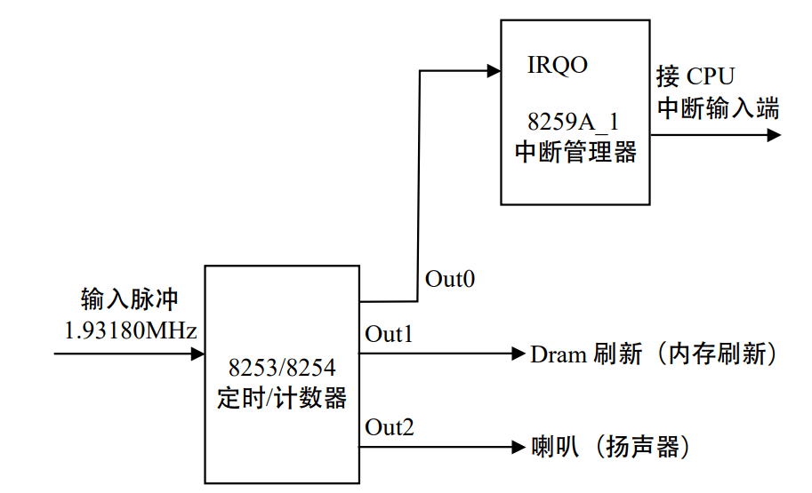

# 进程调度和切换

**进程调度**是多进程操作系统中一个全局性、关键性的问题，根据调度的结果所作的**进程切换**的速度，也是衡量一个操作系统性能的重要指标。进程调度算法的设计，还对系统的复杂性有着极大的影响，常常会由于实现的复杂程度而在功能与性能方面做出必要的权衡和让步。

## 1.进程调度基本知识

### 1.1Linux时间系统

> 时间系统是计算机系统非常重要的组成部分，特别是对于 UNIX 类分时系统尤为重要。 时间系统通常又被简称为时钟，它的主要任务是维持系统时间并且防止某个进程独占 CPU 及 其他资源，也就是驱动进程的调度。

#### 1.1.1时钟硬件

大部分PC机中有两个时钟源，一个是RTC时钟，一个是OS时钟。

**RTC（Real Time Clock）时钟**是PC主机板上的一块芯片，独立于操作系统，用于为整个计算机提供最原始最底层的时钟数据。Linux只用RTC来获得时间和日期，通过作用于/dev/rtc设备文件，也允许进程对RTC编程，系统管理员可以配置时钟。

**OS（操作系统）时钟**是PC主板上的定时/计数芯片，OS时钟只有在开机时才有效，操作系统取得RTC中的时间数据来初始化OS时钟，然后通过技术芯片向下计数形成OS时钟，OS时钟完全由操作系统控制。下面重点讲述OS时钟的产生。

OS时钟最典型的计数芯片是8253/8254可编程计数芯片。

可编程计数器总体上由两部分组成：计数硬件和通信寄存器。操作系统通过通信寄存器读取计数硬件的状态，并且控制计数硬件的工作方式。Linux内核初始化时，内核写入控制字和计数初值，然后计数硬件会按照一定计数方式对晶振产生的输入脉冲信号产生输出脉冲。这就是OS时钟产生的来源。

#### 1.1.2时钟运作机制

RTC是OS时钟的时间基准，操作系统通过读取RTC来初始化OS时钟，此后二者保持同步运行，共同维持系统时间，保持同步意味着操作系统运行过程中，每隔一个固定时间会刷新或校正RTC中的信息。Linux中在内核初始化完成后就完全抛弃了BIOS中的程序。


RTC处于最底层，提供最原始的时钟数据。OS时钟建立在RTC之上，初始化完成后将完全由操作系统控制，和RTC脱离关系。操作系统通过OS时钟提供给应用程序所有和事件有关的服务。

#### 1.1.3Linux时间基准

定义“时间基准”的目的是为了简化计算，这样计算机中的时间只要表示为从这个时间基准开始的时钟滴答数就可以了。“时间基准”是由操作系统的设计者规定的。Linux 的时间基准是 1970 年 1 月 1 日凌晨 0 点。 

#### 1.1.4Linux时间系统

Linux中用全局变量**jiffies**表示系统自启动以来的时钟滴答数目。在/kernel/time.c中定义如下`unsinged long volatile jiffies`

> [volatile](https://so.csdn.net/so/search?q=volatile&spm=1001.2101.3001.7020) 的意思是“易失的，易改变的”。这个限定词的含义是向编译器指明变量的内容可能会由于其他程序的修改而变化。通常在程序中申明了一个变量时，编译器会尽量把它存放在通用寄存器中，例如ebx。当CPU把其值放到ebx中后就不会再关心对应内存中的值。若此时其他程序（例如内核程序或一个中断）修改了内存中它的值，ebx中的值并不会随之更新。为了解决这种情况就创建了volatile限定词，让代码在引用该变量时一定要从指定位置取得其值。

在jiffies基础上，Linux提供了符合人们习惯的时间格式，在/include/linux/time.h中定义如下

```c
struct timespec { /* 这是精度很高的表示*/
 long tv_sec; /*秒 （second）*/
 long tv_nsec; /* 纳秒：十亿分之一秒（ nanosecond）*/ 
};
struct timeval { /* 普通精度 */ 
 int tv_sec; /* 秒 */ 
 int tv_usec; /* 微秒：百万分之一秒（microsecond）*/ 
};
struct timezone { /* 时区 */ 
 int tz_minuteswest; /* 格林尼治时间往西方的时差 */
 int tz_dsttime; /* 时间修正方式 */ 
};
```

下面将详细讨论jiffies的产生和其作用。简而言之，jiffies产生于时钟中断。

### 1.2时钟中断

#### 1.2.1时钟中断的产生

> OS时钟产生的输出脉冲送入CPU就可以引发一个中断请求信号，我们可以把它叫做**时钟中断**。时钟中断能够维持系统时间、促使环境切换，保证所有进程共享CPU，利用时钟中断进行记账、监督系统工作以及确定未来的调度优先级等工作。“时钟中断”是整个操作系统的脉搏。

时钟中断的产生如图。

我们只介绍Out0上的输出脉冲，这个输出脉冲可以触发一个周期性的中断，也就是时钟中断。从本质上说，时钟中断只是一个硬件信号，这个信号触发CPU执行一个中断服务程序，为了方便，我们把这个服务程序叫做**时钟中断**。

#### 1.2.2Linux实现时钟中断的全过程

##### 1.可编程定时/计数器的初始化

Linux对8253的初始化程序段如下（在/arch/i386/kernel/i8259.c 的 init_IRQ()函数中）

```c
set_intr_gate（ox20, interrupt[0]）;
outb_p（0x34,0x43）; /* 写计数器 0 的控制字：工作方式 2*/ 
outb_p（LATCH & 0xff , 0x40）; /* 写计数初值 LSB 计数初值低位字节*/ 
outb（LATCH >> 8 , 0x40）; /* 写计数初值 MSB 计数初值高位字节*/ 
```

LATCH（锁存器，锁存了计数器0的初值）为计数器0的计数初值，在/include/linux/timex.h 中定义如下： 

```c
#define CLOCK_TICK_RATE 1193180 /* 图 5.3 中的输入脉冲 */ 
#define LATCH （（CLOCK_TICK_RATE + HZ/2） / HZ） /* 计数器 0 的计数初值 */
```

CLOCK_TICK_RATE 是整个 8253 的输入脉冲。

HZ 表示计数器 0 的频率，也就是时钟中断或系统时钟的频率，在/include/asm/param.h
中定义如下: 

```c
#define HZ 100
```

##### 2.与时钟中断相关的函数

下面接着介绍时钟中断触发的服务程序，主要包括如下函数：

- 时钟中断程序：timer_interrupt();

  大约每10ms被调用一次，实际上该函数是一个封装例程，它真正做的事情并不多，但是，作为一个中断程序，它必须在关中断的情况下执行。如果只考虑单处理机，那么该函数主要语句是调用do_timer_interrupt()函数

- 中断服务通用例程：do_timer_interrupt();  

  该函数友两个主要任务，一个是调用do_timer()，另一个是维持实时时钟（RTC的回写），其实现代码在/arch/i386/kernel/time.c 

  ```c
  static inline void do_timer_interrupt（int irq, void *dev_id, struct pt_regs *regs） 
  { 
   do_timer（regs）; /* 调用时钟函数，将时钟函数等同于时钟中断未尝不可*/ 
   
   if（xtime.tv_sec > last_rtc_update + 660） 
  update_RTC(); 
  /*每隔 11 分钟就更新 RTC 中的时间信息，以使 OS 时钟和 RTC 时钟保持同步，11 分钟即
  660 秒，xtime.tv_sec 的单位是秒，last_rtc_update 记录的是上次 RTC 更新时的值 */ 
  } 
  ```

- 时钟函数：do_timer();

  ```c
  void do_timer（struct pt_regs * regs） 
  { 
   （*（unsigned long *）&jiffies）++; /*更新系统时间，这种写法保证对 jiffies 
  操作的原子性*/ 
   update_process_times(); 
   ++lost_ticks; 
      
   if (!user_mode(regs))
   	++lost_ticks_system; 
      
   mark_bh(TIMER_BH); 
      
   if (tq_timer) 
   	mark_bh(TQUEUE_BH); 
  } 
  
  ```

  其中update_process_times()函数与进程调度有关，从函数的名字可以看出，它处理的是与当前进程与时间有关的变量。

  该函数中还有两个变量lost_ticks和lost_ticks_system，这是用来记录timer_bh()执行前时钟中断发生的次数。如果时钟中断时当前进程运行于内核态，则lost_ticks_system用来记录timer_bh()执行前在内核态发生时钟中断的次数。

- 中断安装程序：setup_irq();

  在系统进行初始化时，所作的大量工作之一就是对时钟进行初始化。该函数可以把当前的实际时间读入变量中，其中的时钟中断安装函数主要功能是将中断程序连入相应的中断请求队列，以等待终端到来时相应的中断程序被执行。

- 中断返回函数：ret_from_intr();

  主要作用有检测调度标志 need_resched，决定是否要执行调度程序；处理当前进程的信号；恢复当前进程的环境使之继续执行。 

时钟中断的整体描述大致为

```pseudocode
do_timer_interrupt（ ） /*这是一个伪函数 */ 
{ 
 SAVE_ALL /*保存处理机现场 */  
 intr_count += 1; /* 这段操作不允许被中断 */ 
 timer_interrupt() /* 调用时钟中断程序 */ 
 intr_count -= 1; 
 jmp ret_from_intr /* 中断返回函数 */
} 
```

总结一下时钟中断：每个时钟滴答，时钟中断得到执行。时钟中断执行的频率很高：100 次/秒，时钟中断的主要工作是处理和时间有关的所有信息、决定是否执行调度程序以及处理下半部分。和时间有关的所有信息包括系统时间、进程的时间片、延时、使用 CPU 的时间、各种定时器，进程更新后的时间片为进程调度提供依据，然后在时钟中断返回时决定是否要执行调度程序。下半部分处理程序是 Linux 提供的一种机制，它使一部分工作推迟执行。时钟中断要绝对保证维持系统时间的准确性，而下半部分这种机制的提供不但保证了这种准确性，还大幅提高了系统性能。 