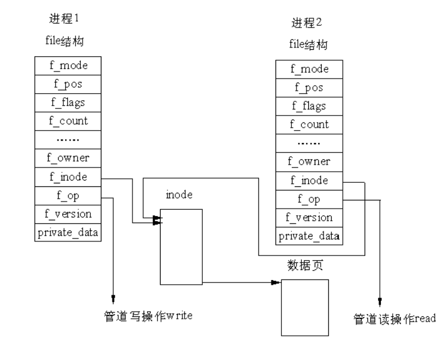
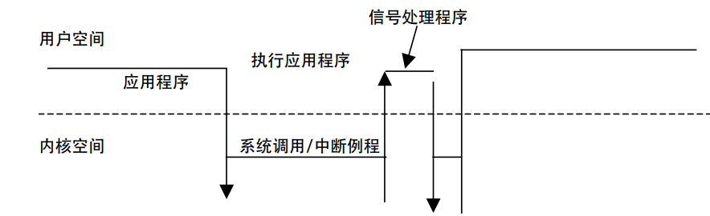
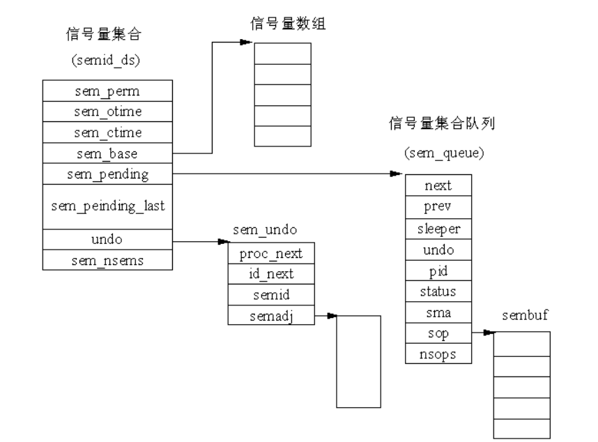
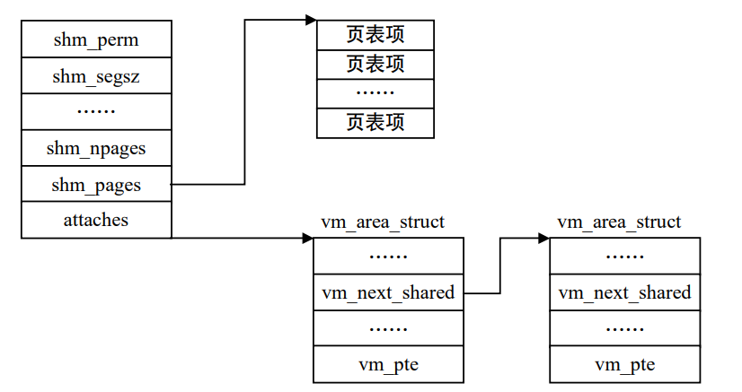

# 进程间通信

> 进程为了能在同一项任务上协调工作，它们彼此之间必须能够进行通信。例如，在一个 shell 管道中，第 1 个进程的输出必须传送到第 2 个进程，这样沿着管道传递下去。因此在需要通信的进程之间，最好使用一种结构较好的通信方式。 
>
>  Linux 支持许多不同形式的进程间通信机制 CIPCC，在特定的情况下，它们各自有优缺点。这一章将讨论最有用的进程间通信机制，即管道、 System V 的 IPC 机制及信号。
>
> 本章介绍的管道通信中，要讨论匿名管道和命名管道两种方式；而在 System V 的 IPC 机 制中，要讨论信号量、消息队列及共享内存 3 种通信方式。对于信号，则主要讨论 Linux 的 信号机制。 

## 1.1管道

所谓管道，是指用于连接一个读进程和一个写进程，以实现它们之间通信的共享文件，又称pipe文件。这种方式首创于 UNIX 系统，因它能传送大量的数据，且很有效，故很多操作系统都引入了这种通信方式，Linux 也不例外。 

管道通信机制必须提供以下三方面的协调能力：

- 互斥。当一个进程正在对 pipe 进行读/写操作时，另一个进程必须等待。
- 同步。当写进程把一定数量数据写入 pipe 后，便去睡眠等待，直到读进程取走数据后，再把它唤醒。当读进程读到一空 pipe 时，也应睡眠等待，直至写进程将数据写入管道后，才将它唤醒。
- 对方是否存在。

### 1.1.1Linux管道的实现机制

#### 1.管道的结构

在Linux中，管道的实现借助了文件系统的file结构和VFS的索引节点inode。通过将两个file结构指向同一个临时的VFS索引节点，而这个VFS索引节点又指向一个物理界面实现的。如图1.1所示。图中有两个file数据结构，其中一个是向管道写入数据的例程地址，另一个是从管道中读出数据的例程地址。



#### 2.管道的读写

管道实现的源代码在fs/pipe.c中，其中pipe_read()和pipe_write()比较重要。管道写函数通过将字节复制到VFS索引节点指向的物理内存而写入数据，而管道读函数则通过复制物理内存中的字节读出数据。内核使用了一定的机制同步对管道的访问，为此使用锁、等待队列和信号。

完成写操作需要：内存中有足够的空间可容纳所有要写入的数据且内存没有被读程序锁定。 管道的读取过程和写入过程类似。但是，进程可以在没有数据或内存被锁定时立即返回错误信息，而不是阻塞该进程。

### 1.1.2管道的应用

管道是利用 pipe()系统调用而不是利用 open()系统调用建立的。pipe()调用的原型是：`int pipe（int fd[2]）`

fd[0]元素将含有管道read()端的文件描述符，而fd[1]含有管道write()端的文件描述符。系统可以根据fd[0]和fd[1]分别找到对应的file结构。

在pipe的参数中，没有路径名。这表明创建管道不需要创建一个目录连接，这样做的好处是其他的进程无法得到该管道的文件描述符，从而不能访问它。那么两个进程如何使用一个管道通信呢？

fork()和exec()系统调用可以保证文件描述符的复制品既可以供双亲进程使用，也可供它的子女进程使用。也就是说，一个进程用pipe()系统调用创建管道，然后用fork()调用创建一个或多个进程，那么管道的文件描述符可供所有这些进程使用。

要注意的是，一个普通的管道仅可供具有共同祖先的两个进程之间共享，并且这个祖先必须已经建立了供它们使用的管道。

下面给出在两个进程之间设置和使用管道的简单程序：

```c
#include <stdio.h> 
#include <unistd.h> 
#include <sys/types.h> 
int main（void） 
{ 
	int fd[2], nbytes; 
	pid_t childpid; 
	char string[] = "Hello, world!\n"; 
	char readbuffer[80]; 
	pipe（fd）; 
	if（（childpid = fork()） == -1） 
	{ 
        printf（"Error:fork"）; 
        exit（1）; 
	} 
	if（childpid == 0） /* 子进程是管道的写进程 */ 
	{ 
		close（fd[0]）; /*关闭管道的读端 */ 
		write（fd[1], string, strlen（string））; 
		exit（0）; 
	} 
	else /* 父进程是管道的读进程 */ 
	{ 
		close（fd[1]）; /*关闭管道的写端 */ 
		nbytes = read（fd[0], readbuffer, sizeof（readbuffer））; 
		printf（"Received string: %s", readbuffer）; 
	} 
 	return（0）; 
} 
```

### 1.1.3命名管道CFIFOC

命名管道又叫FIFO，因为这种管道操作基于“先进先出”原理。命名管道中，首先写入管道的数据是首先被读出的数据。上面讲述的管道被称为"匿名管道"，匿名管道是临时对象，而FIFO则是文件系统的真正实体，如果进程有足够的权限就可以使用FIFO。它和FIFO极其类似，主要区别在于FIFO在使用之前就已经存在，用户可以打开FIFO，但是匿名管道只在操作时存在，因而是临时对象。

为了创造FIFO文件，可以在系统中使用mknod()系统调用。mknod()的系统调用原型为：

```c
#include <sys/type.h> 
#inlcude <sys/state.h> 
#include <fcntl.h> 
#include <unistd.h> 
int mknod（char *pathname,node_t mode, dev_t dev）;
```

其中pathname是被创建的文件名称，mode表示将在文件上设置的权限位和将被创建的权限类型（此情况下为S_IFIFO),dev是当创建设备特殊文件时使用的一个值。因此，对于先进先出文件它的值为0。

一旦先进先出文件已经被创建，它可以由任何具有适当权限的进程利用标准的 open()系统调用加以访问。由于命名管道可以被很多无关系的进程同时访问，那么，在有多个读进程和/或多个写进程的应用中使用 FIFO 是非常有用的。多个进程写一个管道会出现这样的问题：多个进程所写的数据混在一起怎么办？Linux系统有这样的规则：一个 write()调用可以写管道能容纳（Linux 为 4KB）的任意个字节，系统将保证这些数据是分开的。这表示多个写操作的数据在 FIFO 文件中并不混合而将被维持分离的信息。

## 1.2信号

> 尽管大多数进程间通信是计划好的，但同时还需要处理不可预知的通信问题。实际上，信号机制是在软件层次上对中断机制的模拟。从概念上讲，一个进程接受到一个信号与一个处理器接受到一个中断请求是一样的。

### 1.2.1信号种类

每种信号类型都有对应的信号处理程序，就好像每个中断都有一个中断服务例程一样。大多数信号的默认操作是结束接收信号的进程。但是，信号和中断有所不同。中断的响应和处理都发生在内核空间，信号的响应发生在内核空间，信号处理程序的执行却发生在用户空间。 以下两种情况是检测和响应信号的时机：

- 当前进程由于系统调用、中断或异常而进入内核空间以后，从内核空间返回到用户空间前夕。

- 当前进程在内核中进入睡眠以后刚被唤醒的时候，由于检测到信号的存在而提前返 回到用户空间。

当有信号要响应时，处理器执行路线的示意图如图1.2所示。



当前进程在用户态执行的过程中，陷入系统调用或中断服务例程，于是，当前进程从用户态切换到内核态；当处理完系统调用要返回到用户态前夕，发现有信号 处理程序需要执行，于是，又从内核态切换到用户态；当执行完信号处理程序后，并不是接着就在用户态执行应用程序，而是还要返回到内核态。因为此时还没有真正从系统调用返回到用户态，于是从信号处理程序返回到内核态就是为了处理从系统调用到用户态的返回。

### 1.2.2信号掩码

信号掩码是一个“位图”，其中每一位都对应着一种信号。如果位图中某一位为1，就表示在执行当前信号的处理程序期间相应的信号暂时被“屏蔽”，使得在执行的过程中不会嵌套地响应那种信号。

对信号进行屏蔽的目的是为了在相同应用程序处理同样信号时，在执行一个信号处理程序的过程中将该种信号自动屏蔽掉。“屏蔽”和忽略不同，只是将信号暂时“遮蔽”一下，一旦屏蔽去掉，已到达的信号又继续得到处理。

### 1.1.3进程与信号的关系

Linux内核中不存在任何机制用来区分不同信号的优先级。同时有多个信号发出时，进程可能会以任意顺序接收到信号并进行处理。另外，如果进程在处理某个信号之前，又有相同的信号发出，则进程只能接受到一个信号。

进程不能向系统中所有的进程发送信号，一般而言，除系统和超级用户外，普通进程只能向具有相同uid和gid的进程，或者处于统一进程组的进程发送信号。发送给某个进程的信号并不会立即得到处理，相反，只有该进程再次运行时，才有机会处理该信号。

### 1.1.4信号举例

Linux提供系统调用signal()，如何执行一个预先安排好的信号处理函数。signal()调用的原型是：

```c
#include <signal.h> 
#include <unistd.h> 
void (* signal(int signum, void(*handler)(int)))(int);
```

signal()函数的返回值是指向一个函数的指针，该函数的参数为一个整数，无返回值。下面是用户级程序的一段代码。

```c
#include <stdio.h> 
#include <signal.h> 
#include <unistd.h> 
int ctrl_c_count=0; 
void (* old_handler)(INT); 
void ctrl_c(int); 
main() 
{ 
	int c; 
	old_handler = signal(SIGINT,ctrl_c); 
	while ((c=getchar())! = '\n'); 
	printf("ctrl-c count = %d\n",ctrl_c_count); 
	(void) signal(SIGINT,old_handler); 
} 
void ctrl_c(int signum)
{ 
    (void)signal(SIGINT,ctrl_c)
	++ctrl_c; 
} 
```

这个程序是从键盘获得字符，直到换行符为止，然后进入无限循环。程序安排了捕获ctrl_c信号（SIGINT），并利用SIGINT来执行一个ctrl_c的处理函数。在键盘上敲入一个换行符时，SIGINT原来的操作才被恢复。

signal()的参数是：信号值（这里是键盘中断信号SIGINT），以及一个指向函数的指针（ctrl_c），当这个中断信号出现时，将调用该函数。signal()调用返回旧的信号处理程序的地址，在此被赋给变量older_handler，使得原来的信号处理程序稍后可以恢复。

## 1.3System V的IPC机制

Linux 支持 3 种 system Ⅴ的进程间通信机制：消息、信号量（semaphores）和共享内存。在Linux内核中，System V IPC的所有对象都有一个公共的数据结构pc_perm结构，它是IPC对象的权限描述，在linux/ipc.h中定义如下：

```c
struct ipc_perm 
{ 
 key_t key; /* 键 */ 
 ushort uid; /* 对象拥有者对应进程的有效用户识别号和有效组识别号 */ 
 ushort gid; 
 ushort cuid; /* 对象创建者对应进程的有效用户识别号和有效组识别号 */ 
 ushort cgid; 
 ushort mode; /* 存取模式 */ 
 ushort seq; /* 序列号 */ 
}; 
```

键和识别号指的是不同的东西。系统支持两种键：公有和私有。如果键是公有的，则系统中所有的进程通过权限检查后，均可以找 到 System V IPC 对象的识别号。如果键是私有的，则键值为 0，说明每个进程都可以用键值0 建立一个专供其私用的对象。

#### 1.3.1信号量

信号量（semaphore）实际是一个整数，它的值由多个进程进行测试和设置，这两个操作是不可中断的“原子”操作。信号量可用来实现所谓的“临界区”的互斥使用，临界区指同一时刻只能有一个进程执行其中代码的代码段。

##### 1.信号量的数据结构

系统中每个信号量的数据结构（sem）

```c
struct sem { 
 int semval; /* 信号量的当前值 */ 
 int sempid; /*在信号量上最后一次操作的进程识别号 * 
 }; 
```

系统中每个信号量集合的数据结构（semid_ds)

```c
struct semid_ds { 
struct ipc_perm sem_perm; /* IPC 权限 */ 
 long sem_otime; /* 最后一次对信号量操作（semop）的时间 */ 
 long sem_ctime; /* 对这个结构最后一次修改的时间 */ 
 struct sem *sem_base; /* 在信号量数组中指向第一个信号量的指针 */ 
 struct sem_queue *sem_pending; /* 待处理的挂起操作*/ 
 struct sem_queue **sem_pending_last; /* 最后一个挂起操作 */ 
 struct sem_undo *undo; /* 在这个数组上的 undo 请求 */ 
 ushort sem_nsems; /* 在信号量数组上的信号量号 */ 
 };
```

信号中每一信号量集合的队列结构（sem_queue）

```c
struct sem_queue { 
 struct sem_queue * next; /* 队列中下一个节点 */ 
 struct sem_queue ** prev; /* 队列中前一个节点, *（q->prev） == q */ 
 struct wait_queue * sleeper; /* 正在睡眠的进程 */ 
 struct sem_undo * undo; /* undo 结构*/ 
 int pid; /* 请求进程的进程识别号 */ 
 int status; /* 操作的完成状态 */ 
 struct semid_ds * sma; /*有操作的信号量集合数组 */ 
 struct sembuf * sops; /* 挂起操作的数组 */ 
 int nsops; /* 操作的个数 */ 
}; 
```



system V IPC信号量数据结构之间的关系如图所示。

Linux 按如下的规则判断是否所有的操作都可以成功：操作值和信号量的当前值相加大于 0，或操作值和当前值均为 0，则操作成功。如果系统调用中指定的所有操作中有一个操作不能成功时，则 Linux 会挂起这一进程。如果操作标志指定这种情况下不能挂起进程的话，系统调用返回并指明信号量上的操作没有成功，而进程可以继续执行。如果进程被挂起，Linux 必须保存信号量的操作状态并将当前进程放入等待队列。 为此，Linux 内核在堆栈中建立一个 sem_queue结构并填充该结构。新的sem_queue结构添加到集合的等待队列中。当前进程放入 sem_queue结构的等待队列中（sleeper）后调用调度程序选择其他的进程运行。 

##### 2.死锁

和信号量操作相关的概念还有“死锁”。当某个进程修改了信号量而进入临界区之后， 却因为崩溃或被“杀死（kill）”而没有退出临界区，这时，其他被挂起在信号量上的进程 永远得不到运行机会，这就是所谓的死锁。Linux 通过维护一个信号量数组的调整列（semadj） 来避免这一问题。其基本思想是，当应用这些“调整”时，让信号量的状态退回到操作实施 前的状态。

关于调整的描述是在 sem_undo 数据结构中，在 include/linux/sem.h 描述如下： 

```c
/*每一个任务都有一系列的恢复（undo）请求，当进程退出时，自动执行 undo 请求*/ 
struct sem_undo 
{ 
	struct sem_undo * proc_next; /*在这个进程上的下一个 sem_undo 节点 */ 
	struct sem_undo * id_next; /* 在这个信号量集和上的下一个 sem_undo 节点*/ 
	int semid; /* 信号量集的标识号*/
	short * semadj; /* 信号量数组的调整，每个进程一个*/ 
};
```

每一个单独的信号量操作也许要请求得到一次“调整”，Linux 将为每一个信号量数组 的每一个进程维护至少一个 sem_undo 结构。

#### 1.3.2消息队列

一个或多个进程可向消息队列写入消息，而一个或多个进程可从消息队列中读取消息。Linux 中的消息可以被描述成在内核地址空间的一个内部链表，每一个消息队列由一个 IPC 的标识号唯一地标识。Linux 为系统中所有的消息队列维护一个 msgque 链表，该链表 中的每个指针指向一个 msgid_ds 结构，该结构完整描述一个消息队列。

##### 1.消息队列的数据结构：

- 消息缓冲区（msgbuf），它在 include/linux/msg.h 中声明

```c
/* msgsnd 和 msgrcv 系统调用使用的消息缓冲区*/ 
struct msgbuf { 
 long mtype; /* 消息的类型，必须为正数 */ 
 char mtext[1]; /* 消息正文 */ 
};
```

消 息 的 长 度 还 是 有 限 制 的 ， 在 Linux 中 ， 给定消息的最大长度在include/linux/msg.h 中定义如下：

`\#define MSGMAX 8192 /* max size of message （bytes） */ `  

消息总的长度不能超过 8192 字节，包括 mtype 域，它是 4 字节长。 

- 消息结构（msg）

  内核把每一条消息存储在以 msg 结构为框架的队列中，它在 include/ linux/msg.h 中 定义如下： 

```c
struct msg { 
 struct msg *msg_next; /* 队列上的下一条消息 */ 
 long msg_type; /*消息类型*/ 
 char *msg_spot; /* 消息正文的地址 */ 
 short msg_ts; /* 消息正文的大小 */ 
}; 
```

- 消息队列结构（msgid_ds） 

当在系统中创建每一个消息队列时，内核创建、存储及维护这个结构的一个实例。

```c
/* 在系统中的每一个消息队列对应一个 msqid_ds 结构 */ 
struct msqid_ds { 
 struct ipc_perm msg_perm; 
 struct msg *msg_first; /* 队列上第一条消息，即链表头*/ 
 struct msg *msg_last; /* 队列中的最后一条消息，即链表尾 */ 
 time_t msg_stime; /* 发送给队列的最后一条消息的时间 */ 
 time_t msg_rtime; /* 从消息队列接收到的最后一条消息的时间 */ 
 time_t msg_ctime; /* 最后修改队列的时间*/ 
 ushort msg_cbytes; /*队列上所有消息总的字节数 */ 
 ushort msg_qnum; /*在当前队列上消息的个数 */ 
 ushort msg_qbytes; /* 队列最大的字节数 */ 
 ushort msg_lspid; /* 发送最后一条消息的进程的 pid */ 
 ushort msg_lrpid; /* 接收最后一条消息的进程的 pid */ 
};
```

##### 2.系统调用

msgget()系统调用可以创建一个新的消息队列或者存取一个已经存在的队列。

`int msgget (key_t key, int msgflg); `

有了队列识别号，可以在这个队列上进行操作，要把一条信息传递给一个队列必须使用msgsnd()系统调用。

`int msgsnd (int msqid, struct msgbuf *msgp, int msgsz, int msgflg);`

从消息队列中检索信息可以使用msgrcv()系统调用。

`int msgrcv （ int msqid, struct msgbuf *msgp, int msgsz, long mtype, int  msgflg ）;`

#### 1.3.3共享内存

共享内存是一个区域的映射，这个区域可以被更多的进程所共享。像所有的 System V IPC 对象一样，Linux 对共享内存的存取是通过对访问键和访问权限的检查来控制的。 

##### 1.数据结构

每一个共享内存段（存在于它的地址空间）维护 着一个特殊的数据结构 shmid_ds，这个结构在 include/linux/shm.h 中定义如下：

```c
/* 在系统中 每一个共享内存段都有一个 shmid_ds 数据结构. */ 
 struct shmid_ds { 
 struct ipc_perm shm_perm; /* 操作权限 */ 
 int shm_segsz; /* 段的大小（以字节为单位） */ 
 time_t shm_atime; /* 最后一个进程附加到该段的时间 */ 
 time_t shm_dtime; /* 最后一个进程离开该段的时间 */ 
 time_t shm_ctime; /* 最后一次修改这个结构的时间 */ 
 unsigned short shm_cpid; /*创建该段进程的 pid */ 
 unsigned short shm_lpid; /* 在该段上操作的最后一个进程的 pid */ 
 short shm_nattch; /*当前附加到该段的进程的个数 */ 
 /* 下面是私有的 */ 
 unsigned short shm_npages; /*段的大小（以页为单位） */ 
 unsigned long *shm_pages; /* 指向 frames -> SHMMAX 的指针数组 */ 
 struct vm_area_struct *attaches; /* 对共享段的描述 */ 
 }; 
```



##### 2.共享内存的处理过程

某个进程第一次访问共享内存时将产生缺页异常。因此说，第 1 个进程对共享内存的存取引起创建新的物理页面，而其他进程对共享内存的存取引起把那个页添加到它们的地址空间。 

当某个进程不再共享其虚拟内存时，利用系统调用将共享段从自己的虚拟地址区域中移 去，并更新进程页表。当最后一个进程释放了共享段之后，系统将释放给共享段所分配的物理页。当共享的虚拟内存没有被锁定到物理内存时，共享内存也可能会被交换到交换区中。 